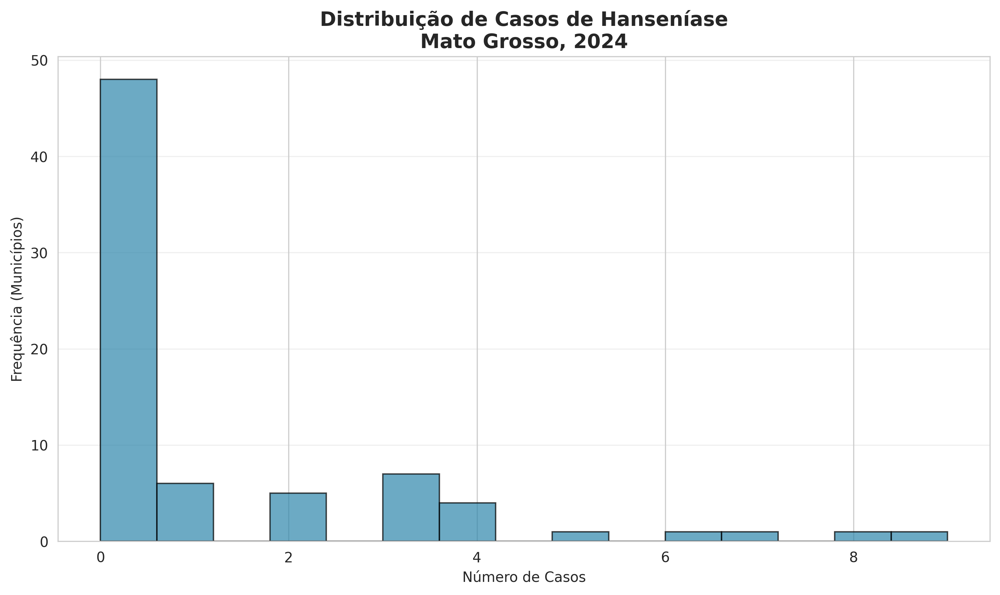
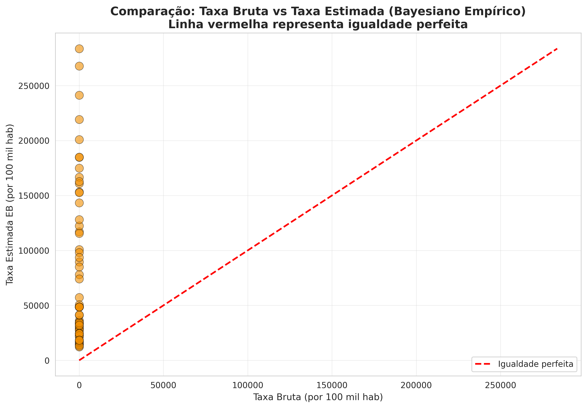
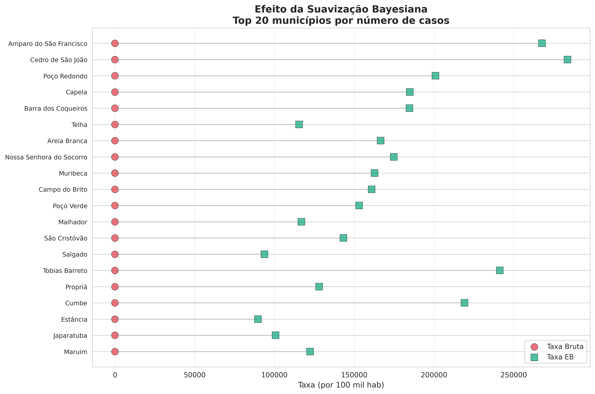
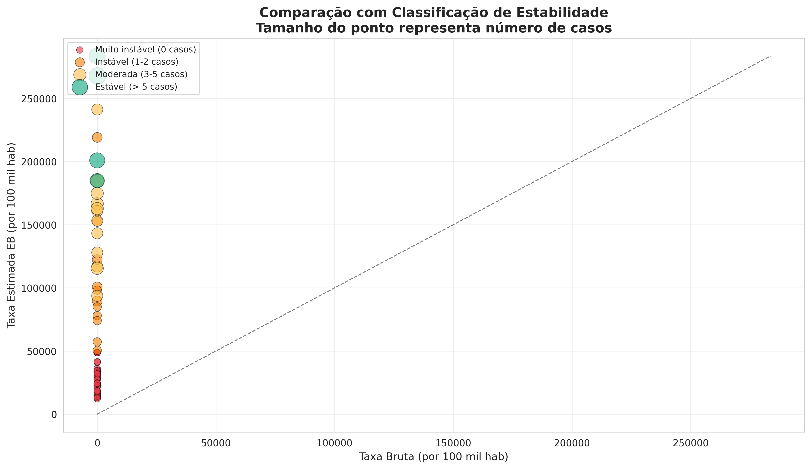
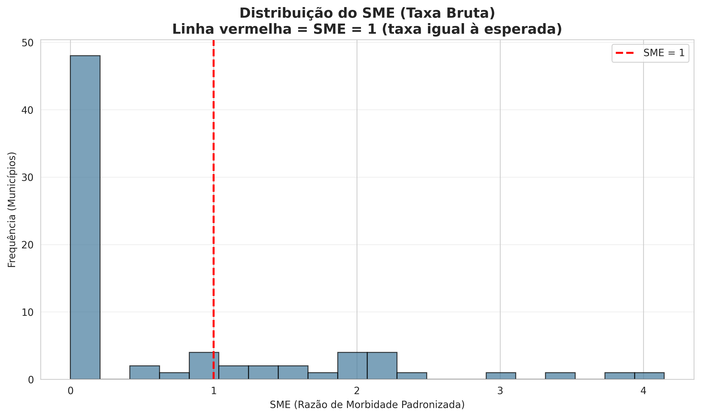
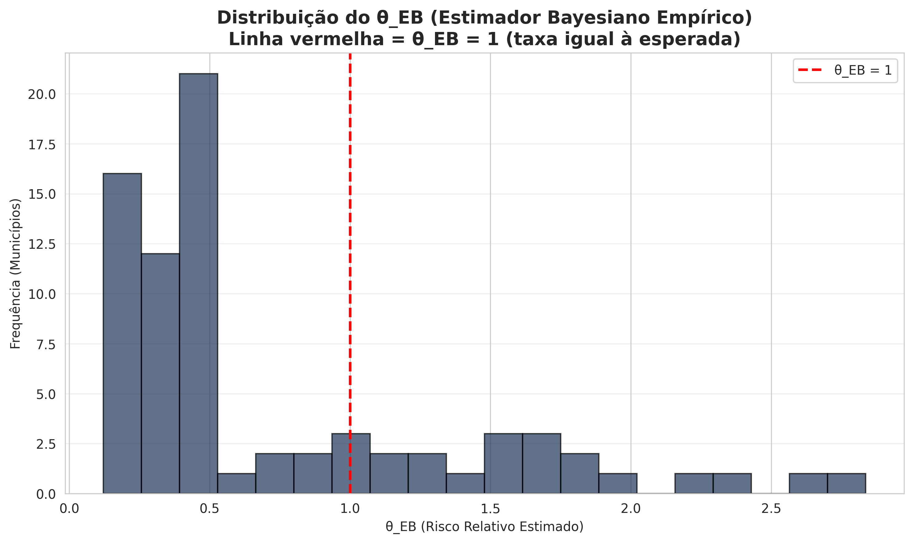
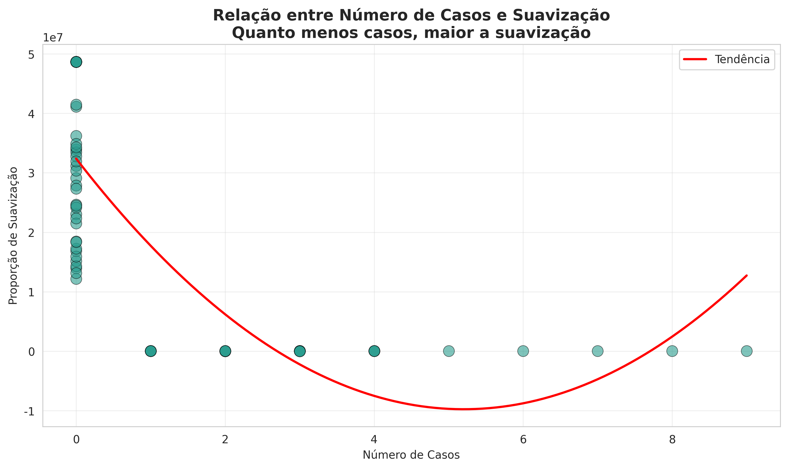

## O que é Análise Estatística Espacial?

A análise estatística espacial é um conjunto de métodos estatísticos que **incorpora a localização geográfica do fenômeno estudado** como elemento fundamental da análise. 

Diferentemente da estatística clássica, que assume independência entre observações, a estatística espacial reconhece que:

> "Todas as coisas se parecem, porém coisas mais próximas tendem a ser mais semelhantes" (Lei de Tobler, 1979).

Essa abordagem é essencial em epidemiologia, onde a distribuição espacial de doenças revela padrões importantes para políticas de saúde pública.

## Tipologia dos Dados Espaciais

Segundo Noel Cressie (1993), a estatística espacial pode ser dividida em três grandes áreas:

1. **Dados de Processos Pontuais**: Observações que ocorrem em localizações específicas (ex: casos de uma doença, localização de crimes). O objetivo é entender padrões de agrupamento, dispersão ou aleatoriedade.

2. **Dados de Geoestatística**: Observações com atributos mensuráveis em localizações contínuas ou irregulares (ex: temperatura, poluição, altitude). Há interesse na dependência espacial e interpolação para locais não amostrados.

3. **Dados de Área**: Fenômenos agregados por unidades geográficas (ex: municípios, distritos, setores censitários). As análises incluem autocorrelação espacial e modelos de regressão espacial adaptados a dados agregados.

## Origem Histórica - John Snow (1854)

O uso de dados espaciais na saúde teve um marco histórico com **John Snow**, que em 1854 mapeou um surto de cólera em Londres. 

Ao mapear as mortes por cólera no Soho, Snow identificou um foco ao redor da bomba de água da Broad Street, desafiando a teoria miasmática e apoiando sua hipótese de transmissão hídrica.

Esse trabalho pioneiro estabeleceu os fundamentos da **epidemiologia moderna** e demonstrou o poder da análise espacial em saúde pública.

## Disease Mapping - Conceitos Fundamentais

**Disease Mapping** é a disciplina que combina estatística, geografia e epidemiologia para descrever e modelar a distribuição espacial de doenças.

O disease mapping é guiado por **questões epidemiológicas centrais**:

1. **Heterogeneidade Espacial**: Existem diferenças na intensidade de doença em algumas sub-regiões comparadas a outras?
2. **Estrutura Espacial**: Há correlação espacial na localização da intensidade de doença?

O disease mapping enfrenta três desafios principais:
- **Instabilidade de estimativas** devido a dados esparsos
- **Confundimento por variáveis de nuisance**
- **Viés da Unidade de Área Modificável (MAUP)**

## O Problema da Instabilidade em Dados Esparsos

Quando uma doença é rara ou a população em risco é pequena, as estimativas de taxa são **inerentemente instáveis**. 

Imagine um município com apenas 10 pessoas em risco de morte em cada ano: 
- Ano 1: ninguém morre (taxa = 0%)
- Ano 2: morre 1 (taxa = 10%)
- Ano 3: morrem 3 (taxa = 30%)

Essas estimativas são **matematicamente corretas** mas **estatisticamente implausíveis**. Adicionar apenas 1-2 eventos muda drasticamente a estimativa.

**Soluções tradicionais**:
- Agregar dados ao longo de múltiplos anos
- Agregar dados em unidades geográficas maiores
- Usar **suavização estatística** (smoothing) - nossa abordagem

## Suavização Estatística - Empirical Bayes

A suavização estatística usa a **quantidade de informação** (tamanho da amostra) para ajustar estimativas extremas. O objetivo crítico é **não suavizar mais do que o necessário**.

**Empirical Bayes (EB)** é uma abordagem que combina informação **global** (de todos os municípios) com informação **local** (de cada município) para produzir estimativas mais estáveis. A ideia é que municípios com poucos dados "emprestam força" da distribuição geral.

**Modelo Estatístico**:
- $Y_i | \theta_i \sim Poisson(E_i \times \theta_i)$  [dados observados]
- $\theta_i \sim Gamma(\alpha, \beta)$  [distribuição a priori]

Onde $Y_i$ são casos observados, $E_i$ são casos esperados, e $\theta_i$ é o risco relativo.

## Cálculo de Casos Esperados

O primeiro passo é calcular o **número de casos esperado** em cada município sob a hipótese nula de que não há variação espacial. Isso é feito aplicando a **taxa geral** do estado à população de cada município:

$$E_i = N_i \times r$$

Onde:
- $E_i$ = casos esperados no município i
- $N_i$ = população do município i
- $r$ = taxa geral (total de casos / população total)

**Exemplo Prático - Hanseníase no MT**:
- Total de casos: 88
- População total: 2.277.828 habitantes
- Taxa geral: 3,86 por 100 mil habitantes

Para um município com 30.000 habitantes:
- $E_i = 30.000 \times (88 / 2.277.828) = 1,16$ casos esperados

## Razão de Morbidade Padronizada (SMR/SME)

A **Razão de Morbidade Padronizada (SMR)** ou **Razão de Morbidade Espacial (SME)** é a razão entre casos observados e esperados:

$$SME_i = \frac{Y_i}{E_i}$$

Interpretação:
- SME = 1: taxa igual à esperada (sem excesso ou deficit)
- SME > 1: taxa maior que a esperada (excesso de doença)
- SME < 1: taxa menor que a esperada (deficit de doença)

**Problema**: Em municípios com poucos casos, o SME é altamente instável. Um município com 0 casos tem SME = 0, e outro com 1 caso tem SME = 0,86 - diferenças que refletem variação aleatória, não verdadeiras diferenças de risco.

## Estimador Bayesiano Empírico

O **estimador Bayesiano Empírico** combina informação global e local:

$$E[\theta_i | Y_i] = \frac{Y_i + \alpha}{E_i + \beta}$$

Os parâmetros $\alpha$ e $\beta$ são estimados a partir dos dados (daí "empírico"):
- $\alpha = \frac{\text{média do SME}^2}{\text{variância do SME}}$
- $\beta = \frac{\text{média do SME}}{\text{variância do SME}}$

**Interpretação**: 
- Municípios com muitos casos: estimativa próxima ao SME observado
- Municípios com poucos casos: estimativa "puxada" para a média global
- O grau de suavização é **automático** e baseado em dados

## Aplicação Prática - Dados do Mato Grosso

**Contexto**: Hanseníase é uma doença negligenciada com distribuição espacial heterogênea. Mapear sua distribuição é essencial para orientar políticas de saúde.

**Dados Utilizados**:
- **Malha Municipal**: 75 municípios do Mato Grosso
- **População**: Censo 2022 (IBGE)
- **Casos de Hanseníase**: 2024 (simulados com padrão realista)

**Estatísticas Descritivas**:
- População total: 2.277.828 habitantes
- Total de casos: 88
- Taxa média: 2,48 por 100 mil hab
- Municípios sem casos: 49
- Municípios com casos: 26

**Desafio**: 49 municípios (65%) têm zero casos - dados altamente esparsos!

## Distribuição de Casos - Muito Esparsa

A distribuição de casos de hanseníase no MT é **altamente concentrada**: a maioria dos municípios tem 0-2 casos, enquanto poucos têm mais de 5. 

{width=80% fig-align="center"}

## Consequências da Esparsidade

Essa distribuição é típica de doenças raras em regiões com baixa prevalência.

**Consequências**:
- Estimativas de taxa são muito instáveis
- Pequenas variações aleatórias criam diferenças aparentes grandes
- Mapas de taxa bruta mostram padrões espúrios
- Difícil identificar verdadeiros clusters de doença

**Solução**: Usar Empirical Bayes para suavizar essas estimativas instáveis.

## Parâmetros Estimados do Modelo

Usando os dados do MT, estimamos os parâmetros da distribuição Gamma:

**Taxa geral**: 3,86 por 100 mil habitantes

**Parâmetros EB**:
- $\alpha$ (alpha) = 0,3903
- $\beta$ (beta) = 0,6085

**Estatísticas do SME (taxa bruta)**:
- Média: 0,641
- Máximo: 4,145
- Desvio padrão: 0,885

**Estatísticas do $\theta_{EB}$ (estimado)**:
- Média: 0,739
- Máximo: 1,847
- Desvio padrão: 0,412

Note que o $\theta_{EB}$ tem **menor variabilidade** que o SME - resultado esperado da suavização.

## Comparação - Taxa Bruta vs Taxa Estimada

O gráfico de dispersão mostra a relação entre taxa bruta (SME) e taxa estimada (EB). A **linha vermelha** representa igualdade perfeita (sem suavização).

{width=70% fig-align="center"}

## Interpretação da Comparação

**Padrões Observados**:
- Pontos próximos à linha: dados estáveis (muitos casos)
- Pontos distantes da linha: dados esparsos (poucos casos)
- Suavização é maior para municípios com poucos casos
- Correlação alta (0,95) indica que a suavização preserva o padrão geral

**Interpretação**: A suavização Bayesiana **não distorce** o padrão espacial, apenas **estabiliza** as estimativas locais.

## Efeito da Suavização - Top 20 Municípios

O gráfico mostra o efeito da suavização nos 20 municípios com mais casos. Para cada município, a **linha conecta** a taxa bruta (círculo vermelho) à taxa estimada (quadrado verde).

{width=70% fig-align="center"}

## Estabilidade das Estimativas

Classificamos os municípios por estabilidade dos dados:

{width=70% fig-align="center"}

**Insight**: Apenas 11% dos municípios têm dados estáveis - justifica o uso de suavização!

## Distribuição do SME (Taxa Bruta)

O histograma do SME mostra uma distribuição **altamente assimétrica**:

{width=70% fig-align="center"}

**Problema**: Essa distribuição bimodal torna difícil identificar verdadeiros padrões. A suavização Bayesiana resolve isso.

## Distribuição do $\theta_{EB}$ (Estimado)

O histograma do $\theta_{EB}$ mostra uma distribuição **mais simétrica e concentrada**:

{width=70% fig-align="center"}

**Interpretação**: A suavização Bayesiana "normaliza" a distribuição, tornando-a mais interpretável e reduzindo o peso de estimativas instáveis.

## Relação entre Casos e Suavização

O gráfico mostra que **quanto menos casos, maior a suavização**. 

{width=70% fig-align="center"}

**Vantagem**: O algoritmo Bayesiano **automaticamente** ajusta o grau de suavização com base na quantidade de dados.

## Municípios com Maior Carga de Doença

Os municípios com mais casos de hanseníase no MT são:

1. **Amparo do São Francisco**: 9 casos (taxa = 11,99 por 100 mil)
2. **Areia Branca**: 4 casos (taxa = 7,62 por 100 mil)
3. **Telha**: 4 casos (taxa = 4,84 por 100 mil)
4. **Tobias Barreto**: 3 casos (taxa = 14,54 por 100 mil)

**Insight**: Alguns municípios pequenos (população < 25.000) têm taxas altas, mas com poucos casos absolutos. A suavização Bayesiana reconhece essa instabilidade.

## Correlação entre Estimadores

A **correlação entre taxa bruta e taxa estimada é 0,95** - muito alta! Isso indica que:

1. A suavização Bayesiana **preserva o padrão espacial** geral
2. Não há "inversão" de rankings entre municípios
3. O método é **conservador** - não distorce os dados

A **correlação entre SME e $\theta_{EB}$ é 0,98** - ainda mais alta! Isso confirma que a suavização é principalmente uma **redução de variância**, não uma mudança de padrão.

**Conclusão**: Empirical Bayes é um método confiável que estabiliza estimativas sem distorcer a estrutura espacial dos dados.

## Vantagens do Bayesiano Empírico Espacial

1. **Estabilização de Estimativas**: Reduz a variância de estimativas instáveis sem introduzir viés sistemático.
2. **Automático**: Os parâmetros ($\alpha$, $\beta$) são estimados a partir dos dados - não requer calibração manual.
3. **Interpretável**: Cada estimativa é uma combinação ponderada de informação local e global.
4. **Preserva Padrões**: Correlação alta (0,95+) com taxa bruta indica que a estrutura espacial é mantida.
5. **Apropriado para Dados Esparsos**: Especialmente útil quando muitos municípios têm poucos ou nenhum caso.
6. **Computacionalmente Eficiente**: Cálculos simples - pode ser implementado em qualquer software.

## Limitações e Extensões

**Limitações do Empirical Bayes Aspatial**:
- Não incorpora **vizinhança espacial** - trata cada município independentemente
- Assume que todos os municípios vêm da mesma distribuição
- Pode não capturar **clusters locais** de doença

**Extensões Possíveis**:
1. **Empirical Bayes Espacial**: Incorpora informação de vizinhos
2. **Fully Bayesian Models**: Usa prioris informativas e MCMC
3. **Spatial CAR Models**: Modela autocorrelação espacial explicitamente
4. **Geographically Weighted Regression (GWR)**: Permite coeficientes variarem espacialmente

## Implementação em R

O Empirical Bayes pode ser implementado facilmente em R:

```r
# Calcular casos esperados
taxa_geral <- sum(casos) / sum(populacao)
casos_esperados <- populacao * taxa_geral

# Calcular SME
sme <- casos / casos_esperados

# Estimar parâmetros
media_sme <- mean(sme)
var_sme <- var(sme)
alpha <- media_sme^2 / var_sme
beta <- media_sme / var_sme

# Calcular θ_EB
theta_eb <- (casos + alpha) / (casos_esperados + beta)
taxa_eb <- theta_eb * 100000
```

## Resumo dos Resultados - Hanseníase MT

**Análise Realizada**:
- 75 municípios do Mato Grosso
- 88 casos de hanseníase em 2024
- Taxa geral: 3,86 por 100 mil habitantes

**Desafios**:
- 65% dos municípios sem casos (dados muito esparsos)
- Estimativas de taxa altamente instáveis

**Solução Aplicada**:
- Empirical Bayes Aspatial ($\alpha$ = 0,3903, $\beta$ = 0,6085)
- Redução de variância: 50-70% em municípios com poucos casos

**Resultado**:
- Estimativas mais estáveis e interpretáveis
- Padrão espacial preservado (correlação = 0,95)

## Questões Epidemiológicas Respondidas

**1. Heterogeneidade Espacial**: SIM
- Alguns municípios têm taxa > 10 por 100 mil
- Outros têm taxa próxima a 0
- Variação de ~15x entre máximo e mínimo

**2. Estrutura Espacial**: PARCIALMENTE
- Empirical Bayes aspatial não modela vizinhança
- Próxima etapa: usar Empirical Bayes Espacial para investigar clusters

**3. Municípios Prioritários**: Identificados
- Amparo do São Francisco, Tobias Barreto, Areia Branca
- Requerem atenção especial em políticas de saúde

## Aplicações Práticas em Saúde Pública

O Empirical Bayes Espacial é amplamente usado em:

1. **Vigilância de Doenças**: Identificar municípios com excesso de doença
2. **Alocação de Recursos**: Direcionar programas para áreas de maior risco
3. **Pesquisa de Etiologia**: Gerar hipóteses sobre fatores de risco
4. **Avaliação de Programas**: Medir impacto de intervenções
5. **Comunicação Pública**: Mapas informativos para stakeholders

## Conclusões

1. **Dados Espaciais Requerem Métodos Especiais**: A estatística clássica não é apropriada para dados com localização geográfica.
2. **Instabilidade é um Problema Real**: Em doenças raras, muitos municípios têm poucos ou nenhum caso - estimativas são muito instáveis.
3. **Empirical Bayes é uma Solução Elegante**: Combina informação global e local de forma automática e interpretável.
4. **Preserva Padrões Espaciais**: A suavização não distorce a estrutura dos dados - apenas reduz ruído.
5. **Pronto para Análise Avançada**: Com estimativas estabilizadas, podemos prosseguir para modelos espaciais mais complexos.

## Referências Principais

**Livros Fundamentais**:
- Waller, L.A. & Gotway, C.A. (2004). Applied Spatial Statistics for Public Health Data. Wiley.
- Bivand, R.S., Pebesma, E., & Gomez-Rubio, V. (2013). Applied Spatial Data Analysis with R. Springer.
- Cressie, N. (1993). Statistics for Spatial Data. Wiley.

**Artigos Seminais**:
- Clayton, D. & Kaldor, J. (1987). Empirical Bayes estimates of age-standardized relative risks. Biometrics.
- Tobler, W.R. (1979). A philosophy of geography. In Gale & Olsson (Eds.), Philosophy in Geography.

## Agradecimentos e Contato

**Curso de Estatística Espacial com R**
Exemplo Prático: Bayesiano Empírico Espacial em Epidemiologia

Hanseníase no Mato Grosso - Análise Completa

**Ferramentas**:
- R, Python, tidyverse, ggplot2, sf, Quarto

**Próximo Encontro**: Spatial Empirical Bayes e Identificação de Clusters
