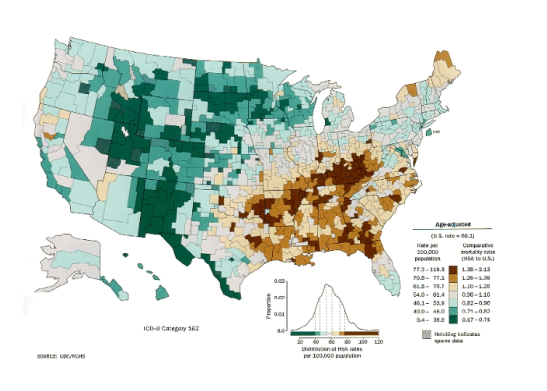
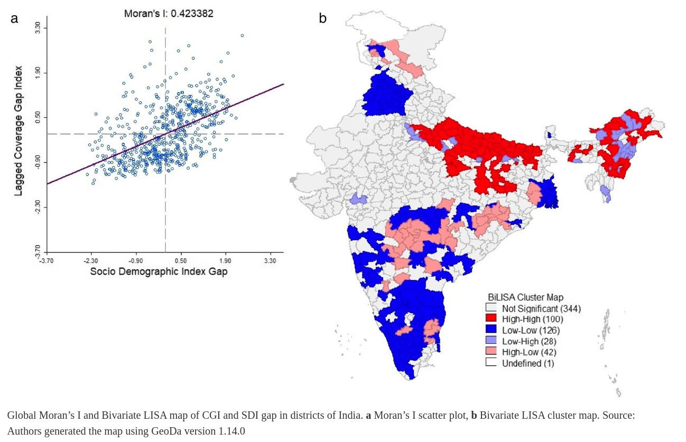

```{r setup, include=FALSE}
library(knitr)
library(rmdformats)

## Global options
options(max.print="75")
knitr::opts_chunk$set(echo=FALSE,
               cache=TRUE,
               prompt=FALSE,
               tidy=TRUE,
               comment=NA,
               message=FALSE,
               warning=FALSE,
               cache.lazy=FALSE)
knitr::opts_knit$set(width=75)

```

```{r klippy}
# Insert copy to clipboard buttons in HTML documents
# remotes::install_github("rlesur/klippy")
# xfun::install_github("rlesur/klippy")
# remotes::install_github("spatstat/spatstat.core")
klippy::klippy(
  lang = c("r", "markdown"),
  all_precode = FALSE,
  position = c("top", "right"),
  color = "whitesmoke",
  tooltip_message = "copiar código",
  tooltip_success = "copiado!"
)

```


```{r}
## Color Format
colFmt <- function(x,color) {
  
  outputFormat <- knitr::opts_knit$get("rmarkdown.pandoc.to")
  
  if(outputFormat == 'latex') {
    ret <- paste("\\textcolor{",color,"}{",x,"}",sep="")
  } else if(outputFormat == 'html') {
    ret <- paste("<font color='",color,"'>",x,"</font>",sep="")
  } else {
    ret <- x
  }

  return(ret)
}
```

📥 [Clique aqui para baixar os dados que iremos utilizar durante as aulas](https://drive.google.com/drive/folders/10WMJYlwHcEX9zw3_RUjDQz5DGZByiI2N?usp=sharing)

# Introdução à Estatística Espacial 

## O que é Estatística Espacial ?

- São métodos estatísticos que levam em consideração a localização espacial do fenômeno estudado;

- Segundo Bailey & Gatrell (1995), *"Análise estatística espacial pode ser realizada quando os dados são espacialmente localizados e se considera explicitamente a possível importância de seu arranjo espacial na análise ou interpretação dos resultados"*

- A primeira pergunta a ser feita é: A distribuição dos dados apresenta um padrão aleatório ou apresenta uma agregação definida (*clusters*) ?

```{r echo=F, fig.align="center", out.width= "70%", fig.show='hold'}
knitr::include_graphics('figuras/imagem1.jpg')
```

## Origem da Estatística Espacial

- Dr. John Snow (1813-1858) $\rightarrow$ Considerado pai da Epidemiologia Moderna


```{r echo=F, fig.align="center", out.width= "80%", fig.show='hold'}
include_graphics('figuras/snow2_2019.png')
```

Mapeamento dos casos de coléra ($\bullet$) e as bombas de água (X) em Londres, 1854.


```{r echo=F, fig.align="center", out.width= "40%", fig.show='hold'}
include_graphics('figuras/snow_2019.png')
```


## Objetivos da Estatística Espacial

1) Análise de padrões espaciais e espaço-temporais (ex: Análise
Exploratória Espacial, Correlação Espacial)

2) Modelagem Espacial (ex: Modelos Estatísticos de Regressão
Espacial)

## Dependência Espacial ou Autocorrelação Espacial

- "Independência é um pressuposto muito conveniente que faz
grande parte da teoria estatística matemática tratável.
Entretanto, modelos que envolvem dependência estatística são
frequentemente mais realísticos. . . . Neste tipos de dados a
dependência está presente em todas as direções e fica mais
fraca a medida em que aumenta a dispersão na localização dos
dados." (Cressie N.,1991)

- *"Todas as coisas se parecem, coisas mais próximas são mais parecidas que
aquelas mais distantes."*  (Tobler, 1979). `r colFmt(" **Também conhecida como $1^a$ Lei da Geografia**",'red')`

# Tipologia dos Dados Espaciais

Os diferentes tipos de dados espaciais são tradicionalmente classificados de acordo com uma tipologia. Esta caracterização diz respeito a natureza estocástica da observação.

Noel Cressie (1993) divide a estatı́stica espacial em 3 grandes áreas:

  i) `r colFmt(" **Dados de processos pontuais**",'darkmagenta')`

  ii) `r colFmt(" **Dados de geoestatística**",'darkmagenta')`

  iii) `r colFmt(" **Dados de área**",'darkmagenta')`

Existem métodos estatı́sticos diferentes para descrever ou analisar estes tipos de dados. Exemplo:

```{r echo=F, fig.align="center", out.width= "75%", fig.show='hold'}
include_graphics('figuras/slide4.jpg')

```

## Padrões Pontuais

* O principal interesse está no conjunto de coordenadas geográficas representando as localizações exatas de eventos.

* Exemplos: Localização de crimes, localização da residência dos casos de dengue, localização de espécies vegetais, etc.

* Neste caso, o dado aleatório de interesse é a localização espacial do evento.


```{r echo=F, fig.align="center", message=FALSE, warning=FALSE, comments=NA, out.width="40%", comment=NA}
knitr::include_graphics('figuras/coordenadas.png')
```


## Focos de incêndios ocorridos em Castilla-La Mancha, Espanha, entre 1998 e 2007.

Esse conjunto de dados, `clmfires`, pertence ao pacote spatstat (Baddeley, Turner e Rubak, 2022).

```{r, echo=T, out.width='90%'}
library(spatstat)
plot(clmfires, use.marks = FALSE, pch = ".") 
```


```{r echo=F, fig.align="center", message=FALSE, warning=FALSE, comments=NA, out.width="70%", comment=NA}
knitr::include_graphics('figuras/pontos1.jpg')
```

```{r echo=F, fig.align="center", out.width= "55%", fig.show='hold'}
knitr::include_graphics('figuras/Cluster2.png')
```

### Estimativas de Kernel (ou Mapas de Calor)


```{r echo=F, fig.align="center", out.width= "45%", fig.show='hold'}
knitr::include_graphics('figuras/kernel2.png')
```

* Estimador de intensidade de distribuição de pontos: 

$$\hat{\lambda}_{\tau}(u) = \dfrac{1}{\tau^2}\sum k(\dfrac{d(u_i , u)}{\tau}), d(u_i , u) \leq \tau$$
[*Fonte: Referência científica: Druck, S.; Carvalho, M.S.; Câmara, G.; Monteiro, A.V.M. (eds) "Análise Espacial de Dados Geográficos". Brasília, EMBRAPA, 2004](http://www.dpi.inpe.br/gilberto/livro/analise/cap2-eventos.pdf)

```{r echo=F, fig.align="center", out.width= "60%", fig.show='hold'}
knitr::include_graphics('figuras/kernel3.png')
```

* Localização da ocorrência de casos de dengue em Belo Horizonte/MG

```{r echo=F, fig.align="center", out.width= "50%", fig.show='hold'}
knitr::include_graphics('figuras/dengueBH.png')
```

## Geoestatística

* Podemos definir como sendo uma análise de um atributo espacialmente contínuo amostrado em localizações fixas.

* Os dados compreendem um conjunto de localizações (em geral latitudes e longitudes), mas atribuidos a eles uma medida, como por exemplo: volume de chuva, concentração de poluentes no ar, número de ovos de Aedes postado em ovitrampas, etc.


## Amostras de concentrações de chumbo na camada superficial do sol

Esse conjunto de dados (`meuse`) se trata das concentrações de chumbo na camada superficial do solo (mg por kg de solo) em vários locais amostrados em uma planície de inundação do rio Meuse, próximo a Stein, na Holanda, obtidas a partir do pacote sp (Pebesma e Bivand, 2022).

```{r, echo=T, out.width='90%'}
library(sp)
library(sf)
library(mapview)

data(meuse)
meuse <- st_as_sf(meuse, coords = c("x", "y"), crs = 28992)
mapview(meuse, zcol = "lead",  map.types = "CartoDB.Voyager")
```


* A determinação experimental do semivariograma, para cada valor de $x_i$, considera todos os pares de amostras $z(x)$ e $z(x+h)$, separadas pelo vetor distância $h$, a partir da equação: 

```{r echo=F, fig.align="center", out.width= "25%", fig.show='hold'}
knitr::include_graphics('figuras/variograma3.png')
```


$$\hat{\gamma}(h) = \dfrac{1}{2N(h)}\sum^{N(h)}_{i=1}[z(x_i) - z(x_i + h)]^2 $$

* Sendo $\hat{\gamma}(h)$ o semivariograma estimado e $N(h)$ o número de pares de valores medidos, $z(x)$ e $z(x+h)$, separados pelo vetor $h$.  

```{r echo=F, fig.align="center", out.width= "40%", fig.show='hold'}
include_graphics('figuras/variograma1.png')
```

* Esta fórmula, entretanto, não é robusta. Podem existir situações em que variabilidade local não é constante e se
modifica ao longo da área de estudo (heteroscedasticidade). 

```{r echo=F, fig.align="center", out.width= "40%", fig.show='hold'}
include_graphics('figuras/variograma2.png')
```

[*Fonte: Referência científica: Druck, S.; Carvalho, M.S.; Câmara, G.; Monteiro, A.V.M. (eds) "Análise Espacial de Dados Geográficos". Brasília, EMBRAPA, 2004](http://www.dpi.inpe.br/gilberto/livro/analise/cap3-superficies.pdf)


* **Exemplo:** Mapa sobre o teor de argila no solo.

```{r echo=F, fig.align="center", out.width= "70%", fig.show='hold'}
knitr::include_graphics('figuras/geoestatistica7.png')
```


## Dados de Área

* Na análise de áreas o atributo estudado é em geral resultado de uma medida sumáraria (ex: contagem, taxas, médias, etc.) em uma determinada área bem definida, por exemplo um polígono.

* Tal polígono cuja forma pode ser complexa bem como as relações de vizinhança.

* O objetivo é a detecção e explicação de padrões e tendências observados entre áreas.


### Mapa Temático

* Taxas de câncer de pulmão na população branca masculina nos Estados Unidos, por condados no ano de 1998

```{r echo=F, fig.align="center", out.width="70%"}

```

## Mapa Temático Mundial da Expectativa de Vida entre os Países

```{r, echo=T, out.width='90%'}
library(tmap)
data(World)
tmap_style("classic")
# Desenhando um rápido mapa temático mundial para esperança de vida.
qtm(World, fill = "life_exp")
```

### Matriz de Vizinhança

```{r echo=F, fig.align="center", out.width="55%"}
knitr::include_graphics('figuras/vizinhanca.png')
```

### Moran Global, Moran Local e Lisa Map

```{r echo=F, fig.align="center", out.width="20%", fig.cap="Moran Global"}
knitr::include_graphics('figuras/moran_global.png')
```

```{r echo=F, fig.align="center", out.width="30%", fig.cap="Moran Local"}
knitr::include_graphics('figuras/moran_local.png')
```

* Desigualdade no nível distrital na cobertura de saúde reprodutiva, materna, neonatal e infantil na Índia

```{r echo=F, fig.align="center", out.width="90%"}

```

[Fonte: PANDA, Basant Kumar; KUMAR, Gulshan; AWASTHI, Ashish. District level inequality in reproductive, maternal, neonatal and child health coverage in India. BMC public health, v. 20, n. 1, p. 1-10, 2020.](https://bmcpublichealth.biomedcentral.com/articles/10.1186/s12889-020-8151-9)

### Modelos de Regressão Espacial

* `r colFmt(" Hipótese de independência das observações em geral é Falsa ",'orange')` $\rightarrow$ Dependência Espacial

* Efeitos Espaciais $\rightarrow$ Se existir forte tendência ou correlação espacial, os resultados serão influenciados, apresentando associação estatística onde não existe (e vice-versa);

* `r colFmt("**Como verificar ?** ",'darkred')` $\rightarrow$ Medir a autocorrelação espacial dos resíduos da regressão (Índice de Moran dos resíduos).

* Autocorrelação espacial constatada ! E agora ? $\rightarrow$ Utilizar Modelos de regressão que incorporam efeitos espaciais:

    i) **Modelos Globais:** utilizam um único parâmetro para capturar a estrutura de correlação espacial $\rightarrow$ ex: *Spatial Error Models (CAR)*
    
$$y_i = \beta_0 + \sum^{p}_{k} \beta_k x_{ik}  + \varepsilon_i \text{    , sendo  }  \varepsilon_i = \lambda  W + \xi$$

  * Os efeitos da autocorrelação espacial são associados ao termo de erro. Sendo  $W$ a matriz de vizinhaça, $\varepsilon$ a componente do erro com efeitos espaciais, $λ$ é o coeficiente autoregressivo e $\xi$ é a componente do erro com variância constante e não
correlacionada. 

  * A hipótese nula para a não existência de autocorrelação é que $\lambda = 0$, ou seja, o termo de erro não é espacialmente correlacionado. 

    ii) **Modelos Locais:** parâmetros variam continuamente no espaço ex: *Geographically Weighted Regression (GWR)*
    
$$y_i = \beta_{0}(u_i, v_i) + \sum^{p}_{k}  \beta_k (u_i, v_i) x_{ik} + \varepsilon_i \text{    , sendo  } (u_i, v_i) \text{    as coordenadas geográficas}$$
[Fonte: ARDILLY, Pascal et al. Manuel d’analyse spatiale. 2018.](https://ec.europa.eu/eurostat/documents/3859598/9462709/INSEE-ESTAT-SPATIAL-ANA-18-EN.pdf)


# Algumas Ferramentas para Estatística Espacial

## SiG QGIS

```{r echo=F, fig.align="center", out.width="80%"}
knitr::include_graphics('figuras/QGIS.png')
```

[QGIS: Um Sistema de Informação Geográfica livre e aberto](https://www.qgis.org/pt_BR/site/)

## GEODA

```{r echo=F, fig.align="center", out.width="80%"}
knitr::include_graphics('figuras/GEODA.png')
```

[GEODA: AN INTRODUCTION TO SPATIAL DATA ANALYSIS](https://spatial.uchicago.edu/geoda)


## R

```{r echo=F, fig.align="center", out.width="60%"}
knitr::include_graphics('figuras/logo_ubuntu.png')
```

Fonte: [Dicas para integração e instalação do R 4.2 no Ubuntu 22.04 LTS e os pacotes espaciais](https://rtask.thinkr.fr/installation-of-r-4-2-on-ubuntu-22-04-lts-and-tips-for-spatial-packages/)


## Python

```{r echo=F, fig.align="center", out.width="60%"}
knitr::include_graphics('figuras/geopandas.png')
```

Fonte: [Github Geopandas](https://geopandas.org/en/stable/)

# Aplicações da Estatística Espacial utilização o pacote estatístico R:

## Aplicação I: Estudo de John Snow

- Segue algumas aplicações com os dados do pacote `cholera`, que contêm as localizações das mortes por cólera no famoso estudo de John Snow (Londres, 1854).

```{r, echo=T, out.width='90%'}
# install.packages("cholera")
library(cholera)

#  Mortes por cólera
head(fatalities[,1:3])
```

```{r, echo=T, out.width='90%'}
# Dados das Bombas de Água
head(pumps[,1:4])
```


```{r, echo=T, out.width='90%'}
# Visualizar mapa 
snowMap(add.cases = TRUE, add.pumps = TRUE, case.col = "darkred")

```

```{r, echo=T, out.width='90%'}
# Instalar e carregar pacotes necessários
# install.packages(c("spatstat", "MASS", "sf", "raster"))
library(spatstat)
library(MASS)
library(sf)
library(raster)
library(viridis)

# Carregar dados
data(fatalities)
data(pumps)
data(roads)
```

```{r, echo=T, out.width='90%'}
# Kernel 2D simples
kernel_simple <- kde2d(fatalities$x, fatalities$y, 
                       n = 100,  # Resolução
                       lims = c(range(fatalities$x), 
                               range(fatalities$y)))

# Plotar
par(mfrow = c(1, 2))

# Contorno
contour(kernel_simple, 
        main = "Densidade de Kernel - Contorno",
        xlab = "Coordenada X", 
        ylab = "Coordenada Y",
        col = "darkred",
        lwd = 2)
points(fatalities$x, fatalities$y, pch = ".", col = "red")
points(pumps$x, pumps$y, pch = 4, col = "blue", cex = 1.5, lwd = 2)

# Imagem de calor
image(kernel_simple, 
      main = "Densidade de Kernel - Heatmap",
      col = heat.colors(50))
contour(kernel_simple, add = TRUE, col = "white")
points(pumps$x, pumps$y, pch = 4, col = "blue", cex = 1.5, lwd = 2)
```


```{r, echo=T, out.width='90%'}
#  Comparação de Diferentes Bandwidths
# Criar diferentes kernels
bandwidths <- c(0.2, 0.5, 1.0, 2.0)

par(mfrow = c(2, 2))

for (h in bandwidths) {
  kernel_h <- kde2d(fatalities$x, fatalities$y, 
                    h = h,
                    n = 100,
                    lims = c(range(fatalities$x), range(fatalities$y)))
  
  image(kernel_h,
        main = paste("Bandwidth =", h),
        col = terrain.colors(50),
        xlab = "X", ylab = "Y")
  
  contour(kernel_h, add = TRUE, col = "white", lwd = 0.5)
  points(pumps$x, pumps$y, pch = 4, col = "blue", cex = 1.2, lwd = 1.5)
  
  # Adicionar número de mortes no título secundário
  mtext(paste("Mortes:", nrow(fatalities)), side = 3, line = 0.3, cex = 0.8)
}

```


```{r, echo=T, out.width='90%'}
# Kernel 3D 

library(plotly)

# Calcular kernel
kernel_3d <- kde2d(fatalities$x, fatalities$y, n = 50)

# Criar plot 3D
plot_ly() |>
  add_surface(
    x = kernel_3d$x,
    y = kernel_3d$y,
    z = kernel_3d$z,
    colorscale = list(c(0, "white"), c(1, "red")),
    opacity = 0.8,
    name = "Densidade"
  ) |>
  add_markers(
    x = fatalities$x,
    y = fatalities$y,
    z = rep(0, nrow(fatalities)),
    marker = list(size = 3, color = "black", symbol = "circle"),
    name = "Mortes"
  ) |>
  add_markers(
    x = pumps$x,
    y = pumps$y,
    z = rep(0, nrow(pumps)),
    marker = list(size = 8, color = "blue", symbol = "x"),
    name = "Bombas"
  ) |>
  layout(
    title = "DENSIDADE 3D DO SURTO DE CÓLERA",
    scene = list(
      xaxis = list(title = "Coordenada X"),
      yaxis = list(title = "Coordenada Y"),
      zaxis = list(title = "Densidade"),
      camera = list(eye = list(x = 1.5, y = 1.5, z = 1.5))
    ),
    showlegend = TRUE
  )
```


## Aplicação II: Construindo mapa temático


#### Bibliotecas que serão utilizadas:

```{r, echo=T}
library(ggplot2)
library(dplyr)
library(viridis)
library(geobr)
library(sf)
library(maptools)
library(leaflet)
library(ggspatial)

```


```{r, echo=T}
brasil.ufs <- st_read("malhas/brasil_ufs_2019.shp")
```

#### Primeiro, vamos fazer um gráfico apenas com as geometrias.

```{r, echo=T}
ggplot(brasil.ufs) + 
  geom_sf()
```

* Para a construção de um mapa onde cada estado recebe uma cor de acordo com a sua região geogrática, procedemos da seguinte forma: 

```{r, echo=T,  out.width="70%"}
ggplot(brasil.ufs) + 
  geom_sf(aes(fill = nam_rgn)) + 
  labs(fill="Região")
```

* Agora utilizaremos dados relativos a porcentagem de municípios com rede de esgoto de acordo com a unidade da federação ([fonte dos dados](https://pt.wikipedia.org/wiki/Lista_de_unidades_federativas_do_Brasil_por_acesso_%C3%A0_rede_de_esgoto) ) para fazer um gráfico. Vamos associar esses dados a tabela de acordo com a variável State e padronizaremos a porcentagem para variar de 0 a 100.


```{r, echo=T,  out.width="70%"}
# Entrando com os dados observados na wikipedia
acesso_san <- data.frame(cod_stt = c(12, 27, 16, 13, 29, 23, 53, 32, 52, 21, 51, 50, 31, 15, 
                                   25, 41, 26, 22, 33, 24, 43, 11, 14, 42, 35, 28, 17), 
                         com_rede = c(0.273, 0.412, 0.313, 0.177, 0.513, 0.696, 1.000, 0.974, 0.280, 0.065, 
                                      0.191, 0.449, 0.916, 0.063, 0.731, 0.421, 0.881, 0.045, 0.924, 0.353, 
                                      0.405, 0.096, 0.400, 0.352, 0.998, 0.347, 0.129))
```

<center>

```{r, echo=T,  out.width="80%"}
# Construindo o mapa com ggplot
brasil.ufs |> 
  left_join(acesso_san, by = "cod_stt") |> 
  mutate(com_rede = 100*com_rede) |> 
  ggplot(aes(fill = com_rede), color = "black") +
    geom_sf() + 
    scale_fill_viridis(name = "Municípios com rede de esgoto (%)", direction = -1) + 
  xlab("Longitude") + 
  ylab("Latitude") +
  annotation_scale(location = "bl") +
  annotation_north_arrow(location = "br") +
    theme_minimal()
```

</center>

* Uma forma alteranativa de apresentar esses mesmos dados se dá pela apresentação de círculos com raios proporcionais a porcentgem de municípios com rede de esgoto no centroide de cada geometria (nesse caso, UF).


```{r, echo=T,  out.width="80%"}
# Juntando o banco com os dados + malha
coord_pontos <- brasil.ufs |> 
                  left_join(acesso_san, by = "cod_stt") |> 
                  mutate(com_rede = 100*com_rede) |> 
                  st_centroid()
```

<center>

```{r, echo=T,  out.width="80%"}
# Construindo o mapa com ggplot
ggplot(brasil.ufs)+ 
  geom_sf() + 
  geom_sf(data = coord_pontos, aes(size = com_rede), col = "blue", alpha = .65,
          show.legend = "point") + 
  scale_size_continuous(name = "Municípios com rede de esgoto (%)") + 
  xlab("Longitude") + 
  ylab("Latitude") +
  annotation_scale(location = "bl") +
  annotation_north_arrow(location = "br") +
    theme_minimal()
```

</center>

* Uma alternativa interativa para trabalhar com mapas é com a utilização do pacote *leaflet*

<center>

```{r, echo=T,  out.width="70%"}
data.frame(st_coordinates(coord_pontos), 
           com_rede = coord_pontos$com_rede, 
           UF = coord_pontos$nam_stt) |>
  leaflet() |> 
    addTiles() |>
    addCircleMarkers(~ X, ~ Y,
                     label = ~ as.character(paste0(UF, ": ", com_rede, "%")),
                     labelOptions = labelOptions(textsize = "13px"),
                     radius = ~ com_rede/10,
                     fillOpacity = 0.5)

```
</center>

[Créditos ao Thiago Mendonça](https://www.tiagoms.com/post/mapa/)

## Geoestatística com dados de pluviosidade na cidade do Rio de Janeiro/RJ

#### Biliotecas do R que serão utilizadas

```{r, echo=T}
library(sf)
library(sp)
library(dplyr)
library(gstat)
library(lattice)
library(automap)
library(raster)
library(leaflet)
```

#### Importando a tabela com a chuva acumulada média de 7 dias das últimas 24hs e 96hs das estações pluviométricas da cidde do Rio de Janeiro

[Descrição das Estações (Alerta Rio)](http://www.sistema-alerta-rio.com.br/dados-meteorologicos/info-estacoes/)

[Download Dados Pluviométricos (Alerta Rio)](http://www.sistema-alerta-rio.com.br/dados-meteorologicos/download/dados-pluviometricos/)

```{r, echo=T}
pluvio <- read.csv("dados/chuva_rio/pluviosidade.csv", sep=";")
```

#### Análise Gráfica Descritiva 

```{r, echo=T}
quantil <- quantile(pluvio$acumulado_24h, seq(0,1,0.2))
quantil
```

#### Transformar os dados em um objeto espacial do R

* x - Longitude
* y - Latitude

```{r, echo=T}
sp::coordinates(pluvio) = ~ x + y
```

#### Análise Gráfica Descritiva com os dados espaciais

```{r, echo=T,  out.width="90%"}
# Bubble plot
bubble(pluvio, "acumulado_24h", key.entries = quantil, pch=19, col="blue")
```

```{r, echo=T,  out.width="90%"}
# Point plot
spplot(pluvio['acumulado_24h'], scales=list(draw=T), key.space="right", colorkey=T)
```

#### Modelando o variograma experimental (ou empírico)

- **width** - Distância média entre amostras ou distância dos lags
- **cutoff** - Máxima distância

```{r, echo=T}
variogram.emp = variogram(acumulado_24h ~x+y, pluvio, width=1000, cutoff=20000)
variogram.emp
```

```{r, echo=T}
# Variogram plot
plot(variogram.emp, main = "Empirical variogram", pch = 19, col = "darkblue")
```

#### Ajustando o semivariograma teórico

- **Sill** - Semivariância estrutural ou contribuição (ponto máximo que chega ao plato no eixo de y)
- **Range** - Alcance (ponto máximo em x)
- **Nugget** - Efeito pepita, quando (y, 0)

```{r echo=F, fig.align="center", out.width= "70%", fig.show='hold'}
include_graphics('figuras/variograma_model.png')
```
[Fonte do gráfico](https://vsp.pnnl.gov/help/Vsample/Kriging_Variogram_Model.htm)


```{r, echo=T}
## 1) Modelo Linear
lin.fit  = fit.variogram(variogram.emp, 
                          model = vgm(psill = 240, model = "Lin",
                                      range = 5000, nugget = 10))

## 2) Modelo exponencial
exp.fit  = fit.variogram(variogram.emp, 
                          model = vgm(psill = 240, model = "Exp",
                                      range = 5000, nugget = 10))

## 3) Modelo gaussiano
gau.fit  = fit.variogram(variogram.emp, 
                          model = vgm(psill = 240, model = "Gau",
                                      range = 5000, nugget = 10))

## 3) Modelo wave
wav.fit  = fit.variogram(variogram.emp, 
                         model = vgm(psill = 240, model = "Wav",
                                     range = 5000, nugget = 10))
```

```{r, echo=T, out.width= "100%"}
plot.lin <- plot(variogram.emp, lin.fit, main = "Modelo Linear")
plot.exp <- plot(variogram.emp, exp.fit, main = "Modelo Exponencial")
plot.gau <- plot(variogram.emp, gau.fit, main = "Modelo Gaussiano")
plot.wav <- plot(variogram.emp, wav.fit, main = "Modelo Wave")
```

#### Validação cruzada 

- **RMSE** (root mean squared error): é a medida que calcula "a raiz quadrática média" dos erros entre valores observados (reais) e predições (hipóteses).

```{r, echo=T}
## 1) Modelo Linear
cv.lin <- krige.cv(acumulado_24h ~x+y, locations = pluvio, model = lin.fit)
summary(cv.lin)
plot(cv.lin$var1.pred ~ cv.lin$observed, cex = 1.2, lwd = 2)
abline(0, 1, col = "lightgrey", lwd = 2)
lm_lin <- lm(cv.lin$var1.pred ~ cv.lin$observed)
abline(lm_lin, col = "red", lwd = 2)
r2_lin = summary(lm_lin)$r.squared
rmse_lin = hydroGOF::rmse(cv.lin$var1.pred, cv.lin$observed)

## 2) Modelo exponencial
cv.exp <- krige.cv(acumulado_24h ~x+y, locations = pluvio, model = exp.fit)
summary(cv.exp)
plot(cv.exp$var1.pred ~ cv.exp$observed, cex = 1.2, lwd = 2)
abline(0, 1, col = "lightgrey", lwd = 2)
lm_exp <- lm(cv.exp$var1.pred ~ cv.exp$observed)
abline(lm_exp, col = "red", lwd = 2)
r2_exp = summary(lm_exp)$r.squared
rmse_exp = hydroGOF::rmse(cv.exp$var1.pred, cv.exp$observed)

## 3) Modelo Gaussiano
cv.gau <- krige.cv(acumulado_24h ~x+y, locations = pluvio, model = gau.fit)
summary(cv.gau)
plot(cv.gau$var1.pred ~ cv.gau$observed, cex = 1.2, lwd = 2)
abline(0, 1, col = "lightgrey", lwd = 2)
lm_gau <- lm(cv.gau$var1.pred ~ cv.gau$observed)
abline(lm_gau, col = "red", lwd = 2)
r2_gau = summary(lm_gau)$r.squared
rmse_gau = hydroGOF::rmse(cv.gau$var1.pred, cv.gau$observed)

## 4) Modelo Wave
cv.wav <- krige.cv(acumulado_24h ~x+y, locations = pluvio, model = wav.fit)
summary(cv.wav)
plot(cv.wav$var1.pred ~ cv.wav$observed, cex = 1.2, lwd = 2)
abline(0, 1, col = "lightgrey", lwd = 2)
lm_wav <- lm(cv.wav$var1.pred ~ cv.wav$observed)
abline(lm_wav, col = "red", lwd = 2)
r2_wav = summary(lm_wav)$r.squared
rmse_wav = hydroGOF::rmse(cv.wav$var1.pred, cv.wav$observed)
```

```{r, echo=T}
# Criando uma tabela das estatística de R2 e RMSE
df.r2 <- data.frame(r2_lin, r2_exp, r2_gau, r2_wav)
df.rmse <- data.frame(rmse_lin, rmse_exp, rmse_gau, rmse_wav)
tabela <- data.frame(cbind(t(df.r2), t(df.rmse)))
colnames(tabela) <- c('R2', 'RMSE')
rnames <- gsub('r2_','', rownames(tabela)) # remove o prefixo r2 dos nomes das linhas
rownames(tabela) <- rnames # substitui o nome das linhas simplificadas na tab original
tabela
```

#### Criando os grids do contorno da cidade do Rio de Janeiro para intermpolação

```{r, echo=T}
# Importando o contorno do Rio
contorno.rio <- shapefile('dados/chuva_rio/MUNIC_2K_2022_IPP_SIRGAS.shp')
```

```{r, echo=T}
# Criando grade para interpolacao com a  resolucao de 50m
r <- raster(contorno.rio, res = 50)

# Criando um objeto formato raster
rp <- rasterize(contorno.rio, r, 0) 

# Trasnsformando o objeto raster no formato SpatialPixelsDataFrame
grid <- as(rp, "SpatialPixelsDataFrame") 
sp::plot(grid)
```

#### Krigagem

```{r, echo=T}
# Colocando os dados de chuva e o grid na mesma projecao
sp::proj4string(pluvio) = CRS(proj4string(contorno.rio))

mapa_chuva_lin <- krige(acumulado_24h ~1, pluvio, grid, model =lin.fit)
mapa_chuva_exp <- krige(acumulado_24h ~1, pluvio, grid, model =exp.fit)
mapa_chuva_gau <- krige(acumulado_24h ~1, pluvio, grid, model =gau.fit)
mapa_chuva_wav <- krige(acumulado_24h ~1, pluvio, grid, model =wav.fit)
```

```{r, echo=T, out.width= "100%"}
plot.lin <- plot(mapa_chuva_lin, main = "Modelo Linear")
plot.exp <- plot(mapa_chuva_exp, main = "Modelo Exponencial")
plot.gau <- plot(mapa_chuva_gau, main = "Modelo Gaussiano")
plot.wav <- plot(mapa_chuva_wav, main = "Modelo Wave")

```

#### Auto Krige 

```{r, echo=T}
# Modelando
auto.krige = autoKrige(acumulado_24h~x+y, pluvio, grid, model = 'Exp')
summary(auto.krige)
```

```{r, echo=T}
# Validação cruzada
auto.krige.cv <- autoKrige.cv(acumulado_24h~x+y, pluvio, model = 'Exp')
summary(auto.krige.cv)
```

#### Convertendo para o formato raster - auto krige

```{r, echo=T}
raster_chuva <- raster(auto.krige$krige_output)
plot(raster_chuva)
```

- Caso queira salvar a imagem raster em um arquivo formato geotiff para ler em algum SIG por exemplo:

```{r, echo=T}
# Exportando o objeto da imagem
writeRaster(raster_chuva,
            filename = 'dados/chuva_rio/chuva_auto.tiff',
            format = 'GTiff',
            overwrite = T)

# Importando de volta para o R
raster_chuva <- raster("dados/chuva_rio/chuva_auto.tiff")
```

#### Fazendo o mapa interativo com as estações

```{r, echo=T}
# Importando os dados referente as estatções pluviométricas
estacoes.sf <- read_sf('dados/chuva_rio/Estac_C3_B5es_Alerta_Rio.shp')

# Convertendo UTM para Lat Long das estacoes
estacoes.longlat <- st_transform(estacoes.sf, "+proj=longlat +ellps=WGS84 +datum=WGS84")
estacoes.longlat$coords <- st_coordinates(estacoes.longlat)
estacoes.longlat$X <- estacoes.longlat$coords[,1]
estacoes.longlat$Y <- estacoes.longlat$coords[,2]
```

```{r, echo=T}
# Importando a malha de bairros
bairros.sf <- read_sf('dados/chuva_rio/BAIRROS_2K_2022_IPP_SIRGAS.shp')

# Convertendo UTM para Lat Long a malha dos bairros
bairros.longlat <- st_transform(bairros.sf, "+proj=longlat +ellps=WGS84 +datum=WGS84")
```

```{r, echo=T}
# Convertendo o raster da chuva para lat long 
raster_chuva_longlat <- projectRaster(raster_chuva, crs = CRS("+proj=longlat +datum=WGS84"))
```

```{r, echo=T}
# Definindo Paleta de cores da superfície interpolada da chuva
pal <- colorNumeric(c("#000066", "#00c8f8", "#F0E68C","#FFFF00", "#FF8C00"), values(raster_chuva_longlat), na.color = "transparent", reverse = T)
```

```{r, echo=T, out.width= "100%"}
# Construindo o mapa interativo via leaflet

leaflet(data = estacoes.longlat, options = leafletOptions(
  attributionControl=FALSE)) |> 
  # addTiles() |>
  addProviderTiles("CartoDB.Positron", group = "Ruas") |>
  addProviderTiles("Esri.WorldImagery", options = providerTileOptions(opacity = 0.7), group = "Satélite") |> 
  addProviderTiles(providers$CartoDB.Voyager, group = "Voyager") |>
  addProviderTiles(providers$Stadia.StamenToner, group = "Toner") |>
  setView(lng = -43.42, lat = -22.90, zoom = 10.4) |>
  # addProviderTiles(providers$CartoDB.Voyager) |>
  addMarkers(~X, ~Y, popup = ~as.character(est), label = ~as.character(est),
             group = "Estações")  |>
  ############## Polígonos dos Bairros ################
addPolygons(data=bairros.longlat,
            weight = 3,
            color = "darkblue",
            smoothFactor = 1,
            fill = FALSE,
            labelOptions = labelOptions(
              style = list("font-weight" = "normal", padding = "3px 8px"),
              textsize = "13px",
              direction = "auto"), 
            group = "Bairros") |>
  ########## Adicionando o raster  #########################
addRasterImage(raster_chuva_longlat, colors = pal, opacity = 0.8,
               group = "Chuva: 1 semana") %>%
  leaflet::addLegend(pal = pal, values = values(raster_chuva_longlat),
                     title = "Chuva Acumulada - 1 semana", group = "Chuva: 1 semana") |>
  ############## Controle das layers (botoes) ################
addLayersControl(
  baseGroups = c("Voyager", "Ruas", "Satélite", "Toner"),
  overlayGroups = c("Estações", "Bairros",  "Chuva: 1 semana"),
  options = layersControlOptions(collapsed = FALSE),
  position = "bottomleft") |>
  ########## Desabilitando os grupos ################
hideGroup(group = c("Bairros"))

```

## Bibliografia sugerida

* Druck, S.; Carvalho, M.S.; Câmara, G.; Monteiro, A.V.M. (eds). [Análise Espacial de Dados Geográficos](http://www.dpi.inpe.br/gilberto/livro/analise/). Brasília, EMBRAPA, 2004.

* Interactive Spatial Data Analysis by Trevor C. Bailey , Anthony C. Gatrell Routledge, 1995

* Applied Spatial Statistics for Public Health Data; Lance A. Waller, Carol A. Gotway Wiley-Interscience 1St ed. 2004

* Applied Spatial Data Analysis with R; Roger S. Bivand, Edzer Pebesma , Virgilio Gomez-Rubio Springer; Edição: 2nd ed. 2013

* Geocomputation with R by Robin Lovelace, Jakub Nowosad and Jannes Muenchow. [Geocomputation with R](https://geocompr.robinlovelace.net/), 2021.

* Spatial Statistics Workbook of Department of Criminology at the University of Manchester by Reka Solymosi and Juanjo Medina [Crime Mapping in R](https://maczokni.github.io/crime_mapping_textbook/)

* Spatial Data Science with R
[Spatial Data Science with R](https://rspatial.org/raster/index.html)

* GeoComputation and Spatial Analysis practicals by Lex Comber
[On-line Book](https://bookdown.org/lexcomber/GEOG3195/)

* GEOG5917 Big Data & Consumer Analytics - RStudio Practicals by Lex Comber
[On-line Book](https://bookdown.org/lexcomber/GEOG5917/)

<!-- # Programa de Pós-Graduação em Epidemiologia em Saúde Pública (ENSP/FIOCRUZ) -->

<!-- - Programa de Pós-Graduação em Epidemiologia em Saúde Pública (ENSP/FIOCRUZ) [link](http://ensino.ensp.fiocruz.br/cursos/mestrado-e-doutorado/epidemiologia-em-saude-publica)) -->

<!-- ```{r echo=F, fig.align="center", out.width="80%"} -->
<!--  -->
<!-- ``` -->

<!-- # Programa de Pós-Graduação em Ciências Veterinárias (IV/UFRRJ) -->

<!-- - Programa de Pós-Graduação em Ciências Veterinárias (IV/UFRRJ) [link](http://cursos.ufrrj.br/posgraduacao/ppgcv/) -->

<!-- ```{r echo=F, fig.align="center", out.width="80%"} -->
<!--  -->
<!-- ``` -->

<!-- # Obrigado !!!!! -->

<!-- ```{r echo=F, fig.align="center", out.width="90%"} -->
<!--  -->
<!-- ``` -->