**Wagner Tassinari**  
Fundação Oswaldo Cruz (FIOCRUZ)  
Universidade Federal Rural do Rio de Janeiro (UFRRJ)  
📧 tassinari@ufrrj.br


```{r setup, include=FALSE}
library(knitr)
library(rmdformats)

## Global options
options(max.print="75")
knitr::opts_chunk$set(echo=FALSE,
               cache=TRUE,
               prompt=FALSE,
               tidy=TRUE,
               comment=NA,
               message=FALSE,
               warning=FALSE,
               cache.lazy=FALSE)
knitr::opts_knit$set(width=75)


```

```{r klippy}
# Insert copy to clipboard buttons in HTML documents
# remotes::install_github("rlesur/klippy")
# xfun::install_github("rlesur/klippy")
# remotes::install_github("spatstat/spatstat.core")
klippy::klippy(
  lang = c("r", "markdown"),
  all_precode = FALSE,
  position = c("top", "right"),
  color = "whitesmoke",
  tooltip_message = "copiar código",
  tooltip_success = "copiado!"
)

```


```{r}
## Color Format
colFmt <- function(x,color) {

outputFormat <- knitr::opts_knit$get("rmarkdown.pandoc.to")

   if(outputFormat == 'latex') {
     ret <- paste("\\textcolor{",color,"}{",x,"}",sep="")
   } else if(outputFormat == 'html') {
     ret <- paste("<font color='",color,"'>",x,"</font>",sep="")
   } else {
     ret <- x
   }

   return(ret)
 }
```

# 📍 Introdução à Estatística Espacial 

## O que é Análise Estatística Espacial ?

- São métodos estatísticos que levam em consideração a localização espacial do fenômeno estudado;

- Segundo Bailey & Gatrell (1995), *"A análise estatística espacial é aplicada quando os dados possuem localização geográfica e quando o arranjo espacial desses dados é considerado relevante para a análise e interpretação dos resultados."*

- A primeira questão a ser considerada é: os dados seguem um padrão aleatório ou indicam a presença de agregações bem definidas (*clusters*) ?

```{r echo=F, fig.align="center", out.width= "80%", fig.show='hold'}
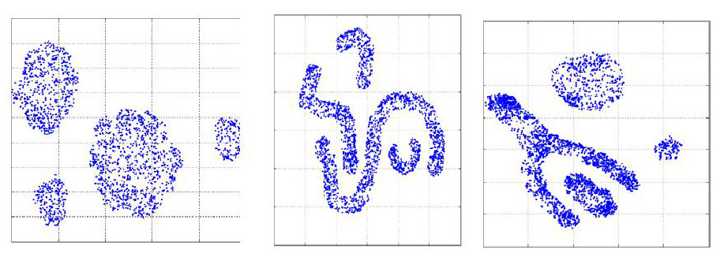
```

## Origem da Estatística Espacial

O uso de dados espaciais na saúde teve um marco histórico com John Snow, que em 1854 mapeou um surto de cólera em Londres, desafiando a teoria miasmática* ao identificar a contaminação da água como causa da doença. Ao mapear as mortes por cólera no Soho, John Snow identificou um foco ao redor da bomba de água da Broad Street, apoiando sua hipótese de transmissão hídrica.

<span style="font-size: 10px;">
*"Miasmática" refere-se à teoria que defendia que as doenças eram causadas por vapores ou odores nocivos (miasmas) provenientes de matéria orgânica em decomposição, particularmente em áreas úmidas ou com má higiene.
</span>


```{r echo=F, fig.align="center", out.width= "80%", fig.show='hold'}
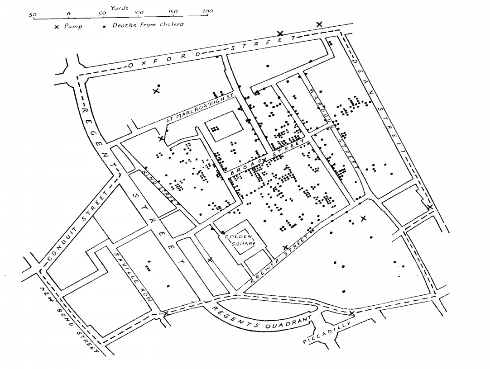
```
<span style="font-size: 11px;">
- Mapeamento dos casos de coléra ($\bullet$) e as bombas de água (X) em Londres, 1854.
</span>

- Dr. John Snow (1813-1858) $\rightarrow$ Considerado pai da Epidemiologia Moderna

```{r echo=F, fig.align="center", out.width= "40%", fig.show='hold'}

```
\

A imagem mostra homenagens a John Snow em Soho, Londres: um retrato na fachada de um pub, a réplica da bomba de água da Broad Street, e uma placa que marca a descoberta de que a cólera era transmitida pela água contaminada em 1854.

## Objetivos da Estatística Espacial

1) Investigar padrões espaciais e espaço-temporais, por meio de técnicas como a Análise Exploratória de Dados Espaciais (AEDE) e medidas de correlação espacial, visando identificar estruturas, agrupamentos e dependências nos dados geográficos.

2) Modelar fenômenos espaciais utilizando modelos estatísticos apropriados, como regressões espaciais (ex: SAR, CAR, GWR) e modelos espaço-temporais, que permitem controlar efeitos de vizinhança (dependência espacial) e heterogeneidade geográfica, com o objetivo de explicar e/ou prever fenômenos influenciados pela localização geográfico.

## Dependência Espacial ou Autocorrelação Espacial

- Segundo Cressie (1991), embora a suposição de independência entre observações torne a teoria estatística mais tratável, modelos que incorporam *dependência estatística* costumam ser mais realistas, especialmente em contextos espaciais. Nesse tipo de dado, a *dependência entre observações ocorre em múltiplas direções* e tende a diminuir conforme aumenta a distância entre os locais amostrados. Em outras palavras, valores próximos no espaço tendem a ser mais semelhantes entre si do que valores distantes, o que caracteriza a autocorrelação espacial.

- *"Todas as coisas se parecem, porém coisas mais próximas tendem a ser mais semelhantes do que aquelas mais distantes."*  (Tobler, 1979). `r colFmt(" **Também conhecida como $1^a$ Lei da Geografia**",'red')`

# 🧩 Tipologia dos Dados Espaciais

Os dados espaciais podem ser classificados segundo diferentes categorias, com base na natureza estocástica de suas observações e na forma como a informação geográfica é representada. Essa tipologia orienta a escolha de métodos estatísticos apropriados para análise.

Segundo Noel Cressie (1993), a estatística espacial pode ser dividida em três grandes áreas:

i) `r colFmt(" **Dados de Processos Pontuais ou Padrões Pontuais**",'darkmagenta')`: As observações ocorrem de maneira aleatória no espaço, como casos de uma doença, localização de crimes ou ocorrência de focos de queimadas. O objetivo é entender padrões de agrupamento, dispersão ou aleatoriedade desses pontos.

ii) `r colFmt(" **Dados de Geoestatística**",'darkmagenta')`: Refere-se as observações que apresentam um atributo mensuravél em localizações contínuas ou irregulares (por exemplo, temperatura, poluição, altitude, teor de argila). Nesses casos, há interesse na dependência espacial entre valores próximos e na interpolação de valores para locais não amostrados, por meio de métodos como krigagem.

iii) `r colFmt(" **Dados de Área**",'darkmagenta')`: Representam fenômenos agregados por unidades geográficas, como municípios, distritos ou setores censitários. As análises incluem autocorrelação espacial (ex: I de Moran) e modelos de regressão espacial adaptados a dados agregados.

## Padrões Pontuais

O principal interesse está no conjunto de coordenadas geográficas representando as localizações exatas de eventos.

* Estrutura dos dados com padrão de pontos


  |   Latitude   |  Longitude | 
  |:-----------:|:------------:|
  |   -22.90    |   -43.20     |  
  |   -22.91    |   -43.22     |   
  |   -22.92    |   -43.18     |  
  |    ...   | ... |
  
```{r echo=FALSE, fig.align="center", out.width="80%", fig.cap="<span style='font-size:9px'>Fonte: Elaboração própria com auxílio do ChatGPT (OpenAI), 2026.</span>"}
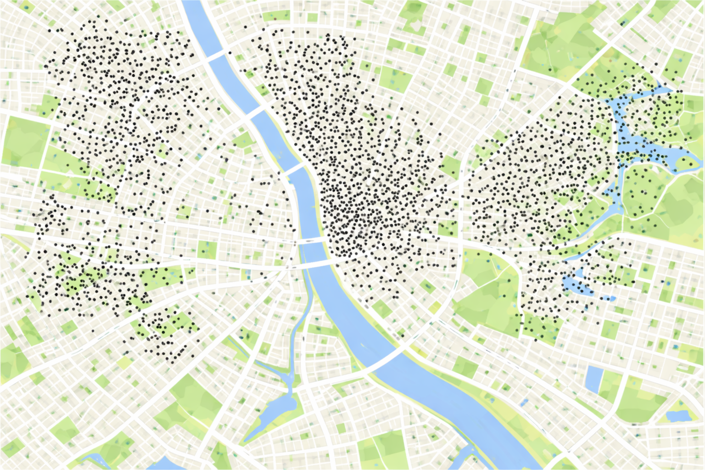
```

**Exemplos de aplicação:**

::: box-dica3
  - 🏥 Localização de casos de uma doença notificados em uma cidade.
  - 🌳 Distribuição espacial de árvores em um parque urbano.
  - 🐾 Registros de avistamentos de animais silvestres em uma reserva.
  - 🔥 Pontos de ocorrência de focos de incêndio florestal detectados por satélite.
  - 🔫 Registros de ocorrências de crimes em uma área urbana.
:::

## Geoestatística
  
Dados usados em geoestatística são atributos contínuos medidos em localizações fixas, na maioria das vezes amostrados no espaço geográfico, e que queremos analisar para entender como um fenômeno varia no espaço.

* Estrutura dos dados geoestatísticos


  |   Latitude   |  Longitude   | Atributo Mensurado |
  |:-----------:|:------------:|:----------------:|
  |   -22.90    |   -43.20     |       5.4        |
  |   -22.91    |   -43.22     |       6.1        |
  |   -22.92    |   -43.18     |       5.9        |
  |    ...   | ... | ... |
  
  
```{r echo=FALSE, fig.align="center", out.width="80%", fig.cap="<span style='font-size:9px'>Fonte: Elaboração própria com auxílio do ChatGPT (OpenAI), 2026.</span>"}
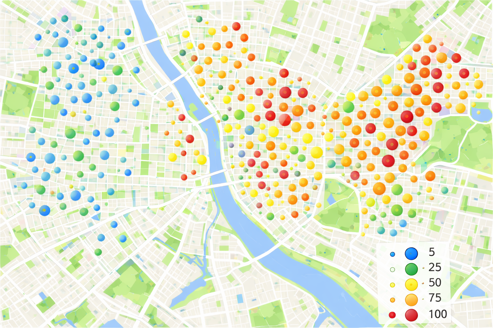
```

**Exemplos de aplicação:**
  
::: box-dica3
  - 🌧️ Medição da quantidade de chuva em diferentes locais de uma cidade.</li>
  - 🦟 Contagem de ovos de Aedes aegypti em ovitrampas.</li>
  - 🌫️ Concentração de poluentes no ar em pontos georreferenciados.</li>
  - 🌽 Análise da produtividade agrícola em diferentes talhões de uma fazenda.</li>
  
:::
  
* Umas das aplicações mais importantes da geoestatística é a interpolação de dados, ou seja, estimação de valores em locais onde não há medição.


::: box-dica2
Neste tipo de dado, o evento aleatório de interesse é a posição espacial onde o fenômeno ocorre, e não uma variável medida em si. A análise busca entender se os pontos seguem um padrão aleatório, agrupado (clusters) ou disperso no espaço.

:::
  
## Dados de Área

Na análise espacial por áreas, o atributo de interesse costuma ser uma medida agregada (como contagem de casos, taxa de mortalidade, média de renda, etc.) calculada dentro de uma unidade geográfica bem definidas (como bairros, municípios, setores censitários ou regiões administrativas.)

Essas áreas são representadas por polígonos, que podem ter formas irregulares e manter relações espaciais com as áreas vizinhas, seja por fronteiras compartilhadas, conexões físicas (como estradas e rios), ou por semelhanças em características socioeconômicas (como nível de renda ou acesso a serviços).

::: box-dica2
O objetivo da análise de dados de área é identificar, explicar e interpretar padrões espaciais e tendências que ocorrem entre essas unidades geográficas pré-definidas.

:::

* Estrutura dos dados de área


  |   Polígono   |  Nome do Polígono   | Atributo Mensurado |
  |:-----------:|:------------:|:----------------:|
  |   110920    |  Alta Esperança     |       1000,50        |
  |   123690    |  Divino     |       963,56        |
  |   130269    |  Dourados     |       801,01        |
    |    ...   | ... | ... |

```{r echo=FALSE, fig.align="center", out.width="80%", fig.cap="<span style='font-size:9px'>Fonte: Elaboração própria com auxílio do ChatGPT (OpenAI), 2026.</span>"}
      
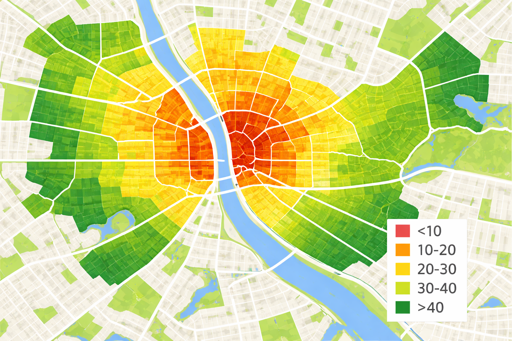
```

**Exemplos de aplicação:**

::: box-dica3

  - 🦟 Taxa de incidência de dengue por bairro em uma cidade.
  - 💸 Renda per capita por setor censitário.
  - 🌽 Produtividade agrícola por microrregião.
  - 🏫 Taxa de evasão escolar por município.
  - 🚔 Taxa de criminalidade por distrito policial.
  - 📦 Volume de vendas por zona de entrega.
:::

# 🗃️ Dados utilizados no curso

📥 [Clique aqui para baixar os dados que iremos utilizar durante as aulas](https://drive.google.com/drive/folders/1lBUWVYcwFDBqrxdz6s0oxaiCS8gAVWj7?usp=sharing)

1) Basta baixar o arquivo `Estatistica_Espacial.zip` e descomprimir;

2) Clicar no arquivo que representa o projeto em R `Estatistica_Espacial.Rproj`


# 🛠️ Algumas Ferramentas para Estatística Espacial
  
## SiG QGIS
  
```{r echo=F, fig.align="center", out.width="80%"}

```
  
[QGIS: Um Sistema de Informação Geográfica livre e aberto](https://www.qgis.org/pt_BR/site/)
  
## GEODA
  
```{r echo=F, fig.align="center", out.width="80%"}
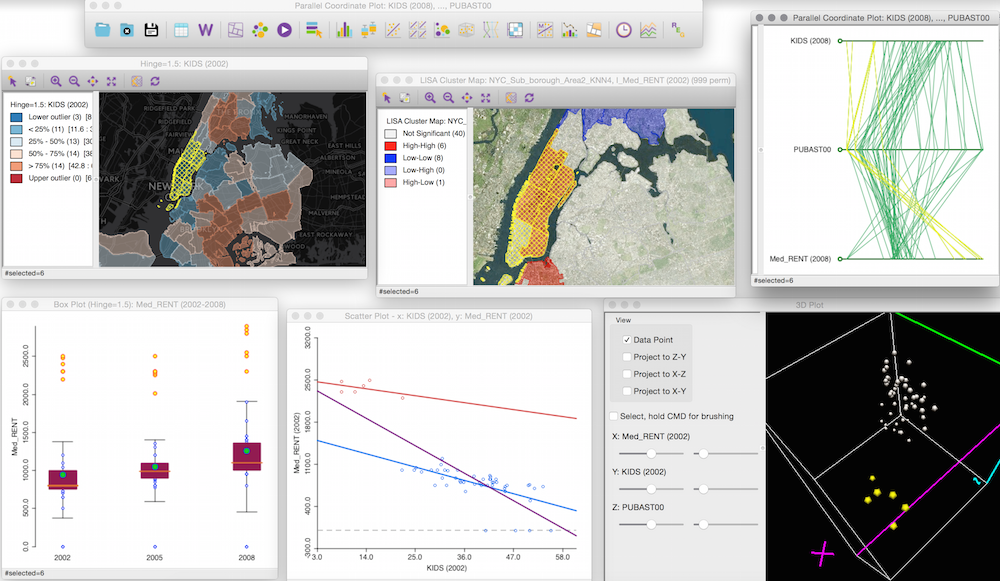
```
  
[GEODA: AN INTRODUCTION TO SPATIAL DATA ANALYSIS](https://spatial.uchicago.edu/geoda)
  
  
## R
  
```{r echo=FALSE, fig.align="center", out.width="80%", fig.cap="<span style='font-size:9px'>Fonte: Elaboração própria com auxílio do modelo de IA Gemini (GOOGLE, 2026).</span>"}

```
  
Fonte: [Dicas para integração e instalação do R 4.2 no Ubuntu 22.04 LTS e os pacotes espaciais](https://rtask.thinkr.fr/installation-of-r-4-2-on-ubuntu-22-04-lts-and-tips-for-spatial-packages/)
  
  
## Python
  
```{r echo=F, fig.align="center", out.width="60%"}

```
  
Fonte: [Github Geopandas](https://geopandas.org/en/stable/)
  
  
# 📚 Bibliotecas R utilizadas no curso

### 📦 Manipulação e Leitura de Dados
| Biblioteca     | Funcionalidade                                                              |
  |----------------|------------------------------------------------------------------------------|
  | `dplyr`        | Manipulação eficiente de dados (filtrar, agrupar, resumir, etc.)             |
  | `readr`        | Leitura rápida de arquivos `.csv`, `.tsv`, etc.                              |
  | `tidyverse`    | Conjunto de pacotes para ciência de dados (inclui `ggplot2`, `dplyr`, etc.)  |
  
---
  
### 📊 Visualização Gráfica (Gráficos, Mapas e Paletas)
  
  | Biblioteca       | Funcionalidade                                                                 |
  |------------------|---------------------------------------------------------------------------------|
  | `ggplot2`        | Sistema gráfico baseado em camadas para criação de gráficos sofisticados        |
  | `tmap`           | Criação de mapas temáticos estáticos e interativos                              |
  | `leaflet`        | Geração de mapas interativos baseados em JavaScript                             |
  | `leaflet.extras2`| 	Extensões avançadas para leaflet, mini mapas e outros widgets                             |
  | `leafem`         | Funcionalidades adicionais ao leaflet, como coordenadas do mouse, zoom por camada etc.                             |
  | `ggspatial`      | Adiciona elementos cartográficos ao `ggplot2` (ex: escalas, bússolas)           |
  | `vioplot`        | Geração de gráficos do tipo violin plot                                         |
  | `RColorBrewer`   | Paletas de cores predefinidas para mapas e gráficos                             |
  | `colorspace`     | Manipulação e criação de paletas de cores                                       |
  
  
---
  
  
### 🌍 Dados Espaciais e Geoprocessamento
  | Biblioteca     | Funcionalidade                                                                  |
  |----------------|----------------------------------------------------------------------------------|
  | `sf`           | Manipulação de dados espaciais com o padrão Simple Features                     |
  | `sp`           | Estrutura clássica para dados espaciais (anterior ao `sf`)                       |
  | `geobr`        | Importa mapas do Brasil (IBGE, municípios, estados, etc.)                        |
  | `maptools`     | Leitura e manipulação de dados espaciais vetoriais                              |
  | `raster`       | Leitura e análise de dados geográficos em formato raster                         |
  | `lattice`      | Sistema gráfico útil para visualização multivariada com suporte espacial         |
  
  ---
  
### 📈 Estatística Espacial e Modelagem
  | Biblioteca     | Funcionalidade                                                                         |
  |----------------|-----------------------------------------------------------------------------------------|
  | `spatstat`     | Análise de padrões de pontos no espaço bidimensional                                   |
  | `spdep`        | Cálculo de dependência e autocorrelação espacial (ex: Moran, Geary)                     |
  | `spatialreg`   | Modelagem de regressão espacial (ex: SAR, SEM, SDM)                                     |
  | `spgwr`        | Regressão ponderada geograficamente (GWR)                                               |
  | `gstat`        | Geoestatística e krigagem                                                               |
  | `automap`      | Krigagem automatizada com ajuste automático de variogramas     


🌐 **Site oficial do pacote `queimadasR`** 
  👉 [Acessar documentação](https://wtassinari.github.io/queimadasR/)
  
# 📍 Dados do tipo Padrões Pontuais
  
## Focos de incêndios ocorridos no estado do Rio de Janeiro/Brasil no mês de dezembro de 2025.
  
```{r, echo=T, out.width='90%'}
library(readxl)
  
# Carregar o arquivo
dados_pontos <- read_excel("dados/queimadas/queimadas_pontos.xlsx")
```
  
```{r, echo=T, out.width='90%'}
library(sf)
pontos_sf <- st_as_sf(dados_pontos, 
                      coords = c("longitude", "latitude"),
                       crs = 4326)
```

📌 O que é CRS (Coordinate Reference System) ?

O CRS é como uma “regra de tradução” entre o que está em um mapa e o mundo real. Ele define como as coordenadas (como 140, 12) se relacionam com locais verdadeiros na Terra, dizendo se os valores estão em metros, graus ou outra unidade, e onde fica o ponto de partida (a origem). Sem um CRS, uma coordenada não tem significado, pois não sabemos onde ela realmente está nem em que escala.

🗺️ Por que isso é importante ?

Se dois mapas tiverem CRSs diferentes, os pontos não vão se alinhar corretamente — como tentar juntar peças de quebra-cabeça de caixas diferentes. Usar o CRS certo garante que todas as informações espaciais estejam bem posicionadas e coerentes. Por exemplo, o WGS 84 é usado por GPS e Google Maps (em graus), enquanto o UTM é usado para mapas locais mais precisos (em metros). Saber isso evita erros em análises espaciais e garante que os dados “conversem” entre si.

**OBS:** Se quiser saber um pouco mais a respeito do CRS, basta acessar ([link](https://rspatial.org/raster/spatial/6-crs.html))

  
```{r, echo=T, out.width='90%'}
library(geobr)

# Baixar polígono do RJ (código IBGE = 33)
rj <- read_state(code_state = 33, year = 2020)
```
  
```{r, echo=T, out.width='90%'}
library(geobr)

# Baixar polígono do RJ (código IBGE = 33)
rj <- read_state(code_state = 33, year = 2020)
```
  
```{r, echo=T, out.width='90%'}
library(ggplot2)
# Plotar
ggplot() +
   geom_sf(data = rj, fill = "lightgreen", color = "black") +
   geom_sf(data = pontos_sf, color = "red", size = 1.0, alpha = 0.7) +
   labs(title = "Focos de Queimadas - Rio de Janeiro",
       caption = "Fonte: INPE") +
  theme_minimal()
```
  
### Possíveis distribuições dos pontos
  
```{r echo=F, fig.align="center", out.width= "65%", fig.show='hold'}
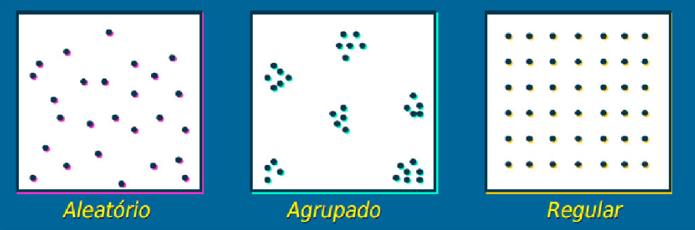
```
  
### Investigando os padrões pontuais
  
  
```{r echo=F, fig.align="center", message=FALSE, warning=FALSE, comments=NA, out.width="70%", comment=NA}
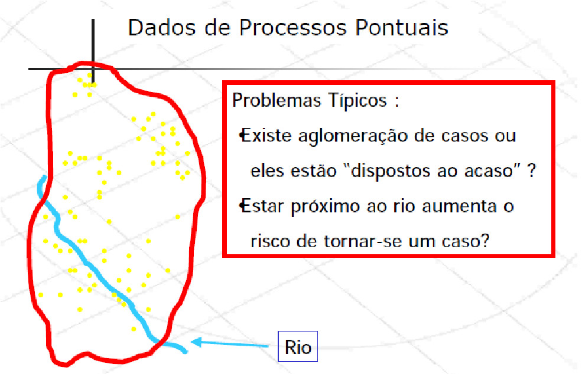
```
  
  
## Estimativas de Kernel (ou Mapas de Calor)
  
As estimativas de densidade kernel são uma técnica amplamente utilizada para **representar visualmente a concentração espacial de eventos pontuais**, como casos de doenças, crimes ou ocorrências de focos de calor. Essa abordagem transforma um conjunto de pontos em uma superfície contínua de intensidade, evidenciando áreas com maior ou menor densidade (nesse caso a frequencia) de eventos.
  
```{r echo=FALSE, fig.align="center", out.width="60%", fig.cap="Localização da ocorrência de casos de dengue em Belo Horizonte/MG"}
  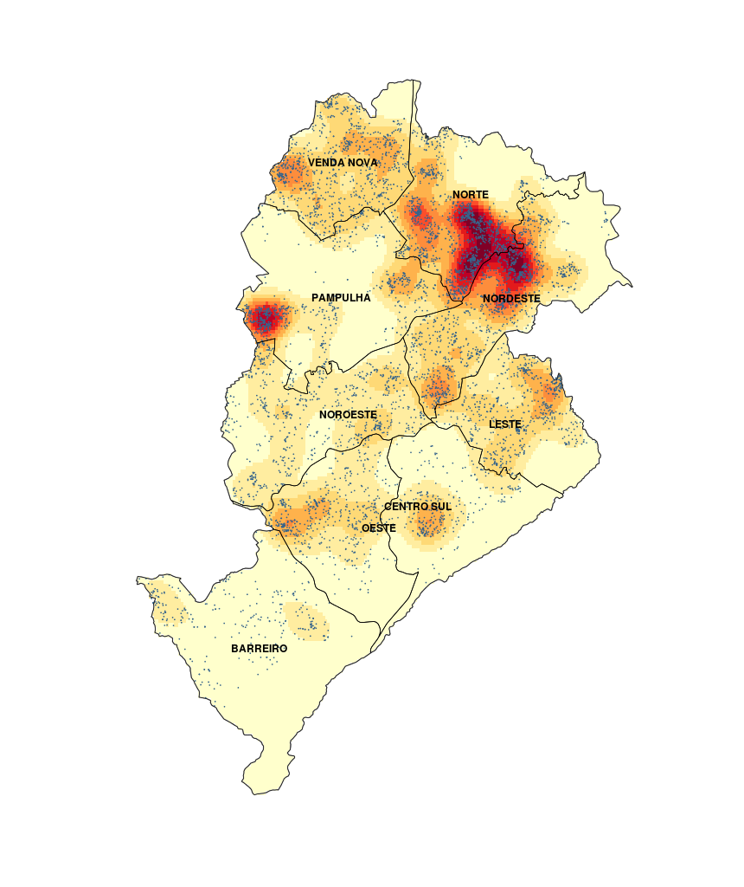
```
  
A técnica foi aplicada para identificar áreas de maior risco de dengue em Belo Horizonte/MG. O mapa resultante revela zonas de alta concentração de casos, o que pode subsidiar ações de controle vetorial e políticas públicas de saúde mais direcionadas.
  
O objetivo principal é estimar a função de intensidade espacial $\hat{\lambda}_{\tau}(u)$, que descreve a probabilidade de ocorrência de eventos em diferentes locais da região de estudo.
  
  
```{r echo=F, fig.align="center", out.width= "45%", fig.show='hold'}
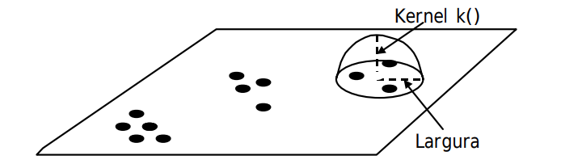
```
  
* Estimador de intensidade de distribuição de pontos: 
    
$$\hat{\lambda}_{\tau}(u) = \dfrac{1}{\tau^2}\sum k(\dfrac{d(u_i , u)}{\tau}) \text{   ,   } d(u_i , u) \leq \tau$$
    
Sabendo que:
    
- $\hat{\lambda}_{\tau}(u)$: estimativa da intensidade do processo pontual no ponto $u$.
  
- $u_i$: coordenadas dos pontos observados no plano (ex.: localização dos eventos).
  
- $\tau$: parâmetro de suavização (largura de banda), define o raio de influência dos pontos ao redor de $u$.
  
- $d(u_i, u)$: distância entre o ponto observado $u_i$ e o ponto de avaliação $u$. Normalmente, a distância euclidiana.
  
- Condição $d(u_i, u) \leq \tau$: garante que apenas os pontos dentro da vizinhança (de raio $\tau$) contribuam para a estimativa.
  
- $k(\cdot)$: função kernel que define o peso atribuído a cada ponto com base na distância. Exemplos:
    
i) **Kernel gaussiano**: atribui maior peso aos pontos mais próximos.
ii) **Kernel uniforme**: todos os pontos dentro do raio recebem o mesmo peso.
iii) **Kernel Epanechnikov**: pesos decrescem com a distância, chegando a zero na borda.


### Como funciona:

- Para cada ponto no espaço, é aplicado um funil de suavização (kernel) que distribui "peso" ao redor do ponto, atribuindo maior peso às áreas próximas e menor peso conforme a distância aumenta.

- Ou seja, esse peso decresce com o aumento da distância a partir do centro, de acordo com uma função $k(\cdot)$, e é controlado por um parâmetro chamado largura de banda ($\tau$).

- O resultado é uma superfície contínua de densidade, onde regiões com cores mais quentes (vermelho, laranja) indicam maior concentração de eventos.

::: box-dica1

🌧️ **Analogia intuitiva:**
  
  O kernel atua como um *limpador de para-brisa*, pesando mais os eventos próximos e menos os eventos muito distantes. A escolha do tamanho do limpador ($\tau$) e do tipo de movimento (forma da função kernel) define o quanto você vê ao redor do ponto onde está focando.
:::
  
#### **Localização da ocorrência de roubo em Belo Horizonte/MG**
  
```{r echo=F, fig.align="center", out.width= "50%", fig.show='hold'}
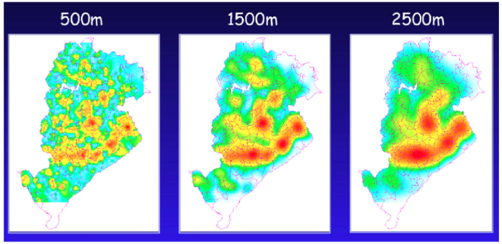
```

A figura acima mostra como diferentes larguras de banda ($500 m$, $1.500 m$ e $2.500 m$) alteram o grau de suavização:
  
A imagem mostra a distribuição espacial dos casos de dengue em Belo Horizonte (MG) em três larguras de banda ($\tau$) diferentes: 500 m, 1500 m e 2500 m. As cores indicam a intensidade da ocorrência, sendo azul/verde áreas com menor concentração e amarelo/vermelho áreas com maior concentração de casos.

No mapa de 500 metros, observam-se muitos pequenos focos, com maior detalhamento local. Essa escala é útil para ações pontuais e operacionais, mas pode apresentar mais variações muito específicas do território. No de 1500 metros, os padrões tornam-se mais contínuos e estáveis, facilitando a identificação de áreas prioritárias em nível regional. Já no de 2500 metros, aparecem apenas grandes zonas de maior concentração, sendo mais adequado para decisões estratégicas em nível municipal.

O importante é notar que a escala de análise influencia a forma como enxergamos o problema. O fenômeno é o mesmo, mas sua interpretação muda conforme a “lente” utilizada, algo fundamental para o planejamento e a tomada de decisão na gestão pública.


[*Fonte: Referência científica: Druck, S.; Carvalho, M.S.; Câmara, G.; Monteiro, A.V.M. (eds) "Análise Espacial de Dados Geográficos". Brasília, EMBRAPA, 2004](http://www.dpi.inpe.br/gilberto/livro/analise/cap2-eventos.pdf)


# 🌐 Dados do tipo Geoestística

## Semivariograma: a base da análise espacial

Uma das principais ferramentas da geoestatística é o semivariograma, que mede o quanto dois pontos próximos no espaço se parecem (ou se diferem) com relação ao valor de uma variável.

::: box-dica2
**A ideia central é**: Se dois pontos estão muito próximos, é esperado que seus valores sejam parecidos. Já se estiverem distantes, a diferença entre os valores tende a aumentar.

:::
  
A versão experimental do semivariograma é calculada para diferentes distâncias entre os pontos, usando a seguinte fórmula:
  
  <!-- * A determinação experimental do semivariograma, para cada valor de $x_i$, considera todos os pares de amostras $z(x)$ e $z(x+h)$, separadas pelo vetor distância $h$, a partir da equação:  -->
  
  <!-- ```{r echo=F, fig.align="center", out.width= "25%", fig.show='hold'} -->
  <!-- 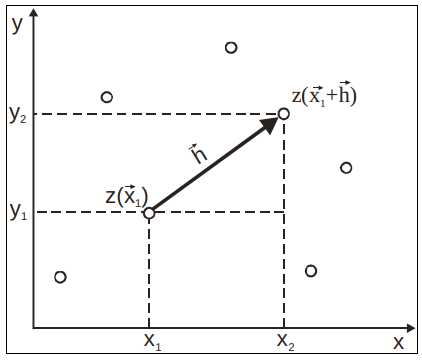 -->
  <!-- ``` -->
  
  
  
$$\hat{\gamma}(h) = \dfrac{1}{2N(h)}\sum^{N(h)}_{i=1}[z(x_i) - z(x_i + h)]^2 $$
Sabendo que:
  
- $\hat{\gamma}(h)$: valor estimado do fenômeno para a distância $h$;

- $N(h)$: número de pares de pontos separados por uma distância $h$;

- $z(x_i)$: valor observado da variável na localização $x_i$;

- $z(x_i + h)$: valor observado da variável em um ponto a uma distância $h$ de $x_i$.

* A expressão representa a \textbf{diferença média ao quadrado} entre os valores da variável observada em pares de pontos separados pela distância $h$.


```{r echo=F, fig.align="center", out.width= "40%", fig.show='hold'}
include_graphics('figuras/variograma1.png')
```

::: box-dica1

📌 **Efeito Pepita (C₀)**: É a variação observada mesmo quando a distância entre os pontos é muito pequena ou zero. 

📌 **Patamar (C)**: É o valor em que o variograma se estabiliza, indicando que a partir de certa distância, a variabilidade entre os pontos não aumenta mais. 

📌 **Alcance (a)**: É a distância a partir da qual dois pontos deixam de estar correlacionados. Até essa distância, os valores ainda apresentam semelhança espacial, ou seja, após essa distância, tornam-se independentes.

:::
  
  
Apesar de útil, essa fórmula não é robusta em todas as situações. Em alguns casos, a variabilidade não é constante ao longo da área estudada, o que chamamos de heterocedasticidade. Nesses cenários, modelos diferentes podem ser utilizados para representar o comportamento do semivariograma. Por exemplo:
  
i) **Modelo Exponencial**
  
ii) **Modelo Esférico**
  
iii) **Modelo Gaussiano**
  
iv) **Outros**
  
```{r echo=F, fig.align="center", out.width= "40%", fig.show='hold'}
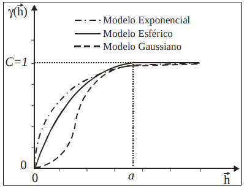
```

* **Exemplo:** Mapa sobre o teor de argila no solo.

```{r echo=F, fig.align="center", out.width= "70%", fig.show='hold'}
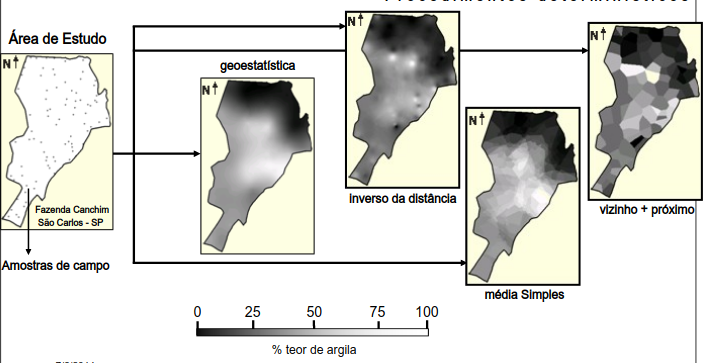
```

A imagem mostra a interpolação do teor de argila em uma área agrícola da Fazenda Canchim (SP), a partir de amostras de solo coletadas em campo. Diversos métodos são comparados: **a geoestatística (krigagem)**, que utiliza a estrutura de dependência espacial dos dados via semivariograma e produz um mapa suavizado e estatisticamente robusto; o método do **inverso da distância (IDW)**, que pondera os pontos mais próximos com maior influência, resultando em maior detalhamento local, mas com risco de exagerar variações; a **média simples**, que suaviza os dados sem considerar plenamente a variabilidade espacial; e o método do **vizinho mais próximo**, que gera áreas abruptas ao atribuir a cada região o valor da amostra mais próxima, sem suavização. O exemplo evidencia como a escolha do método de interpolação impacta diretamente a qualidade e continuidade do mapa final.


[*Fonte: Referência científica: Druck, S.; Carvalho, M.S.; Câmara, G.; Monteiro, A.V.M. (eds) "Análise Espacial de Dados Geográficos". Brasília, EMBRAPA, 2004](http://www.dpi.inpe.br/gilberto/livro/analise/cap3-superficies.pdf)


# 🗺️ Dados de Área

## Mapas Temáticos

O mapa temático tem como principal objetivo visualizar e analisar a distribuição espacial de um fenômeno específico.

**Mapa Temático Mundial da Expectativa de Vida entre os Países**

```{r, echo=T, out.width='90%'}
library(tmap)
data(World)
tmap_style("classic")
# Desenhando um rápido mapa temático mundial para esperança de vida.
qtm(World, fill = "life_exp")
```

**Mapa Temático da incidência de dengue no estado do Rio de Janeiro**

```{r, echo=T, out.width='90%'}
# ============================================================================
# 1. LER A PLANILHA
# ============================================================================
library(readxl)
library(dplyr)

dengue <- read_excel("dados/dengue/dengue2025.xlsx") |>
    mutate(code_muni  = as.character(code_muni),
           casos  = as.numeric(casos),
           pop2022 = as.numeric(pop2022), 
           incidencia = round(casos / pop2022 * 100000, 1))

head(dengue)
```

```{r, echo=T, out.width='90%'}
# ============================================================================
# 2. BAIXAR MALHA MUNICIPAL DO RJ
# ============================================================================
library(geobr)

# Baixar a malha municipal do estado do Rio de Janeiro
# code_muni = 33 (código do estado do RJ)

mapa_rj <- read_municipality(code_muni = 33, year = 2024) |>
        mutate(code_muni = as.character(code_muni))

# Visualizar rapidamente o mapa
plot(mapa_rj$geom, main = "Municípios do Estado do Rio de Janeiro")
```

```{r, echo=T, out.width='90%'}
# ============================================================================
# 3. Left Join mapa_rj + planilha casos dengue
# ============================================================================
mapa_rj <- mapa_rj |>
  left_join(dengue, by = "code_muni") |> 
  select(code_muni, municipio, pop2022, casos, incidencia)  
```

```{r, echo=T, out.width='90%'}
# ============================================================================
# 4. Mapa Temático com as incidências de dengue por município de forma contínua
# ============================================================================
library(ggplot2)

ggplot() +
  geom_sf(data = mapa_rj, aes(fill = incidencia), color = "white", size = 0.2) +
  scale_fill_viridis_c(option = "plasma", 
                       name = "Incidência\n(por 100.000 hab)",
                       direction = -1) +  # direction = -1 inverte a escala
  theme_minimal() +
  labs(title = "Incidência de Casos nos Municípios do RJ - 2025",
       subtitle = "Escala Contínua",
       caption = "Fonte: Dados Simulados") +
  theme(legend.position = "right",
        plot.title = element_text(hjust = 0.5, face = "bold"),
        plot.subtitle = element_text(hjust = 0.5),
        axis.text = element_blank(),
        axis.title = element_blank())     
```

```{r, echo=T, out.width='90%'}
# Sumário estatístico da incidência de dengue por município
summary(mapa_rj$incidencia)
```

```{r, echo=T, out.width='90%'}
# ============================================================================
# 5. Mapa Temático com as incidências de dengue por município de forma categórica
# ============================================================================
# Criar categorias usando 5 classes com método quantil
library(viridis)

map_data <- mapa_rj %>%
  mutate(
    incidencia_cat = cut(incidencia,
                         breaks = c(0, 51.7, 723.5, 1791.9, 2375.7, 3779.5, 7458.7, Inf),
                         labels = c("Mín - 51.7", 
                                   "51.7 - 723.5", 
                                   "723.5 - 1791.9", 
                                   "1791.9 - 2375.7", 
                                   "2375.7 - 3779.5", 
                                   "3779.5 - 7458.7",
                                   "> 7458.7"),
                         include.lowest = TRUE,
                         right = FALSE)
  )

ggplot() +
  geom_sf(data = map_data, aes(fill = incidencia_cat), color = "white", size = 0.2) +
  scale_fill_manual(values = viridis(7, option = "plasma", direction = -1),
                    name = "Incidência\n(por 100.000 hab)",
                    na.translate = FALSE) +
  theme_minimal() +
  labs(title = "Incidência de Casos nos Municípios do RJ",
       subtitle = "Classificação por Quantis",
       caption = "Fonte: Dados Simulados") +
  theme(legend.position = "right",
        plot.title = element_text(hjust = 0.5, face = "bold"),
        plot.subtitle = element_text(hjust = 0.5),
        axis.text = element_blank(),
        axis.title = element_blank())  
```

```{r, echo=T, out.width='90%'}
# ============================================================================
# 6. Mapa Temático com as incidências de dengue por município de forma categórica
# ============================================================================
library(classInt)

# Calcular breaks Jenks
jenks_breaks <- classIntervals(mapa_rj$incidencia, n = 7, style = "jenks")$brks

# Criar labels com os intervalos (formato igual ao da imagem, mas com os valores)
jenks_labels <- c(
  paste0(round(jenks_breaks[1], 1), " - ", round(jenks_breaks[2], 1)),
  paste0(round(jenks_breaks[2], 1), " - ", round(jenks_breaks[3], 1)),
  paste0(round(jenks_breaks[3], 1), " - ", round(jenks_breaks[4], 1)),
  paste0(round(jenks_breaks[4], 1), " - ", round(jenks_breaks[5], 1)),
  paste0(round(jenks_breaks[5], 1), " - ", round(jenks_breaks[6], 1)),
  paste0(round(jenks_breaks[6], 1), " - ", round(jenks_breaks[7], 1)),
  paste0("> ", round(jenks_breaks[7], 1))
)

# Criar a variável categórica
mapa <- mapa_rj %>%
  mutate(
    incidencia_cat = cut(incidencia,
                         breaks = jenks_breaks,
                         labels = jenks_labels,
                         include.lowest = TRUE,
                         right = FALSE)
  )

# Plotar o mapa
ggplot() +
  geom_sf(data = mapa, aes(fill = incidencia_cat), color = "white", size = 0.2) +
  scale_fill_manual(values = viridis(7, option = "plasma", direction = -1),
                    name = "Incidência\n(por 100.000 hab)",
                    na.translate = FALSE) +
  theme_minimal() +
  labs(title = "Incidência de Casos nos Municípios do RJ",
       subtitle = "Classificação por Quebras Naturais (Jenks)",
       caption = "Fonte: SINAN") +
  theme(legend.position = "right",
        plot.title = element_text(hjust = 0.5, face = "bold"),
        plot.subtitle = element_text(hjust = 0.5),
        axis.text = element_blank(),
        axis.title = element_blank())
```
### Matriz de Vizinhança

A matriz de vizinhança é um instrumento fundamental da Estatística Espacial utilizado para representar formalmente quais áreas são consideradas vizinhas entre si. Em termos simples, ela transforma o mapa em uma estrutura matemática que indica quem é vizinho de quem.

Imagine os municípios de um estado. No mapa, visualmente conseguimos perceber quais compartilham fronteiras. A matriz de vizinhança traduz essa informação em números: se dois municípios são vizinhos, atribuímos valor 1; se não são, atribuímos 0. O resultado é uma tabela quadrada (n × n), onde n é o número de municípios analisados.

```{r echo=F, fig.align="center", out.width="55%"}
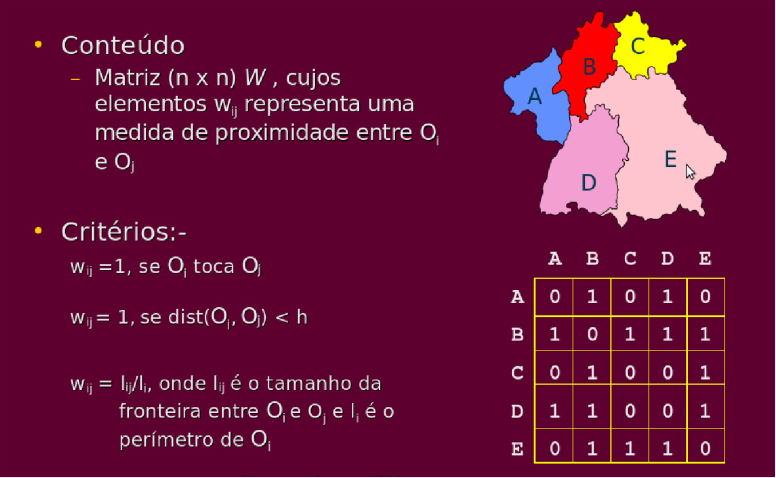
```

#### **Exemplo Simplificado de Matriz de Vizinhança**

**Municípios analisados:**  
  Rio de Janeiro, Niterói, São Gonçalo, Duque de Caxias, Nova Iguaçu  

**Critério:** Contiguidade do tipo *Rainha*  
  (considera vizinhos os municípios que compartilham qualquer ponto de fronteira)


|            | Rio | Niterói | S. Gonçalo | D. Caxias | N. Iguaçu |
  |:-----------|:---:|:-------:|:----------:|:---------:|:---------:|
  | **Rio**        |  0  |    1    |     1      |     1     |     1     |
  | **Niterói**    |  1  |    0    |     1      |     0     |     0     |
  | **S. Gonçalo** |  1  |    1    |     0      |     0     |     0     |
  | **D. Caxias**  |  1  |    0    |     0      |     0     |     1     |
  | **N. Iguaçu**  |  1  |    0    |     0      |     1     |     0     |
  
  ---
  
Notas:
  
- **1** = municípios são vizinhos (compartilham fronteira)  
- **0** = municípios não são vizinhos  
A **diagonal principal é zero**, pois um município não é vizinho de si mesmo.

Essa matriz é essencial porque muitos fenômenos da gestão pública apresentam dependência espacial. Ou seja, o que acontece em um município pode influenciar municípios vizinhos. Exemplos incluem:
  
- Propagação de doenças (como dengue);
- Dinâmica do desemprego;
- Criminalidade;
- Poluição ambiental;
- Expansão urbana.

Sem a matriz de vizinhança, os métodos utilizados na estatísticos estatística tratariam cada município como independente. Com ela, conseguimos incorporar a ideia de que “o território importa”.

Existem diferentes critérios para definir vizinhança:
  
- Contiguidade (compartilham fronteira);

- Distância (municípios dentro de um raio específico);

- k-vizinhos mais próximos (cada área tem um número fixo de vizinhos).

A escolha do critério depende do problema de política pública analisado. Para doenças transmissíveis, por exemplo, a contiguidade territorial pode ser adequada. Já para fluxos econômicos, a distância ou conectividade pode fazer mais sentido.


```{r, echo=T, out.width='90%'}
# ============================================================================
# MATRIZ DE VIZINHANÇA DOS MUNICÍPIOS DO RIO DE JANEIRO
# ============================================================================

library(spdep)
# ============================================================================
# 1. CRIAR A MATRIZ DE VIZINHANÇA
# ============================================================================

# Converter para objeto sp (formato exigido por alguns pacotes)
# Mas o spdep também aceita sf diretamente
rj_sp <- as(mapa_rj, "Spatial")

# Criar lista de vizinhos baseada em contiguidade (critério "rainha" - queen)
# queen = TRUE considera vizinhos que compartilham qualquer ponto da fronteira
vizinhos_rainha <- poly2nb(mapa_rj, queen = TRUE)

# Criar lista de vizinhos baseada em contiguidade (critério "torre" - rook)
# queen = FALSE considera apenas vizinhos com fronteira lateral
vizinhos_torre <- poly2nb(mapa_rj, queen = FALSE)

# Verificar o resultado
summary(vizinhos_rainha)
summary(vizinhos_torre)

```

| Item do Output                   | O que representa |
  |----------------------------------|------------------|
  | Number of regions               | Número total de unidades territoriais analisadas (ex.: municípios). |
  | Number of nonzero links         | Total de conexões de vizinhança existentes entre as áreas. |
  | Percentage nonzero weights      | Percentual de conexões existentes em relação ao total possível de conexões. |
  | Average number of links         | Número médio de vizinhos por unidade territorial. |
  | Link number distribution        | Distribuição do número de vizinhos entre as áreas analisadas. |
  | Least connected regions         | Unidades territoriais com menor número de vizinhos. |
  | Most connected regions          | Unidades territoriais com maior número de vizinhos. |
  
  
```{r, echo=T, out.width='90%'}
# ============================================================================
# 2. CONVERTER PARA MATRIZ DE VIZINHANÇA (FORMATO TABELA)
# ============================================================================

# Converter lista de vizinhos para matriz binária
matriz_vizinhos_rainha <- nb2mat(vizinhos_rainha, style = "B", zero.policy = TRUE)
matriz_vizinhos_torre <- nb2mat(vizinhos_torre, style = "B", zero.policy = TRUE)

# Visualizar as primeiras linhas e colunas da matriz
print(matriz_vizinhos_rainha[1:10, 1:10])

# Verificar dimensões (deve ser 92x92, pois são 92 municípios)
dim(matriz_vizinhos_rainha)

```

### Verificando a malha de conectividade da vizinhança da cidade do Rio de Janeiro/RJ

* Iremos precisar da coordenadas dos centróides para montar a malha de conectividade.

```{r, echo=T,  out.width="70%"}
library(sp)
mapa_rj.sp <- as(mapa_rj, 'Spatial') # convertendo em formato sp
coord <- coordinates(mapa_rj.sp) # coordenadas dos centroides dos poligonos do RJ
class(mapa_rj.sp)
```

```{r, echo=T}
viz.sf <- as(nb2lines(vizinhos_rainha, coords = coord), 'sf')
viz.sf <- st_set_crs(viz.sf, st_crs(mapa_rj))
```

::: box-dica2
- `st_set_crs()` define o sistema de referência de coordenadas (CRS) do objeto `viz.sf`.

- Ele está copiando o CRS do objeto `setor.sf`, garantindo que os dois objetos estejam no mesmo sistema de coordenadas.
:::

```{r, echo=T,  out.width="80%"}
# Plotando o grafo de conectividade por contiguidade
mapa.viz <- ggplot(mapa_rj) + 
  geom_sf(fill = 'lightpink', color = 'white') +
  geom_sf(data = viz.sf) +
  theme_minimal() +
  ggtitle("Vizinhança por conectividade (vizinhos_rainha)") +
  ylab("Latitude") +
  xlab("Longitude")
mapa.viz
```

  
## Autocorrelação espacial

🔎 **Moran Global**

O Moran Global é uma medida sintética que avalia se existe autocorrelação espacial em todo o território analisado. Em outras palavras, ele indica se municípios vizinhos tendem a apresentar valores semelhantes para determinado indicador, como renda, taxa de mortalidade ou incidência de dengue. Quando o índice é positivo e estatisticamente significativo, significa que áreas próximas apresentam padrões semelhantes (alto com alto, baixo com baixo), revelando a existência de agrupamentos espaciais. Quando é próximo de zero, sugere ausência de padrão espacial. 

O Moran Global é importante porque permite verificar se o fenômeno analisado possui organização territorial, indicando a necessidade de políticas regionais integradas em vez de intervenções isoladas.

$$I = \frac{ \sum_{i=1}^{n} \sum_{j=1}^{n} w_{ij} (y_i - \bar{y})(y_j - \bar{y}) }{ \sum_{i=1}^{n} (y_i - \bar{y})^2 }$$
  
::: box-dica4

* $I > 0$: valores similares estão próximos (agrupamento positivo).

* $I < 0$: valores diferentes estão próximos (dispersão).

* $I \approx 0$: padrão aleatório.

:::
  
Sabendo que:
  
- \( I \): valor do índice de Moran global.
- \( n \): número total de unidades espaciais (regiões).
- \( y_i \): valor da variável de interesse na região \( i \).
- \( \bar{y} \): média dos valores de \( y \) em todas as regiões.
- \( w_{ij} \): elemento da matriz de vizinhança que representa a relação espacial entre as regiões \( i \) e \( j \).
- \( w_{ij} = 1 \) se \( i \) e \( j \) são vizinhos, 0 caso contrário (ou ponderado).
- O numerador mede a covariância espacial ponderada, e o denominador é a variância total de \( y \).

#### Autocorrelação espacial dos casos de dengue nos municípios/RJ

```{r, echo=T, out.width='90%'}
pesos.viz <- nb2listw(vizinhos_torre)
moran.test(mapa$casos, pesos.viz)
```

O resultado do teste de Moran’s I indicou autocorrelação espacial positiva estatisticamente significativa $(I = 0,0324; Z = 2,88; p = 0,0019)$. Como o valor observado é superior ao valor esperado $(E[I] = −0,0109)$ e o p-valor é inferior a $0,05$, rejeita-se a hipótese nula de ausência de dependência espacial. Isso sugere que municípios vizinhos tendem a apresentar valores semelhantes da variável analisada, caracterizando um padrão de agrupamento espacial. Contudo, apesar de estatisticamente significativo, o valor do índice é de baixa magnitude, indicando que a intensidade da autocorrelação espacial é relativamente fraca.

#### Autocorrelação espacial para incidências de dengue nos municípios/RJ

```{r, echo=T, out.width='90%'}
moran.test(mapa$incidencia, pesos.viz)
```

O teste de Moran indicou ausência de autocorrelação espacial significativa na incidência analisada $(I = −0,055; p-valor = 0,71)$. Como o valor do índice é próximo de zero e o $p-valor$ é superior a $0,05$, não há evidências para rejeitar a hipótese de aleatoriedade espacial. Assim, os dados não apresentam padrão de agrupamento ou dispersão no espaço, sugerindo que a variação observada não está associada à localização geográfica das áreas estudadas.

📍 **Moran Local (LISA)**

O Moran Local, também conhecido como LISA (*Local Indicators of Spatial Association*), aprofunda a análise ao avaliar a autocorrelação espacial em cada unidade territorial individualmente. Diferentemente do Moran Global, que fornece um único valor para todo o estado ou país, o Moran Local identifica onde exatamente estão os agrupamentos espaciais e possíveis áreas atípicas. Ele permite classificar cada município como parte de um cluster de valores altos, um cluster de valores baixos ou como um ponto fora do padrão em relação aos seus vizinhos. Essa análise é fundamental para identificar territórios prioritários e direcionar recursos de forma mais estratégica.

Avalia a autocorrelação espacial **local**, permitindo identificar regiões com agrupamentos (clusters) ou comportamentos atípicos.

$$I^{(i)} = \frac{n}{\sum_{j=1}^{n} (z_j - \bar{z})^2} \sum_{j=1}^{n} w_{ij} (z_i - \bar{z})(z_j - \bar{z})$$
  
Sabendo que:
  
- \( I^{(i)} \): índice de Moran local para a região \( i \).
- \( n \): número total de regiões.
- \( z_i \): valor padronizado (ou original, dependendo da convenção) da variável na região \( i \).
- \( \bar{z} \): média da variável \( z \).
- \( w_{ij} \): peso espacial entre as regiões \( i \) e \( j \).
- A soma considera a influência dos vizinhos \( j \) sobre o ponto \( i \), ponderada pela matriz de vizinhança.

### **Mapeando os polígonos que tiveram os p-valores mais significativos no Moran Local para os casos.**

```{r, echo=T,  out.width="70%"}
mapa$pval <- localmoran(mapa$casos, pesos.viz)[,5]

library(tmap)

tmap_mode("plot")  # modo estático

tm_shape(mapa) + 
  tm_polygons(
    col = "pval",
    title = "p-valores",
    breaks = c(0, 0.01, 0.05, 0.10, 1),
    style = "fixed",
    palette = "-Red"
  )

```


### **Moran Local dos casos de dengue no Rio de Janeiro/RJ**

```{r, echo=T}
resI <- localmoran.sad(lm(mapa$casos ~ 1), 1:length(vizinhos_torre), vizinhos_torre, style = "W")
summary(resI)[1:10,]
```

::: box-dica2 

- A função `localmoran.sad()` calcula o Moran Local `(Iᵢ)` e algumas outras estatísticas associadas para cada polígono (setor).

- `lm(setor.sf$tx ~ 1)`:  cria um modelo linear sem preditores (apenas o intercepto), ou seja, considera a variável `casos` como resposta a ser analisada.

- `1:length(viz)`: identifica o índice de cada área/setor.

- `viz`: é a estrutura de vizinhança (do tipo `nb`), que define quem é vizinho de quem.

- `style = "W"`: define o estilo de normalização dos pesos espaciais (padronização row-standardized).

:::

- A está mostrando:

  * `Local Morans I`:	Valor do I de Moran local `(Iᵢ)`, indicando se o valor do setor e seus vizinhos são semelhantes (positivo) ou diferentes (negativo).
  
  * `Stand. dev. (N)`:	Desvio padrão padronizado da estatística de Moran local.
  
  * `Pr. (N)`:	p-valor do teste de significância para o valor de `Iᵢ` (baseado na dist. normal).
  
  * `Saddlepoint`:	Valor do I de Moran local corrigido.
  
```{r, echo=T,  out.width="70%"}
mapa$MoranLocal <- summary(resI)[,1] 

library(scales)

ggplot(mapa) + 
  geom_sf(aes(fill = MoranLocal), color = 'black') +
  scale_fill_gradientn(colours=c("blue", "white", "red"), 
                       values=rescale(c(min(mapa$MoranLocal), 0,   max(mapa$MoranLocal))), guide="colorbar") + 
  ggtitle("Moran local") + 
  theme_void()
```

Neste mapa, podemos observar:

- Valores altos de Local Morans I com p-valor pequeno indicam clusters estatisticamente significativos:

  * Positivo + significativo $\rightarrow$ cluster alto-alto ou baixo-baixo.

  * Negativo + significativo $\rightarrow$ outlier (ex: um valor alto cercado por baixos, ou o contrário).
  
🗺 **LISA Map**

O LISA Map é um mapa temático que representa graficamente os resultados do Índice de Moran Local, ele identifica:
  
- Clustering local (agrupamento de valores semelhantes)

- Outliers espaciais (valores discrepantes em relação aos vizinhos)

- Regiões não significativas (sem padrão espacial detectável)


| Tipo de Associação        | Descrição                                                | Interpretação Espacial                                                |
  | ------------------------- | -------------------------------------------------------- | --------------------------------------------------------------------- |
  | 🔴 **Alto-Alto (High-High)** | Valor alto cercado por vizinhos também com valores altos | Indica **cluster de altas magnitudes**, também chamado de **hotspot** |
  | 🔵 **Baixo-Baixo (Low-Low)** | Valor baixo cercado por vizinhos com valores baixos      | Indica **cluster de baixas magnitudes**, ou **coldspot**              |
  | 🟠 **Alto-Baixo (High-Low)** | Valor alto cercado por valores baixos                    | Indica um **outlier espacial positivo**                               |
  | 🟡 **Baixo-Alto (Low-High)** | Valor baixo cercado por valores altos                    | Indica um **outlier espacial negativo**                               |
  | ⚪ **Não significativo**     | Sem associação espacial relevante                        | O valor na região não apresenta padrão espacial detectável            |
  
  
* Os valores do Moran Local são testados por permutação para verificar se o padrão observado é estatisticamente significativo ou poderia ocorrer por acaso.

* Apenas as regiões significativas (p-valor < 0.05) costumam ser coloridas nos mapas.

Esse mapa abaixo pertence ao artigo ["Are regions equal in adversity? A spatial analysis of the spread and dynamics of COVID-19 in Europe", de Amdaoud, Arcuri e Levratto (2021)](https://www.researchgate.net/publication/349729379_Are_regions_equal_in_adversity_A_spatial_analysis_of_the_spread_and_dynamics_of_COVID-19_in_Europe). O artigo realiza uma análise espacial detalhada da mortalidade por COVID-19 em 125 regiões europeias durante a primeira onda da pandemia (março a maio de 2020). 

```{r echo=F, fig.align="center", out.width="80%"}
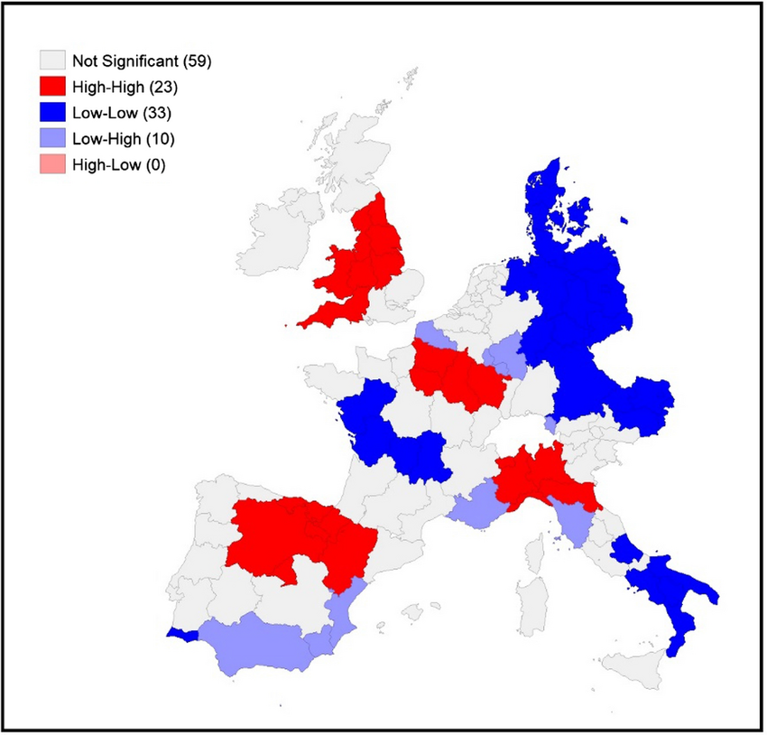
```

Utilizando o índice de Moran Local (LISA), o estudo identifica padrões de autocorrelação espacial na mortalidade por COVID-19 entre as regiões europeias durante a primeira onda da pandemia. O resultado evidencia clusters espaciais significativos, com destaque para regiões High-High (altas taxas de mortalidade cercadas por outras com altas taxas), como o norte da Itália, Madrid e a região da Alsácia, na França. Ao mesmo tempo, regiões Low-Low, como o sul da Itália, Dinamarca e partes da Alemanha Oriental, apresentaram baixa mortalidade em vizinhança igualmente baixa. Esses padrões persistentes ao longo do tempo indicam que a disseminação da pandemia seguiu lógicas regionais, reforçando a importância de políticas públicas que considerem as desigualdades territoriais na resposta à crise sanitária.

**Autocorrelação espacial dos casos confirmados de covid-19 em municípios sede de regionais
de saúde e vizinhos, segundo a análise do Índice Local de Moran (LISA) Univariado. Paraná, Brasil,
março de 2020 a janeiro de 2021.**

```{r echo=F, fig.align="center", out.width="90%"}
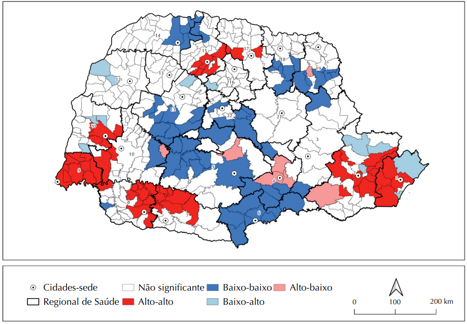
```

[COVRE, Eduardo Rocha et al. Correlação espacial da covid-19 com leitos de unidades de terapia intensiva no Paraná. Revista de Saúde Pública, v. 56, p. 14, 2022.](https://www.scielo.br/j/rsp/a/NDB7dYnVxgbtWPFskqxMgKR/?lang=pt)

Na figura acima, observamos que o valor do Índice de Moran Global foi de $0,404$, com $p-valor < 0,001$, indicando uma autocorrelação espacial positiva moderada e estatisticamente significativa. Isso significa que a distribuição dos casos não ocorreu de forma aleatória no território paranaense – pelo contrário, municípios com taxas semelhantes de COVID-19 tenderam a se agrupar no espaço.

Observando o mapa LISA (Indicadores Locais de Associação Espacial), podemos identificar diferentes padrões regionais. As áreas em vermelho (Alto-Alto) representam municípios com altas taxas da doença cercados por vizinhos igualmente afetados, formando verdadeiros "clusters de transmissão" que exigiam intervenções coordenadas e prioritárias. Por outro lado, as áreas em azul escuro (Baixo-Baixo) mostram regiões onde tanto o município quanto seus vizinhos mantiveram baixas taxas, sugerindo que estratégias de controle podem ter sido mais eficazes nessas localidades.

As áreas em rosa (Alto-Baixo) e azul claro (Baixo-Alto) revelam situações de transição ou exceção, onde um município destoa do padrão de seus vizinhos. Estes são pontos de atenção para a vigilância em saúde, pois podem indicar locais onde a doença se comporta de forma diferente da região de entorno. Já as áreas em cinza (Não significante) não apresentaram padrão espacial definido, podendo refletir maior heterogeneidade local ou dinâmicas de transmissão mais complexas.


### **LISA Map dos casos de dengue na cidade do Rio de Janeiro/RJ**

  
```{r, echo=T}
library(spdep)

#  Convertendo uma estrutura de vizinhança (objeto nb) em uma matriz de pesos espaciais padronizada
w <- nb2listw(vizinhos_torre, style = "W")

# Matriz de pesos espaciais padronizada (row-standardized)
resI <- localmoran(mapa$casos, nb2listw(vizinhos_torre, style = "W"))

# Armazena estatísticas no objeto espacial
mapa$Ii       <- resI[,1]   # valor de Moran Local
mapa$pvalue   <- resI[,5]   # p-valor

# Valor padronizado da variável tx
mapa$z_casos <- scale(mapa$casos)[, 1]

# Média dos vizinhos (lagged value)
lag_casos <- lag.listw(w, mapa$z_casos)

# Classificação dos tipos de associação local dos clusters
mapa$cluster_type <- "Não significativo"

mapa$cluster_type[mapa$pvalue <= 0.05 & mapa$z_casos > 0 & lag_casos > 0] <- "Alto-Alto"
mapa$cluster_type[mapa$pvalue <= 0.05 & mapa$z_casos < 0 & lag_casos < 0] <- "Baixo-Baixo"
mapa$cluster_type[mapa$pvalue <= 0.05 & mapa$z_casos > 0 & lag_casos < 0] <- "Alto-Baixo"
mapa$cluster_type[mapa$pvalue <= 0.05 & mapa$z_casos < 0 & lag_casos > 0] <- "Baixo-Alto"


```
  
```{r, echo=T,  out.width="80%"}
library(tmap)

# Modo estático (ideal para relatórios impressos ou PDF)
tmap_mode("plot")

# Tema visual limpo com fundo branco
tmap_style("white")

# Geração do mapa LISA
tm_shape(mapa) +
  tm_fill(
    col = "cluster_type",
    palette = c(
      "Alto-Alto"         = "#E60000",  # vermelho forte
      "Baixo-Baixo"       = "#0033CC",  # azul escuro
      "Baixo-Alto"        = "#9999FF",  # azul claro
      "Alto-Baixo"        = "#FF9999",  # rosa claro
      "Não significativo" = "#FFFFFF"   # branco
    ),
    title = "Cluster Local (LISA)",
    legend.is.portrait = TRUE
  ) +
  tm_borders(col = "gray40", lwd = 0.4) +
  tm_layout(
    main.title = "Mapa LISA - Clusters Locais dos Casos",
    main.title.size = 1.2,
    legend.outside = TRUE,
    frame = FALSE,
    bg.color = "white"
  )

```

🎯 Diferença resumida

* Moran Global → Existe padrão espacial no estado como um todo ?

* Moran Local (LISA) → Onde estão esses padrões ?

* LISA Map → Visualização espacial desses agrupamentos.

::: box-dica2

🗺️ Resumindo

- **Moran Global** indica se há padrão geral de autocorrelação espacial (positivo, negativo ou aleatório).

- **Moran Local** revela **onde** esses padrões ocorrem: clusters de alto/alto (*hotspots*), baixo/baixo (*coldspots*), alto/baixo (*outliers*), etc.

:::

  

## Modelos de Regressão Espacial

### Introdução

Além das análises exploratórias para os dados espaciais de área, é possível avançar na modelagem estatística dos dados por meio de modelos espaciais que consideram a dependência espacial dos dados. Entre os mais utilizados estão os modelos de autocorrelação espacial global, como o **SAR (Simultaneous Autoregressive Model)** e o **CAR (Conditional Autoregressive Model)** (CRESSIE, 1993). O modelo SAR incorpora a dependência espacial diretamente no valor da variável dependente, assumindo que o valor observado em uma região é influenciado pelos valores das regiões vizinhas. Já o modelo CAR considera essa dependência na estrutura do erro, sendo muito utilizado em abordagens bayesianas para modelagem de risco em áreas geográficas.

Outra abordagem é a dos modelos com efeitos espaciais locais, como a **Regressão Geograficamente Ponderada (GWR)** (FOTHERINGHAM et al., 2002). Diferente dos modelos SAR e CAR, que assumem relações espaciais globais, o GWR permite que os coeficientes da regressão variem ao longo do espaço, ajustando uma equação específica para cada localidade. Isso possibilita identificar como os efeitos de uma variável explicativa sobre a resposta mudam de acordo com a localização, sendo especialmente útil em contextos onde há forte heterogeneidade espacial. 

### Na prática

* `r colFmt(" Hipótese de independência das observações em geral é Falsa ",'orange')` $\rightarrow$  Existe dependência espacial, ou seja, o valor observado em uma localização tende a se parecer com os valores observados em locais vizinhos.

* Efeitos Espaciais $\rightarrow$ Se existir dependência ou correlação espacial significativa, devemos incluir no modelo os `r colFmt(" Efeitos Espaciais ",'darkpurple')`, caso contrário, as estimativas geradas pelo modelo de regressão podem ficar enviesadas, criando associações espúrias (isto é, sugerindo relações estatísticas onde elas não existem de fato, ou mascarando relações reais);

* `r colFmt("**Como verificar ?** ",'darkred')` $\rightarrow$ Para detectar a dependência espacial, podemos analisar os resíduos da regressão tradicional (OLS), utilizando indicadores como o índice de Moran dos resíduos. Se os resíduos mostrarem autocorrelação espacial significativa, isso indica que há estrutura espacial não modelada.

* `r colFmt("**Detectada a autocorrelação espacial: e agora ?** ",'darkblue')` $\rightarrow$  É necessário adotar modelos de regressão que incorporem explicitamente os efeitos espaciais, evitando vieses nas estimativas dos coeficientes.


### i) Modelos Globais: 

* Esses modelos assumem que a estrutura espacial é constante em todo o espaço geográfico. Utilizam um único parâmetro para captar a autocorrelação.

* Um exemplo é o **Modelo de Erro Espacial** (*Spatial Error Model* - **CAR**), representado por:
  
  $$y_i = \beta_0 + \sum^{p}_{k} \beta_k x_{ik}  + \varepsilon_i \text{    , sendo  }  \varepsilon_i = \lambda  W + \xi$$
  
::: box-dica4
Sendo:
  
- $y_i$: valor observado da variável dependente na unidade $i$;

- $\beta_0$: intercepto da regressão;

- $\beta_k$: coeficiente da $k$-ésima variável explicativa;

- $x_{ik}$: valor da $k$-ésima variável explicativa para a unidade $i$;

- $\varepsilon_i$: erro com estrutura de autocorrelação espacial;


- $\lambda$: coeficiente de autocorrelação espacial;

- $W$: matriz de vizinhança espacial (define como cada unidade está conectada às outras);

- $\xi$: erro aleatório normal (sem autocorrelação).
:::
  
$\rightarrow$ Podemos observar que os efeitos da autocorrelação espacial são associados ao termo de erro.

::: box-dica2

🧠 Interpretação:
  
  - Se $\lambda \ne 0$, há evidência de dependência espacial nos erros, ou seja, o erro em uma localidade está correlacionado com os erros em localidades vizinhas.

- Se $\lambda = 0$, o modelo reduz-se a uma regressão tradicional, e não há autocorrelação espacial significativa.
:::
  
  
  
### ii) Modelos Locais: 
  
* Enquanto os modelos globais assumem uma relação espacial uniforme, os modelos locais admitem que os parâmetros da regressão variam ao longo do espaço geográfico.

* Um exemplo clássico é o Modelo **Geograficamente Ponderado** (*Geographically Weighted Regression* - **GWR**), expresso por:
  
  
\[
    y_i = \beta_{0}(u_i, v_i) + \sum_{k=1}^{p} \beta_k(u_i, v_i) \cdot x_{ik} + \varepsilon_i,
    \\
    \quad \text{com } \beta_k(u_i, v_i) \text{ estimado via } 
    \sum_{j=1}^{n} K(d_{ij}) \cdot x_{jk}
    \]

::: box-dica4

Onde:
  
- $(u_i, v_i)$: coordenadas geográficas da observação $i$;

- $\beta_k(u_i, v_i)$: coeficiente local da variável explicativa $x_k$, estimado para a posição $i$;

- $K(d_{ij})$: função kernel que atribui um peso à observação $j$ com base na distância $d_{ij}$ entre as localizações $i$ e $j$;
:::
  
  
**Efeito da vizinhança no GWR**: No GWR, para estimar os coeficientes de regressão em cada local, utiliza-se um "kernel espacial". O objetivo do kernel é dar mais peso para observações próximas e menos peso para as distantes. A forma e o alcance desse kernel são definidos por um parâmetro chamado largura de banda (*bandwidth*).

```{r echo=F, fig.align="center", out.width= "80%", fig.show='hold'}
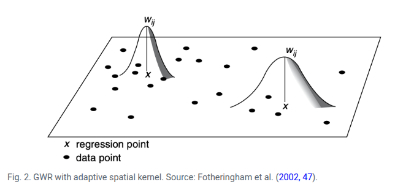
```

$\rightarrow$ Quanto menor $d_{ij}$, maior é o peso de $j$ na estimação de $\beta_k(u_i, v_i)$.

[Fonte: ARDILLY, Pascal et al. Manuel d’analyse spatiale. 2018.](https://ec.europa.eu/eurostat/documents/3859598/9462709/INSEE-ESTAT-SPATIAL-ANA-18-EN.pdf)

# 👉 Aplicações da Estatística Espacial 

## **Aplicação I:** Estudo de John Snow

- Segue algumas aplicações com os dados do pacote `cholera`, que contêm as localizações das mortes por cólera no famoso estudo de John Snow (Londres, 1854).

```{r, echo=T, out.width='90%'}
# install.packages("cholera")
library(cholera)

#  Mortes por cólera
head(fatalities[,1:3])
```

```{r, echo=T, out.width='90%'}
# Dados das Bombas de Água
head(pumps[,1:4])
```


```{r, echo=T, out.width='90%'}
# Visualizar mapa 
snowMap(add.cases = TRUE, add.pumps = TRUE, case.col = "darkred")

```

```{r, echo=T, out.width='90%'}
# Instalar e carregar pacotes necessários
# install.packages(c("spatstat", "MASS", "sf", "raster"))
library(spatstat)
library(MASS)
library(sf)
library(raster)
library(viridis)

# Carregar dados
data(fatalities)
data(pumps)
data(roads)
```

```{r, echo=T, out.width='90%'}
# Kernel 2D simples
kernel_simple <- kde2d(fatalities$x, fatalities$y, 
                       n = 100,  # Resolução
                       lims = c(range(fatalities$x), 
                                range(fatalities$y)))

# Plotar
par(mfrow = c(1, 2))

# Contorno
contour(kernel_simple, 
        main = "Densidade de Kernel - Contorno",
        xlab = "Coordenada X", 
        ylab = "Coordenada Y",
        col = "darkred",
        lwd = 2)
points(fatalities$x, fatalities$y, pch = ".", col = "red")
points(pumps$x, pumps$y, pch = 4, col = "blue", cex = 1.5, lwd = 2)

# Imagem de calor
image(kernel_simple, 
      main = "Densidade de Kernel - Heatmap",
      col = heat.colors(50))
contour(kernel_simple, add = TRUE, col = "white")
points(pumps$x, pumps$y, pch = 4, col = "blue", cex = 1.5, lwd = 2)
```


```{r, echo=T, out.width='90%'}
#  Comparação de Diferentes Bandwidths
# Criar diferentes kernels
# Calcular cada kernel individualmente
kernel_02 <- kde2d(fatalities$x, fatalities$y, h = 0.2, n = 100,
                   lims = c(range(fatalities$x), range(fatalities$y)))

kernel_05 <- kde2d(fatalities$x, fatalities$y, h = 0.5, n = 100,
                   lims = c(range(fatalities$x), range(fatalities$y)))

kernel_1 <- kde2d(fatalities$x, fatalities$y, h = 1, n = 100,
                  lims = c(range(fatalities$x), range(fatalities$y)))

kernel_2 <- kde2d(fatalities$x, fatalities$y, h = 2, n = 100,
                  lims = c(range(fatalities$x), range(fatalities$y)))


# --- Plot 1: bandwidths 0.2 e 0.5 ---
par(mfrow = c(1, 2))

image(kernel_02, main = "Bandwidth = 0.2", col = terrain.colors(50), xlab = "X", ylab = "Y")
contour(kernel_02, add = TRUE, col = "white", lwd = 0.5)
points(pumps$x, pumps$y, pch = 4, col = "blue", cex = 1.2, lwd = 1.5)
mtext(paste("Mortes:", nrow(fatalities)), side = 3, line = 0.3, cex = 0.8)

image(kernel_05, main = "Bandwidth = 0.5", col = terrain.colors(50), xlab = "X", ylab = "Y")
contour(kernel_05, add = TRUE, col = "white", lwd = 0.5)
points(pumps$x, pumps$y, pch = 4, col = "blue", cex = 1.2, lwd = 1.5)
mtext(paste("Mortes:", nrow(fatalities)), side = 3, line = 0.3, cex = 0.8)


# --- Plot 2: bandwidths 1 e 2 ---
par(mfrow = c(1, 2))

image(kernel_1, main = "Bandwidth = 1", col = terrain.colors(50), xlab = "X", ylab = "Y")
contour(kernel_1, add = TRUE, col = "white", lwd = 0.5)
points(pumps$x, pumps$y, pch = 4, col = "blue", cex = 1.2, lwd = 1.5)
mtext(paste("Mortes:", nrow(fatalities)), side = 3, line = 0.3, cex = 0.8)

image(kernel_2, main = "Bandwidth = 2", col = terrain.colors(50), xlab = "X", ylab = "Y")
contour(kernel_2, add = TRUE, col = "white", lwd = 0.5)
points(pumps$x, pumps$y, pch = 4, col = "blue", cex = 1.2, lwd = 1.5)
mtext(paste("Mortes:", nrow(fatalities)), side = 3, line = 0.3, cex = 0.8)

```


```{r, echo=T, out.width='90%'}
# Kernel 3D 

library(plotly)

# Calcular kernel
kernel_3d <- kde2d(fatalities$x, fatalities$y, n = 50)

# Criar plot 3D
plot_ly() |>
  add_surface(
    x = kernel_3d$x,
    y = kernel_3d$y,
    z = kernel_3d$z,
    colorscale = list(c(0, "white"), c(1, "red")),
    opacity = 0.8,
    name = "Densidade"
  ) |>
  add_markers(
    x = fatalities$x,
    y = fatalities$y,
    z = rep(0, nrow(fatalities)),
    marker = list(size = 3, color = "black", symbol = "circle"),
    name = "Mortes"
  ) |>
  add_markers(
    x = pumps$x,
    y = pumps$y,
    z = rep(0, nrow(pumps)),
    marker = list(size = 8, color = "blue", symbol = "x"),
    name = "Bombas"
  ) |>
  layout(
    title = "DENSIDADE 3D DO SURTO DE CÓLERA",
    scene = list(
      xaxis = list(title = "Coordenada X"),
      yaxis = list(title = "Coordenada Y"),
      zaxis = list(title = "Densidade"),
      camera = list(eye = list(x = 1.5, y = 1.5, z = 1.5))
    ),
    showlegend = TRUE
  )
```

## **Aplicação V:** Geoestatística com dados de pluviosidade na cidade do Rio de Janeiro/RJ

Nesta aplicação, utilizaremos técnicas de geoestatística para analisar os dados de chuva acumulada provenientes das estações pluviométricas do sistema Alerta Rio. Os dados referem-se à média da precipitação acumulada em 7 dias, com base nos totais das últimas 24h e 96h, permitindo uma visão mais abrangente da distribuição espacial da chuva no município.

Através do uso de bibliotecas do R específicas para análise espacial e interpolação, o objetivo é construir modelos geoestatísticos que possibilitem a interpolação dos valores de precipitação em regiões não monitoradas diretamente por estações. Esse tipo de abordagem pode auxiliar tanto no planejamento urbano quanto na prevenção de desastres naturais.

### Biliotecas do R que serão utilizadas

```{r, echo=T}
library(sf)
library(sp)
library(dplyr)
library(gstat)
library(lattice)
library(automap)
library(raster)
library(leaflet)
library(leaflet.extras2)
library(leafem)

```

### Importando a tabela com a chuva acumulada média de 7 dias das últimas 24hs e 96hs das estações pluviométricas da cidade do Rio de Janeiro

[Descrição das Estações (Alerta Rio)](http://www.sistema-alerta-rio.com.br/dados-meteorologicos/info-estacoes/)

[Download Dados Pluviométricos (Alerta Rio)](http://www.sistema-alerta-rio.com.br/dados-meteorologicos/download/dados-pluviometricos/)

* Como esses dados já foram baixados, iremos ler direto no R:

```{r, echo=T}
# 
pluvio <- read.csv("dados/chuva/pluviosidade.csv", sep=";")
```

### Análise Gráfica Descritiva 

```{r, echo=T}
quantil <- quantile(pluvio$acumulado_24h, seq(0,1,0.2))
quantil
```

### Transformar os dados em um objeto espacial do R

* x - Longitude
* y - Latitude

```{r, echo=T}
sp::coordinates(pluvio) = ~ x + y
```

### Análise Gráfica Descritiva com os dados espaciais

```{r, echo=T,  out.width="90%"}
# Bubble plot
bubble(pluvio, "acumulado_24h", key.entries = quantil, pch=19, col="blue")
```

```{r, echo=T,  out.width="90%"}
# Point plot
spplot(pluvio['acumulado_24h'], scales=list(draw=T), key.space="right", colorkey=T)
```

### 📌 Variograma Experimental (ou empírico)

O variograma experimental (ou empírico) é uma ferramenta usada em geoestatística para medir como a semelhança entre os valores de uma variável muda com a distância entre os pontos amostrados. Nesse caso, o variograma experimental vai nos ajudar a entender quão relacionados estão os valores de chuva conforme a distância entre as estações pluviométricas aumenta.

🧪 Como é construído ?

1. Para vários pares de pontos, calcula-se a diferença entre os valores medidos (por exemplo, de chuva em 24h).

2. Agrupa-se esses pares por faixas de distância (os "lags").

3. Para cada faixa, calcula-se a média da variância entre os pares.

🧠 Por que é importante ?

1. O variograma experimental é a base para escolher e ajustar um modelo geoestatístico.

2. Ele permite aplicar métodos como krigagem, para estimar valores em locais sem medição.


```{r, echo=T}
variogram.emp = variogram(acumulado_24h ~x+y, pluvio, width=1000, cutoff=20000)
variogram.emp
```

::: box-dica2

- `acumulado_24h ~ x + y`: estamos analisando como a variável chuva acumulada varia no espaço (coordenadas x e y).

- `width = 1000`: define que os pares de pontos serão agrupados em intervalos de 1000 metros, ou seja, é aistância média entre amostras ou distância dos lags.

- `cutoff = 20000`: só serão considerados pares de pontos com até 20 km de distância (Distância máxima entre os pontos amostrados).
:::


```{r, echo=T}
# Variogram plot
plot(variogram.emp, main = "Empirical variogram", pch = 19, col = "darkblue")
```

::: box-dica2

Esse código plota o variograma experimental (ou empírico), que foi criado anteriormente com o objeto `variogram.emp`.

:::

O variograma empírico mostra que há uma autocorrelação espacial positiva entre os pontos amostrados até aproximadamente 10.000 unidades de distância. Após esse ponto, a semivariância se estabiliza, sugerindo que a dependência espacial se dissipa. Oscilações em maiores distâncias podem indicar variação não explicada (efeito pepita) ou padrões espaciais mais complexos.

### 📌 Semivariograma Teórico

É uma função matemática ajustada sobre o variograma experimental. Ele serve para modelar a relação espacial entre os dados (ex: chuva), e é usado para realizar interpolações com krigagem.

🟡 **Nugget (efeito pepita)**:  É o valor do variograma no ponto zero da distância ($x = 0$).

⚫ **Sill (patamar ou limite da variância)**: É o valor máximo da semivariância (eixo $Y$), onde a curva estabiliza. Indica o ponto em que os dados deixam de estar correlacionados espacialmente.

📏 **Range (alcance)**: É a distância (eixo $X$) até onde os dados ainda estão correlacionados. Depois do range, os pontos não têm mais relação espacial entre si.

🤔 Por que isso importa ?

Esses três parâmetros (nugget, sill e range) definem como a variável se comporta no espaço, e são essenciais para:

* Interpolar dados em locais sem observação (krigagem),

* Planejar amostragem eficiente,

* Entender o grau de continuidade espacial de um fenômeno.


```{r echo=F, fig.align="center", out.width= "70%", fig.show='hold'}
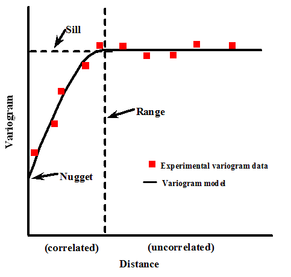
```

[Fonte do gráfico](https://vsp.pnnl.gov/help/Vsample/Kriging_Variogram_Model.htm)

📌 Alguns modelos mais usuais para o ajuste do variograma teorico:

```{r variograma-teorico, echo=FALSE, message=FALSE, warning=FALSE}
library(gstat)
library(ggplot2)
library(dplyr)

psill <- 80
range <- 12000
nugget <- 15
h <- seq(1, 20000, length.out = 200)

lin <- variogramLine(vgm(psill, "Lin", range, nugget), dist_vector = h) |> mutate(Modelo = "Linear")
exp <- variogramLine(vgm(psill, "Exp", range, nugget), dist_vector = h) |> mutate(Modelo = "Exponencial")
gau <- variogramLine(vgm(psill, "Gau", range, nugget), dist_vector = h) |> mutate(Modelo = "Gaussiano")
wav <- suppressWarnings(na.omit(variogramLine(vgm(psill, "Wav", range, nugget), dist_vector = h))) |> mutate(Modelo = "Wave")

p0 <- data.frame(dist = 0, gamma = nugget)
p0_list <- lapply(c("Linear", "Exponencial", "Gaussiano", "Wave"), \(m) cbind(p0, Modelo = m))

dados <- bind_rows(p0_list[[1]], p0_list[[2]], p0_list[[3]], p0_list[[4]],
                   lin, exp, gau, wav)

dados <- dados %>% filter(!is.na(gamma) & is.finite(gamma))

ggplot(dados, aes(x = dist, y = gamma, color = Modelo, linetype = Modelo)) +
  geom_line(size = 1.2) +
  labs(title = "Modelos Teóricos de Variograma",
       x = "Distância", y = "Semivariância") +
  theme_minimal(base_size = 14) +
  theme(
    legend.position = "bottom",
    legend.title = element_blank(),
    plot.title = element_text(face = "bold", hjust = 0.5),
    axis.line = element_line(color = "black"),
    panel.grid = element_line(color = "gray90"),
    panel.grid.minor = element_blank()
  )
```


📌 Parâmetros sugeridos para ajuste do variograma teórico:

Observando o Variograma Empírico, é possível sugerir os três parâmetros principais que definem a estrutura espacial dos dados:

| Parâmetro                  | Significado                                                                        | Interpretação visual no seu gráfico                                                                          |
| -------------------------- | ---------------------------------------------------------------------------------- | ------------------------------------------------------------------------------------------------------------ |
| **Nugget (efeito pepita)** | Variação a distância zero (ruído, erro de medição, microvariação)                  | O valor de semivariância onde o gráfico começa. Visualmente está entre **10 e 15**                           |
| **Range (alcance)**        | Distância onde a semivariância se estabiliza (pontos além disso são independentes) | A estabilização parece ocorrer por volta de **10.000 a 12.000 unidades de distância**                        |
| **Sill (platô)**           | Valor máximo da semivariância (nugget + psill)                                     | O platô está próximo de **80 a 100**, portanto o `psill` seria algo como **70 a 90** (psill = sill - nugget) |


```{r, echo=T}
## 1) Modelo Linear
lin.fit  = fit.variogram(variogram.emp, 
                         model = vgm(psill = 80, model = "Lin",
                                     range = 12000, nugget = 15))

## 2) Modelo exponencial
exp.fit  = fit.variogram(variogram.emp, 
                         model = vgm(psill = 80, model = "Exp",
                                     range = 12000, nugget = 15))

## 3) Modelo gaussiano
gau.fit  = fit.variogram(variogram.emp, 
                         model = vgm(psill = 80, model = "Gau",
                                     range = 12000, nugget = 15))

## 4) Modelo wave
wav.fit  = fit.variogram(variogram.emp, 
                         model = vgm(psill = 80, model = "Wav",
                                     range = 12000, nugget = 15))

```

::: box-dica2

Os comandos usam a função `fit.variogram()` do pacote `gstat` no R para ajustar modelos teóricos ao variograma empírico (representado pelo objeto `variogram.emp` da figura acima). Isso é essencial para modelar a dependência espacial entre os dados.

Os modelos ajustados foram: Modelo Linear (`Lin`), Exponencial (`Exp`), Gaussiano (`Gau`) e Wave (`Wav`). Para o ajuste dos mpdels, foram utilizados os seguintes parâmentros que definem a estrutura espacial dos dados:

- `model`: tipo de modelo teórico (forma da curva).

- `psill`: efeito de platô (sill parcial).

- `range`: alcance da dependência espacial.

- `nugget`: efeito pepita (variação não explicada, ruído ou erro de medição).

:::

```{r echo=T, out.width="90%"}
# Layout: 2 linhas, 2 colunas
par(mfrow = c(2, 2))

# Plota cada modelo com linha vermelha
plot(variogram.emp, lin.fit, main = "Modelo Linear", col.line = "red")
plot(variogram.emp, exp.fit, main = "Modelo Exponencial", col.line = "red")
plot(variogram.emp, gau.fit, main = "Modelo Gaussiano", col.line = "red")
plot(variogram.emp, wav.fit, main = "Modelo Wave", col.line = "red")

# Restaura o layout padrão
par(mfrow = c(1, 1))
```


### 🧪 Validação Cruzada 

A validação cruzada é um processo utilizado para avaliar o desempenho do modelo de krigagem. No contexto espacial, ela consiste em retirar um ponto por vez da malha de dados, utilizar os demais pontos para prever o valor naquele local removido, comparar a previsão com o valor real observado e repetir esse procedimento para todos os pontos da amostra. Esse método permite estimar a capacidade do modelo em gerar boas predições em locais onde não há observações diretas.

🧮 O que é o **RMSE (Root Mean Squared Error)**: é um dos indicadores que resume a performance do modelo. É a "a raiz quadrática média" dos erros entre valores observados (reais) e predições (hipóteses).

$$\text{RMSE} = \sqrt{ \frac{1}{n} \sum_{i=1}^{n} (y_i - \hat{y}_i)^2 }$$

### Modelo Linear

```{r, echo=T}
## 1) Modelo Linear
cv.lin <- krige.cv(acumulado_24h ~x+y, locations = pluvio, model = lin.fit)
summary(cv.lin)
```

::: cox-dica2

- Executando a validação cruzada do modelo de krigagem linear (`lin.fit`) aplicado aos dados de precipitação `acumulado_24h` com base nas coordenadas `x` e `y`.

- `krige.cv()`: função do pacote `gstat` que realiza a validação cruzada.

- `locations = pluvio`, indica que os pontos estão no objeto espacial pluvio.

- Armazena o resultado (resíduos, predições, observações, etc.) no objeto `cv.lin`.

- `summary(cv.lin)`: Mostra estatísticas descritivas da predição (`var1.pred`), valor observado (`observed`) e resíduo (`residual`).
:::

```{r, echo=T}
plot(cv.lin$var1.pred ~ cv.lin$observed, cex = 1.2, lwd = 2)
abline(0, 1, col = "lightgrey", lwd = 2)
lm_lin <- lm(cv.lin$var1.pred ~ cv.lin$observed)
abline(lm_lin, col = "red", lwd = 2)
r2_lin = summary(lm_lin)$r.squared
rmse_lin = hydroGOF::rmse(cv.lin$var1.pred, cv.lin$observed)
```


::: cox-dica2

- Plota os valores preditos em função dos valores observados. Serve para visualizar a qualidade das previsões. 

- Ajusta um modelo linear entre predito e observado. Adiciona essa linha ao gráfico em vermelho, indicando o ajuste real das predições. Quanto mais próximos da linha cinza $45°$ <span style="color:#808080;">●</span>, melhor o modelo.

:::

### Modelo Exponencial

```{r, echo=T}
## 2) Modelo exponencial
cv.exp <- krige.cv(acumulado_24h ~x+y, locations = pluvio, model = exp.fit)
summary(cv.exp)
```

```{r, echo=T}
plot(cv.exp$var1.pred ~ cv.exp$observed, cex = 1.2, lwd = 2)
abline(0, 1, col = "lightgrey", lwd = 2)
lm_exp <- lm(cv.exp$var1.pred ~ cv.exp$observed)
abline(lm_exp, col = "red", lwd = 2)
r2_exp = summary(lm_exp)$r.squared
rmse_exp = hydroGOF::rmse(cv.exp$var1.pred, cv.exp$observed)

```

### Modelo Gaussiano


```{r, echo=T}
## 3) Modelo Gaussiano
cv.gau <- krige.cv(acumulado_24h ~x+y, locations = pluvio, model = gau.fit)
summary(cv.gau)

```


```{r, echo=T}
plot(cv.gau$var1.pred ~ cv.gau$observed, cex = 1.2, lwd = 2)
abline(0, 1, col = "lightgrey", lwd = 2)
lm_gau <- lm(cv.gau$var1.pred ~ cv.gau$observed)
abline(lm_gau, col = "red", lwd = 2)
r2_gau = summary(lm_gau)$r.squared
rmse_gau = hydroGOF::rmse(cv.gau$var1.pred, cv.gau$observed)

```

### Modelo Wave

```{r}
## 4) Modelo Wave
cv.wav <- krige.cv(acumulado_24h ~x+y, locations = pluvio, model = wav.fit)
summary(cv.wav)
```


```{r, echo=T}
plot(cv.wav$var1.pred ~ cv.wav$observed, cex = 1.2, lwd = 2)
abline(0, 1, col = "lightgrey", lwd = 2)
lm_wav <- lm(cv.wav$var1.pred ~ cv.wav$observed)
abline(lm_wav, col = "red", lwd = 2)
r2_wav = summary(lm_wav)$r.squared
rmse_wav = hydroGOF::rmse(cv.wav$var1.pred, cv.wav$observed)
```

### 📋 Tabela das estatística de $R^2$ e $RMSE$

```{r, echo=T}
# Criando um data frame com os nomes dos modelos
modelos <- c("Linear", "Exponencial", "Gaussiano", "Wave")

# Combinando os valores de R² e RMSE em um único data frame
tabela_desempenho <- data.frame(
  Modelo = modelos,
  R2 = c(r2_lin, r2_exp, r2_gau, r2_wav),
  RMSE = c(rmse_lin, rmse_exp, rmse_gau, rmse_wav)
)

# Visualizando a tabela
print(tabela_desempenho)

```

Apesar de todos os modelos apresentarem $R^2$ baixos (indicando que os modelos explicam uma parcela limitada da variabilidade dos dados), o modelo linear se destacou como o mais eficiente nesse conjunto de dados, tanto por explicar mais da variância da variável resposta (acumulado de chuva) quanto por apresentar o menor erro médio de previsão.


### Criando os grids do contorno da cidade do Rio de Janeiro para intermpolação

```{r, echo=T, message=FALSE, warning=FALSE, results='hide'}
# Importando o contorno do Rio
contorno.rio <- shapefile("dados/chuva/MUNIC_2K_2022_IPP_SIRGAS.shp")

# Ou usar o comando

# contorno.rio <- st_geometry(read_municipality(code_muni = 3304557, year = 2022))
```

::: box-dica2

Criando um objeto com apenas o contorno do polígono da cidade do Rio de Janeiro.
:::

```{r, echo=T, echo=T, message=FALSE, warning=FALSE, results='hide'}
# Criando grade para interpolacao com a  resolucao de 50m
r <- raster(contorno.rio, res = 50)

# Criando um objeto formato raster
rp <- rasterize(contorno.rio, r, 0) 

# Trasnsformando o objeto raster no formato SpatialPixelsDataFrame
grid <- as(rp, "SpatialPixelsDataFrame") 
sp::plot(grid)
```

::: box-dica2

- Cria um objeto `RasterLayer` baseado no **contorno geográfico do Rio de Janeiro** (`contorno.rio`).

- `res = 50` define a **resolução da grade**: cada célula do raster terá **50 metros por 50 metros**.

- Esse raster ainda **não contém valores** — é só uma grade espacial com a extensão e projeção do contorno.

:::


### Krigagem {.tabset}

#### Visualização via `plot`

```{r, echo=T, echo=T, message=FALSE, warning=FALSE, results='hide'}
# Colocando os dados de chuva e o grid na mesma projecao
sp::proj4string(pluvio) = CRS(proj4string(contorno.rio))

# Executando a interpolação espacial por krigagem 
# usando diferentes modelos de variograma.
mapa_chuva_lin <- krige(acumulado_24h ~1, pluvio, grid, model =lin.fit)
mapa_chuva_exp <- krige(acumulado_24h ~1, pluvio, grid, model =exp.fit)
mapa_chuva_gau <- krige(acumulado_24h ~1, pluvio, grid, model =gau.fit)
mapa_chuva_wav <- krige(acumulado_24h ~1, pluvio, grid, model =wav.fit)
```


```{r, echo=T, out.width= "100%"}
plot.lin <- plot(mapa_chuva_lin, main = "Modelo Linear")
plot.exp <- plot(mapa_chuva_exp, main = "Modelo Exponencial")
plot.gau <- plot(mapa_chuva_gau, main = "Modelo Gaussiano")
plot.wav <- plot(mapa_chuva_wav, main = "Modelo Wave")

```

#### Visualização via `spplot`

```{r, echo=T, out.width= "90%"}
###############################
# Outra opção de gerar o mapa:#
##############################

# Paleta personalizada: tons frios (azul/verde claro) para baixos, quente (vermelho) para altos
paleta_cor <- rev(viridis(100, option = "A"))  # opção "A" = magma (vermelho escuro a amarelo claro)

# Opções de paleta da função viridis():
# option = "A"  → magma     (preto → roxo → vermelho → laranja → amarelo claro)
# option = "B"  → inferno   (preto → vermelho → laranja → amarelo claro, com mais contraste)
# option = "C"  → plasma    (roxo → rosa → laranja → amarelo claro)
# option = "D"  → viridis   (verde escuro → azul → roxo → amarelo claro) [padrão]
# option = "E"  → cividis   (azul acinzentado → amarelo pálido, acessível para daltônicos)
# option = "F"  → rocket    (roxo escuro → rosa → branco amarelado)
# option = "G"  → mako      (azul escuro → ciano → verde-água, tons frios)
# option = "H"  → turbo     (azul → verde → amarelo → laranja → vermelho, vibrante estilo Google)


# Plots com a nova paleta
spplot(mapa_chuva_lin, "var1.pred", main = "Modelo Linear", col.regions = paleta_cor)
spplot(mapa_chuva_exp, "var1.pred", main = "Modelo Exponencial", col.regions = paleta_cor)
spplot(mapa_chuva_gau, "var1.pred", main = "Modelo Gaussiano", col.regions = paleta_cor)
spplot(mapa_chuva_wav, "var1.pred", main = "Modelo Wave", col.regions = paleta_cor)
```


### 🔧 Auto Krige 

A função `autoKrige()` do pacote `automap` é utilizada para realizar a krigagem de forma automatizada, combinando os passos de ajuste do variograma e interpolação espacial em um único processo. Ela permite que o usuário defina uma variável de interesse e as coordenadas espaciais associadas, e então calcula o variograma experimental, ajusta automaticamente (ou conforme especificado) um modelo teórico de variograma — como exponencial, gaussiano ou esférico — e executa a krigagem ordinária sobre uma grade de predição. O resultado é um objeto que contém os valores interpolados, a variância da predição e os parâmetros do modelo ajustado, o que facilita a geração de mapas e a análise espacial de forma prática e eficiente, mesmo para usuários com pouca familiaridade com o ajuste manual de variogramas.

```{r, echo=T, message=FALSE, warning=FALSE}
# Modelando
auto.krige = autoKrige(acumulado_24h~x+y, pluvio, grid, model = 'Exp')
summary(auto.krige)
```

::: box-dica2

- `acumulado_24h ~ x + y`: fórmula indicando que será feito um modelo espacial com base nas coordenadas x e y para a variável de interesse acumulado_24h (precipitação).

- `pluvio`: dados observados de precipitação (classe SpatialPointsDataFrame).

- `grid`: grade de predição (onde queremos estimar os valores).

- `modelmodel = "Exp"`: especifica o tipo de modelo de variograma a ser ajustado — neste caso, exponencial.
:::

```{r, echo=T, message=FALSE, warning=FALSE}
# Validação cruzada
auto.krige.cv <- autoKrige.cv(acumulado_24h~x+y, pluvio, model = 'Exp')
summary(auto.krige.cv)
```

### Convertendo para o formato raster - auto krige

```{r, echo=T, echo=T, message=FALSE, warning=FALSE}
raster_chuva <- raster(auto.krige$krige_output)
plot(raster_chuva)
```
```{r, echo=T, echo=T, message=FALSE, warning=FALSE}
# Outra opção de plotar o raster
sp::spplot(auto.krige$krige_output, "var1.pred", main = "AutoKrige - Modelo Exponencial")

```

- Caso queira salvar a imagem raster em um arquivo formato geotiff para ler em algum SIG por exemplo:
  
```{r, echo=T, message=FALSE, warning=FALSE}
# Exportando o objeto da imagem
writeRaster(raster_chuva,
            filename = 'dados/chuva/chuva_auto.tiff',
            format = 'GTiff',
            overwrite = T)

# Importando de volta para o R
raster_chuva <- raster("dados/chuva/chuva_auto.tiff")
```

### 🔍 Fazendo o mapa interativo com as estações

```{r, echo=T, message=FALSE, warning=FALSE}
# 1. Importando e transformando as estações pluviométricas
estacoes.sf <- read_sf("dados/chuva/Estac_C3_B5es_Alerta_Rio.shp")
estacoes.longlat <- st_transform(estacoes.sf, 4326)  # EPSG:4326 = WGS84
estacoes.longlat$coords <- st_coordinates(estacoes.longlat)
estacoes.longlat$X <- estacoes.longlat$coords[, 1]
estacoes.longlat$Y <- estacoes.longlat$coords[, 2]
```

```{r, echo=T, message=FALSE, warning=FALSE}
# 2. Importando e transformando a malha de bairros
bairros.sf <- read_sf("dados/chuva/BAIRROS_2K_2022_IPP_SIRGAS.shp")
bairros.longlat <- st_transform(bairros.sf, 4326)
bairros.longlat <- st_make_valid(bairros.longlat)  # Corrige geometrias se necessário
```


```{r, echo=T, message=FALSE, warning=FALSE}
# 3. Convertendo o resultado da krigagem para raster
raster_chuva <- raster(auto.krige$krige_output["var1.pred"])

# 4. Projetando o raster para WGS84
raster_chuva_longlat <- projectRaster(raster_chuva, crs = CRS("+proj=longlat +datum=WGS84"))
```


```{r, echo=T, message=FALSE, warning=FALSE, results='hide'}
# 5. Definindo a paleta de cores da superfície interpolada
pal <- colorNumeric(
  palette = c("#000066", "#00c8f8", "#F0E68C", "#FFFF00", "#FF8C00"),
  domain = values(raster_chuva_longlat),
  na.color = "transparent",
  reverse = TRUE
)
```

```{r, echo=T, message=FALSE, warning=FALSE, out.width= "100%"}
# 6. Construindo o mapa interativo
leaflet(data = estacoes.longlat, options = leafletOptions(attributionControl = FALSE)) |>
  addProviderTiles("CartoDB.Positron", group = "Ruas") |>
  addProviderTiles("Esri.WorldImagery", options = providerTileOptions(opacity = 0.7), group = "Satélite") |>
  addProviderTiles("CartoDB.Voyager", group = "Voyager") |>
  # Escala (distância)
  addScaleBar(position = "bottomleft") |>
  # Coordenadas do mouse
  addMouseCoordinates() |>
  # Define a visualização inicial
  setView(lng = -43.42, lat = -22.90, zoom = 10.4) |>
  # Adicionando os marcadores das estações
  addMarkers(~X, ~Y, popup = ~as.character(est), label = ~as.character(est), group = "Estações") |>
  # Adicionando a malha de bairros
  addPolygons(data = bairros.longlat,
              weight = 3,
              color = "darkblue",
              smoothFactor = 1,
              fill = FALSE,
              labelOptions = labelOptions(
                style = list("font-weight" = "normal", padding = "3px 8px"),
                textsize = "13px",
                direction = "auto"),
              group = "Bairros") |>
  # Adicionando o raster de chuva interpolada
  addRasterImage(raster_chuva_longlat, colors = pal, opacity = 0.8, group = "Chuva: 1 semana") |>
  # Legenda
  addLegend(pal = pal, values = values(raster_chuva_longlat),
            title = "Chuva Acumulada - 1 semana",
            group = "Chuva: 1 semana") |>
  # Controle das camadas
  addLayersControl(
    baseGroups = c("Voyager", "Ruas", "Satélite"),
    overlayGroups = c("Estações", "Bairros", "Chuva: 1 semana"),
    options = layersControlOptions(collapsed = FALSE),
    position = "bottomleft") |>
  # Oculta os bairros inicialmente
  hideGroup(group = c("Bairros"))
```

# **Trabalho Final**

Veja aqui os detalhes do 👉 [Trabalho Final](trabalho_final.html)

# 📚 Bibliografia sugerida

* Druck, S.; Carvalho, M.S.; Câmara, G.; Monteiro, A.V.M. (eds). [Análise Espacial de Dados Geográficos](http://www.dpi.inpe.br/gilberto/livro/analise/). Brasília, EMBRAPA, 2004.

* Interactive Spatial Data Analysis by Trevor C. Bailey , Anthony C. Gatrell Routledge, 1995

* Applied Spatial Statistics for Public Health Data; Lance A. Waller, Carol A. Gotway Wiley-Interscience 1St ed. 2004

* Applied Spatial Data Analysis with R; Roger S. Bivand, Edzer Pebesma , Virgilio Gomez-Rubio Springer; Edição: 2nd ed. 2013

* Geocomputation with R by Robin Lovelace, Jakub Nowosad and Jannes Muenchow. [Geocomputation with R](https://geocompr.robinlovelace.net/), 2021.

* Spatial Statistics Workbook of Department of Criminology at the University of Manchester by Reka Solymosi and Juanjo Medina [Crime Mapping in R](https://maczokni.github.io/crime_mapping_textbook/)

* Spatial Data Science with R
[Spatial Data Science with R](https://rspatial.org/raster/index.html)

* GeoComputation and Spatial Analysis practicals by Lex Comber
[On-line Book](https://bookdown.org/lexcomber/GEOG3195/)

* GEOG5917 Big Data & Consumer Analytics - RStudio Practicals by Lex Comber
[On-line Book](https://bookdown.org/lexcomber/GEOG5917/)

