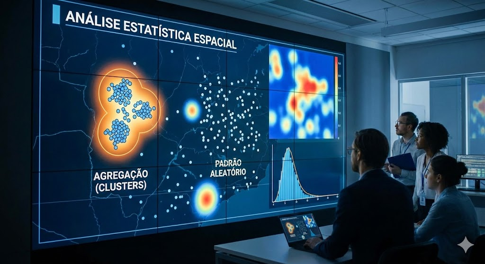
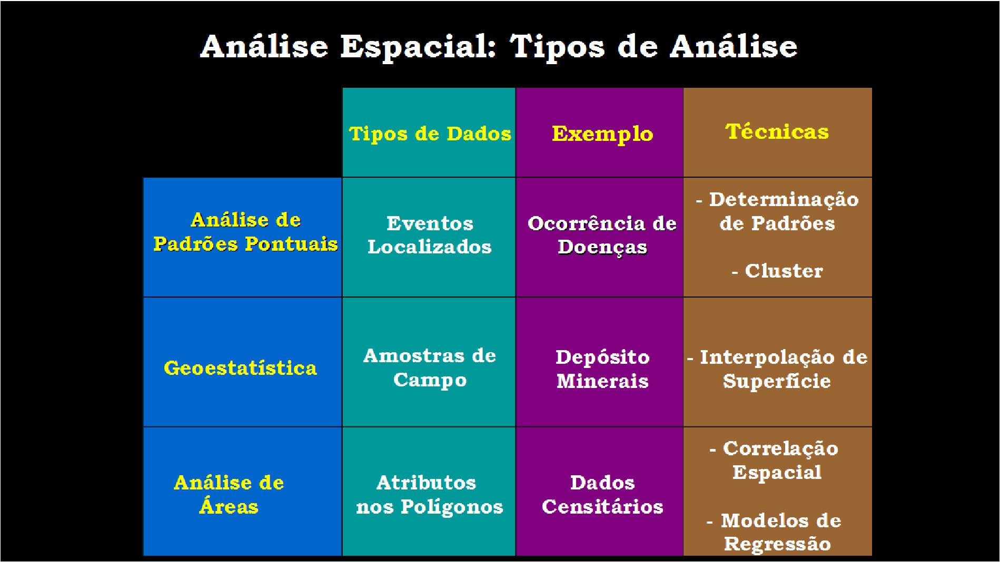
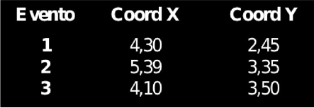
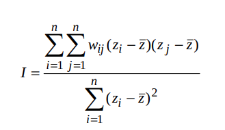
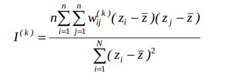

**Wagner Tassinari**  
Fundação Oswaldo Cruz (FIOCRUZ)  
Universidade Federal Rural do Rio de Janeiro (UFRRJ)  
📧 tassinari@ufrrj.br


```{r setup, include=FALSE}
library(knitr)
library(rmdformats)

## Global options
options(max.print="75")
knitr::opts_chunk$set(echo=FALSE,
               cache=TRUE,
               prompt=FALSE,
               tidy=TRUE,
               comment=NA,
               message=FALSE,
               warning=FALSE,
               cache.lazy=FALSE)
knitr::opts_knit$set(width=75)


```

```{r klippy}
# Insert copy to clipboard buttons in HTML documents
# remotes::install_github("rlesur/klippy")
# xfun::install_github("rlesur/klippy")
# remotes::install_github("spatstat/spatstat.core")
klippy::klippy(
  lang = c("r", "markdown"),
  all_precode = FALSE,
  position = c("top", "right"),
  color = "whitesmoke",
  tooltip_message = "copiar código",
  tooltip_success = "copiado!"
)

```


```{r}
## Color Format
colFmt <- function(x,color) {
  
  outputFormat <- knitr::opts_knit$get("rmarkdown.pandoc.to")
  
  if(outputFormat == 'latex') {
    ret <- paste("\\textcolor{",color,"}{",x,"}",sep="")
  } else if(outputFormat == 'html') {
    ret <- paste("<font color='",color,"'>",x,"</font>",sep="")
  } else {
    ret <- x
  }

  return(ret)
}
```

📥 [Clique aqui para baixar os dados que iremos utilizar durante as aulas](https://drive.google.com/drive/folders/1lBUWVYcwFDBqrxdz6s0oxaiCS8gAVWj7?usp=sharing)


🌐 **Site oficial do pacote `queimadasR`** 
👉 [Acessar documentação](https://wtassinari.github.io/queimadasR/)

# Introdução à Estatística Espacial 

## O que é Estatística Espacial ?

- São métodos estatísticos que levam em consideração a localização espacial do fenômeno estudado;

- Segundo Bailey & Gatrell (1995), *"Análise estatística espacial pode ser realizada quando os dados são espacialmente localizados e se considera explicitamente a possível importância de seu arranjo espacial na análise ou interpretação dos resultados"*

- A primeira pergunta a ser feita é: A distribuição dos dados apresenta um padrão aleatório ou apresenta uma agregação definida (*clusters*) ?

```{r echo=F, fig.align="center", out.width= "70%", fig.show='hold'}

```

## Origem da Estatística Espacial

- Dr. John Snow (1813-1858) $\rightarrow$ Considerado pai da Epidemiologia Moderna


```{r echo=F, fig.align="center", out.width= "80%", fig.show='hold'}
include_graphics('figuras/snow2_2019.png')
```

Mapeamento dos casos de coléra ($\bullet$) e as bombas de água (X) em Londres, 1854.


```{r echo=F, fig.align="center", out.width= "40%", fig.show='hold'}
include_graphics('figuras/snow_2019.png')
```


## Objetivos da Estatística Espacial

1) Análise de padrões espaciais e espaço-temporais (ex: Análise
Exploratória Espacial, Correlação Espacial)

2) Modelagem Espacial (ex: Modelos Estatísticos de Regressão
Espacial)

## Dependência Espacial ou Autocorrelação Espacial

- "Independência é um pressuposto muito conveniente que faz
grande parte da teoria estatística matemática tratável.
Entretanto, modelos que envolvem dependência estatística são
frequentemente mais realísticos. . . . Neste tipos de dados a
dependência está presente em todas as direções e fica mais
fraca a medida em que aumenta a dispersão na localização dos
dados." (Cressie N.,1991)

- *"Todas as coisas se parecem, coisas mais próximas são mais parecidas que
aquelas mais distantes."*  (Tobler, 1979). `r colFmt(" **Também conhecida como $1^a$ Lei da Geografia**",'red')`

# Tipologia dos Dados Espaciais

Os diferentes tipos de dados espaciais são tradicionalmente classificados de acordo com uma tipologia. Esta caracterização diz respeito a natureza estocástica da observação.

Noel Cressie (1993) divide a estatı́stica espacial em 3 grandes áreas:

  i) `r colFmt(" **Dados de processos pontuais**",'darkmagenta')`

  ii) `r colFmt(" **Dados de geoestatística**",'darkmagenta')`

  iii) `r colFmt(" **Dados de área**",'darkmagenta')`

Existem métodos estatı́sticos diferentes para descrever ou analisar estes tipos de dados. Exemplo:

```{r echo=F, fig.align="center", out.width= "85%", fig.show='hold'}


```

## Padrões Pontuais

* O principal interesse está no conjunto de coordenadas geográficas representando as localizações exatas de eventos.

* Exemplos: Localização de crimes, localização da residência dos casos de dengue, localização de espécies vegetais, etc.

* Neste caso, o dado aleatório de interesse é a localização espacial do evento.


```{r echo=F, fig.align="center", message=FALSE, warning=FALSE, comments=NA, out.width="40%", comment=NA}

```


### Focos de incêndios ocorridos no estado do Rio de Janeiro/Brasil no mês de dezembro de 2025.

```{r, echo=T, out.width='90%'}
library(readxl)

# Carregar o arquivo
dados_pontos <- read_excel("dados/queimadas_rio/queimadas_pontos.xlsx")
```

```{r, echo=T, out.width='90%'}
library(sf)
pontos_sf <- st_as_sf(dados_pontos, 
                      coords = c("longitude", "latitude"),
                      crs = 4326)
```

```{r, echo=T, out.width='90%'}
library(geobr)
# Baixar polígono do RJ (código IBGE = 33)
rj <- read_state(code_state = 33, year = 2020)
```

```{r, echo=T, out.width='90%'}
library(geobr)
# Baixar polígono do RJ (código IBGE = 33)
rj <- read_state(code_state = 33, year = 2020)
```

```{r, echo=T, out.width='90%'}
library(ggplot2)
# Plotar
ggplot() +
  geom_sf(data = rj, fill = "lightgreen", color = "black") +
  geom_sf(data = pontos_sf, color = "red", size = 1.0, alpha = 0.7) +
  labs(title = "Focos de Queimadas - Rio de Janeiro",
       caption = "Fonte: INPE") +
  theme_minimal()
```

### Possíveis distribuições dos pontos

```{r echo=F, fig.align="center", out.width= "65%", fig.show='hold'}
knitr::include_graphics('figuras/Cluster2.png')
```

### Investigando os padrões pontuais


```{r echo=F, fig.align="center", message=FALSE, warning=FALSE, comments=NA, out.width="70%", comment=NA}
knitr::include_graphics('figuras/pontos1.jpg')
```


### Estimativas de Kernel (ou Mapas de Calor)


```{r echo=F, fig.align="center", out.width= "60%", fig.show='hold'}
knitr::include_graphics('figuras/kernel2.png')
```

* Estimador de intensidade de distribuição de pontos: 

$$\hat{\lambda}_{\tau}(u) = \dfrac{1}{\tau^2}\sum k(\dfrac{d(u_i , u)}{\tau}), d(u_i , u) \leq \tau$$
[*Fonte: Referência científica: Druck, S.; Carvalho, M.S.; Câmara, G.; Monteiro, A.V.M. (eds) "Análise Espacial de Dados Geográficos". Brasília, EMBRAPA, 2004](http://www.dpi.inpe.br/gilberto/livro/analise/cap2-eventos.pdf)


#### **Localização da ocorrência de casos de dengue em Belo Horizonte/MG**

```{r echo=F, fig.align="center", out.width= "60%", fig.show='hold'}
knitr::include_graphics('figuras/kernel3.png')
```


A imagem mostra a distribuição espacial dos casos de dengue em Belo Horizonte (MG) em três larguras de banda ($\tau$) diferentes: 500 m, 1500 m e 2500 m. As cores indicam a intensidade da ocorrência, sendo azul/verde áreas com menor concentração e amarelo/vermelho áreas com maior concentração de casos.

No mapa de 500 metros, observam-se muitos pequenos focos, com maior detalhamento local. Essa escala é útil para ações pontuais e operacionais, mas pode apresentar mais variações muito específicas do território. No de 1500 metros, os padrões tornam-se mais contínuos e estáveis, facilitando a identificação de áreas prioritárias em nível regional. Já no de 2500 metros, aparecem apenas grandes zonas de maior concentração, sendo mais adequado para decisões estratégicas em nível municipal.

O importante é notar que a escala de análise influencia a forma como enxergamos o problema. O fenômeno é o mesmo, mas sua interpretação muda conforme a “lente” utilizada, algo fundamental para o planejamento e a tomada de decisão na gestão pública.

## Geoestatística

* Podemos definir como sendo uma análise de um atributo espacialmente contínuo amostrado em localizações fixas.

* Os dados compreendem um conjunto de localizações (em geral latitudes e longitudes), mas atribuidos a eles uma medida, como por exemplo: volume de chuva, concentração de poluentes no ar, número de ovos de Aedes postado em ovitrampas, etc.


### Intensidade dos focos de incêndios ocorridos no estado do Rio de Janeiro/Brasil no mês de dezembro de 2025.


```{r, echo=T, out.width='90%'}
library(readxl)

# Carregar o arquivo
dados_geo <- read_excel("dados/queimadas_rio/queimadas_geo.xlsx")
```

```{r, echo=T, out.width='90%'}
library(sf)
pontos_sf <- st_as_sf(dados_geo, 
                      coords = c("longitude", "latitude"),
                      crs = 4326)
```


```{r, echo=T, out.width='85%'}
library(mapview)
library(viridis)

# Plotar com pontos menores
mapview(pontos_sf, 
        zcol = "frp",
        cex = 3,                    # tamanho dos pontos (padrão é ~6)
        col.regions = viridis(100, option = "plasma", direction = -1))
```

#### **Semivariograma**

Em Geoestatística, utilizamos amplamente o semivariograma para descrever e quantificar a dependência espacial de um fenômeno. Ele nos permite entender como a semelhança entre os valores observados varia em função da distância entre os pontos amostrais. Em termos práticos, o semivariograma responde à seguinte pergunta: pontos mais próximos tendem a apresentar valores mais parecidos?

Ao calcular o semivariograma experimental, comparamos todos os pares de observações separados por uma determinada distância 
$h$. Se pontos próximos apresentam valores semelhantes, a semivariância será pequena para pequenas distâncias. À medida que a distância aumenta, essa diferença tende a crescer, até atingir um patamar onde não há mais dependência espacial.


* A determinação experimental do semivariograma, para cada valor de $x_i$, considera todos os pares de amostras $z(x)$ e $z(x+h)$, separadas pelo vetor distância $h$, a partir da equação: 

```{r echo=F, fig.align="center", out.width= "55%", fig.show='hold'}
knitr::include_graphics('figuras/variograma3.png')
```


$$\hat{\gamma}(h) = \dfrac{1}{2N(h)}\sum^{N(h)}_{i=1}[z(x_i) - z(x_i + h)]^2 $$

* Sendo $\hat{\gamma}(h)$ o semivariograma estimado e $N(h)$ o número de pares de valores medidos, $z(x)$ e $z(x+h)$, separados pelo vetor $h$.  

```{r echo=F, fig.align="center", out.width= "55%", fig.show='hold'}
include_graphics('figuras/variograma1.png')
```

* Esta fórmula, entretanto, não é robusta. Podem existir situações em que variabilidade local não é constante e se
modifica ao longo da área de estudo (heteroscedasticidade). 

```{r echo=F, fig.align="center", out.width= "55%", fig.show='hold'}
include_graphics('figuras/variograma2.png')
```

[*Fonte: Referência científica: Druck, S.; Carvalho, M.S.; Câmara, G.; Monteiro, A.V.M. (eds) "Análise Espacial de Dados Geográficos". Brasília, EMBRAPA, 2004](http://www.dpi.inpe.br/gilberto/livro/analise/cap3-superficies.pdf)

Esse instrumento é fundamental porque serve de base para a modelagem espacial e para métodos de interpolação, como a krigagem. Em aplicações na gestão pública, por exemplo, no estudo da dengue, da qualidade da água ou da distribuição de indicadores socioeconômicos, o semivariograma permite identificar o alcance da influência espacial do fenômeno e orientar decisões sobre amostragem, monitoramento e planejamento territorial.

Em síntese, o semivariograma é a ferramenta que traduz matematicamente a ideia de que *“o que está mais próximo tende a ser mais semelhante”*, permitindo transformar essa intuição em um modelo estatístico formal.

* **Exemplo:** Mapa sobre o teor de argila no solo.

```{r echo=F, fig.align="center", out.width= "70%", fig.show='hold'}
knitr::include_graphics('figuras/geoestatistica7.png')
```


## Dados de Área

* Na análise de áreas o atributo estudado é em geral resultado de uma medida sumáraria (ex: contagem, taxas, médias, etc.) em uma determinada área bem definida, por exemplo um polígono.

* Tal polígono cuja forma pode ser complexa bem como as relações de vizinhança.

* O objetivo é a detecção e explicação de padrões e tendências observados entre áreas.


### Mapas Temáticos

#### **Mapa Temático Mundial da Expectativa de Vida entre os Países**

```{r, echo=T, out.width='90%'}
library(tmap)
data(World)
tmap_style("classic")
# Desenhando um rápido mapa temático mundial para esperança de vida.
qtm(World, fill = "life_exp")
```

#### **Distribuição Geográfica do Produto Interno Bruto (PIB) Municipal no Estado do Rio de Janeiro - 2020**

```{r, echo=T, out.width='90%'}
# ----------------------------------------------------------------------------
# 1. CARREGAR PACOTES NECESSÁRIOS
# ----------------------------------------------------------------------------

library(geobr)      # Para baixar shapes oficiais do IBGE
library(sidrar)     # Para acessar dados da SIDRA/IBGE
library(dplyr)      # Para manipulação de dados
library(sf)         # Para trabalhar com dados espaciais
library(tmap)       # Para mapas temáticos (alternativa ao ggplot2)
library(ggplot2)    # Para gráficos e mapas
library(viridis)    # Para escalas de cores
```

```{r, echo=T, out.width='90%'}
# ----------------------------------------------------------------------------
# 2. IMPORTAR DADOS ESPACIAIS (MUNICÍPIOS DO RJ)
# ----------------------------------------------------------------------------

# Baixar a malha municipal do estado do Rio de Janeiro
# code_muni = 33 (código do estado do RJ)
# year = 2020 (ano da malha - compatível com os dados do PIB)
rj_mun <- read_municipality(code_muni = 33, year = 2020)

# Visualizar rapidamente o mapa
plot(rj_mun$geom, main = "Municípios do Estado do Rio de Janeiro")
```


```{r, echo=T, out.width='90%'}
# ----------------------------------------------------------------------------
# 3. IMPORTAR DADOS TABULARES (PIB MUNICIPAL)
# ----------------------------------------------------------------------------

# Tentar com PIB municipal (dados mais recentes)
# Tabela 5938: Produto Interno Bruto dos Municípios
# Variável 37: Valor adicionado bruto (PIB)
# Período: 2020 (ano mais recente disponível)
# geo = "City": nível municipal
# geo.filter = list("State" = 33): filtrar apenas municípios do RJ

pib_rj <- get_sidra(
  x = 5938,                 # Tabela do PIB municipal
  variable = 37,            # Valor adicionado bruto
  period = "2020",          # Ano mais recente disponível
  geo = "City",             # Nível geográfico municipal
  geo.filter = list("State" = 33),  # Filtrar apenas RJ
  classific = "all",        # Considera todas as classificações
  header = TRUE             # Mantém nomes das colunas legíveis
)

```


```{r, echo=T, out.width='90%'}
# ----------------------------------------------------------------------------
# 4. LIMPAR E PREPARAR OS DADOS TABULARES
# ----------------------------------------------------------------------------

pib_limpo <- pib_rj %>%
  select(
    # Use os nomes exatos que aparecerem no console
    cod_munic = `Município (Código)`,  # Pode ser com acento ou sem
    nome_munic = `Município`,
    pib_valor = Valor,
    ano = Ano
  ) %>%
  mutate(
    # Converter PIB de mil reais para milhões de reais
    pib_milhoes = pib_valor / 1000,
    # Converter PIB de mil reais para bilhões de reais
    pib_bilhoes = pib_valor / 1e6,
    # Extrair código com 6 dígitos (removendo o dígito verificador)
    cod_munic_6dig = substr(cod_munic, 1, 6)
  )

# Selecionar apenas as colunas relevantes e renomear
pib_limpo <- pib_rj %>%
  select(
    cod_munic = `Município (Código)`,  # Código do município (ex: 3300100)
    nome_munic = `Município`,           # Nome do município
    pib_valor = Valor,                   # Valor do PIB em mil reais
    ano = Ano                            # Ano de referência
  ) %>%
  mutate(
    # Converter PIB de mil reais para milhões de reais
    pib_milhoes = pib_valor / 1000,
    # Converter PIB de mil reais para bilhões de reais
    pib_bilhoes = pib_valor / 1e6,
    # Extrair código com 6 dígitos para facilitar junção
    cod_munic_6dig = substr(cod_munic, 1, 6)
  )

```


```{r, echo=T, out.width='90%'}
# ----------------------------------------------------------------------------
# 5. JUNTAR DADOS ESPACIAIS E TABULARES
# ----------------------------------------------------------------------------

# No objeto rj_mun, o código do município está na coluna 'code_muni' (ex: 3300100)
# No objeto pib_limpo, o código está em 'cod_munic_6dig' (ex: 330010)

# Criar coluna com código de 6 dígitos no objeto espacial para facilitar a junção
rj_mun <- rj_mun %>%
  mutate(cod_munic_6dig = substr(code_muni, 1, 6))

# Juntar os dados (left join mantém todas as geometrias)
rj_completo <- rj_mun %>%
  left_join(pib_limpo, by = c("cod_munic_6dig" = "cod_munic_6dig"))
```

```{r, echo=T, out.width='90%'}
# ----------------------------------------------------------------------------
# 6. MAPAS TEMÁTICOS COM GGPLOT2
# ----------------------------------------------------------------------------

# 6.1 Mapa básico - PIB contínuo
mapa_continuo <- ggplot() +
  geom_sf(data = rj_completo, 
          aes(fill = pib_bilhoes),
          color = "white", 
          size = 0.2) +
  scale_fill_viridis_c(
    option = "plasma", 
    name = "PIB (bi R$)",
    direction = -1
  ) +
  labs(
    title = "Produto Interno Bruto Municipal",
    subtitle = "Estado do Rio de Janeiro - 2020",
    caption = "Fonte: IBGE"
  ) +
  theme_minimal() +
  theme(
    panel.grid = element_blank(),
    axis.text = element_blank(),
    axis.title = element_blank()
  )

print(mapa_continuo)
```

```{r, echo=T, out.width='90%'}
# 6.2 Mapa com categorias de PIB
rj_completo <- rj_completo %>%
  mutate(
    pib_categoria = case_when(
      pib_bilhoes < 1 ~ "Até 1 bi",
      pib_bilhoes < 5 ~ "1 a 5 bi",
      pib_bilhoes < 10 ~ "5 a 10 bi",
      pib_bilhoes < 50 ~ "10 a 50 bi",
      pib_bilhoes >= 50 ~ "Acima de 50 bi"
    )
  )

mapa_categorico <- ggplot() +
  geom_sf(data = rj_completo, 
          aes(fill = pib_categoria),
          color = "white", 
          size = 0.2) +
  scale_fill_viridis_d(
    option = "viridis", 
    name = "Categorias"
  ) +
  labs(
    title = "PIB Municipal por Categorias",
    subtitle = "Estado do Rio de Janeiro - 2020",
    caption = "Fonte: IBGE"
  ) +
  theme_minimal() +
  theme(
    panel.grid = element_blank(),
    axis.text = element_blank()
  )

print(mapa_categorico)

```

### Matriz de Vizinhança

A matriz de vizinhança é um instrumento fundamental da Estatística Espacial utilizado para representar formalmente quais áreas são consideradas vizinhas entre si. Em termos simples, ela transforma o mapa em uma estrutura matemática que indica quem é vizinho de quem.

Imagine os municípios de um estado. No mapa, visualmente conseguimos perceber quais compartilham fronteiras. A matriz de vizinhança traduz essa informação em números: se dois municípios são vizinhos, atribuímos valor 1; se não são, atribuímos 0. O resultado é uma tabela quadrada (n × n), onde n é o número de municípios analisados.

```{r echo=F, fig.align="center", out.width="55%"}
knitr::include_graphics('figuras/vizinhanca.png')
```

#### **Exemplo Simplificado de Matriz de Vizinhança**

**Municípios analisados:**  
Rio de Janeiro, Niterói, São Gonçalo, Duque de Caxias, Nova Iguaçu  

**Critério:** Contiguidade do tipo *Rainha*  
(considera vizinhos os municípios que compartilham qualquer ponto de fronteira)


|            | Rio | Niterói | S. Gonçalo | D. Caxias | N. Iguaçu |
|:-----------|:---:|:-------:|:----------:|:---------:|:---------:|
| **Rio**        |  0  |    1    |     1      |     1     |     1     |
| **Niterói**    |  1  |    0    |     1      |     0     |     0     |
| **S. Gonçalo** |  1  |    1    |     0      |     0     |     0     |
| **D. Caxias**  |  1  |    0    |     0      |     0     |     1     |
| **N. Iguaçu**  |  1  |    0    |     0      |     1     |     0     |
---

Notas:

- **1** = municípios são vizinhos (compartilham fronteira)  
- **0** = municípios não são vizinhos  
A **diagonal principal é zero**, pois um município não é vizinho de si mesmo.

Essa matriz é essencial porque muitos fenômenos da gestão pública apresentam dependência espacial. Ou seja, o que acontece em um município pode influenciar municípios vizinhos. Exemplos incluem:

- Propagação de doenças (como dengue);
- Dinâmica do desemprego;
- Criminalidade;
- Poluição ambiental;
- Expansão urbana.

Sem a matriz de vizinhança, os métodos utilizados na estatísticos estatística tratariam cada município como independente. Com ela, conseguimos incorporar a ideia de que “o território importa”.

Existem diferentes critérios para definir vizinhança:

- Contiguidade (compartilham fronteira);

- Distância (municípios dentro de um raio específico);

- k-vizinhos mais próximos (cada área tem um número fixo de vizinhos).

A escolha do critério depende do problema de política pública analisado. Para doenças transmissíveis, por exemplo, a contiguidade territorial pode ser adequada. Já para fluxos econômicos, a distância ou conectividade pode fazer mais sentido.


```{r, echo=T, out.width='90%'}
# ============================================================================
# MATRIZ DE VIZINHANÇA DOS MUNICÍPIOS DO RIO DE JANEIRO
# ============================================================================

library(spdep)
# ============================================================================
# 1. CRIAR A MATRIZ DE VIZINHANÇA
# ============================================================================

# Converter para objeto sp (formato exigido por alguns pacotes)
# Mas o spdep também aceita sf diretamente
rj_sp <- as(rj_mun, "Spatial")

# Criar lista de vizinhos baseada em contiguidade (critério "rainha" - queen)
# queen = TRUE considera vizinhos que compartilham qualquer ponto da fronteira
vizinhos_rainha <- poly2nb(rj_mun, queen = TRUE)

# Criar lista de vizinhos baseada em contiguidade (critério "torre" - rook)
# queen = FALSE considera apenas vizinhos com fronteira lateral
vizinhos_torre <- poly2nb(rj_mun, queen = FALSE)

# Verificar o resultado
summary(vizinhos_rainha)
summary(vizinhos_torre)

```

| Item do Output                   | O que representa |
|----------------------------------|------------------|
| Number of regions               | Número total de unidades territoriais analisadas (ex.: municípios). |
| Number of nonzero links         | Total de conexões de vizinhança existentes entre as áreas. |
| Percentage nonzero weights      | Percentual de conexões existentes em relação ao total possível de conexões. |
| Average number of links         | Número médio de vizinhos por unidade territorial. |
| Link number distribution        | Distribuição do número de vizinhos entre as áreas analisadas. |
| Least connected regions         | Unidades territoriais com menor número de vizinhos. |
| Most connected regions          | Unidades territoriais com maior número de vizinhos. |


```{r, echo=T, out.width='90%'}
# ============================================================================
# 2. CONVERTER PARA MATRIZ DE VIZINHANÇA (FORMATO TABELA)
# ============================================================================

# Converter lista de vizinhos para matriz binária
matriz_vizinhos_rainha <- nb2mat(vizinhos_rainha, style = "B", zero.policy = TRUE)
matriz_vizinhos_torre <- nb2mat(vizinhos_torre, style = "B", zero.policy = TRUE)

# Visualizar as primeiras linhas e colunas da matriz
print(matriz_vizinhos_rainha[1:10, 1:10])

# Verificar dimensões (deve ser 92x92, pois são 92 municípios)
dim(matriz_vizinhos_rainha)

```


```{r, echo=T, out.width='90%'}
# ============================================================================
# 3. CRIAR MAPA DA MATRIZ DE VIZINHANÇA
# ============================================================================

### 3.1 Mapa mostrando as conexões entre municípios ###

#  Criar matriz de vizinhança (critério rainha)
vizinhos <- poly2nb(rj_mun, queen = TRUE)

# Extrair coordenadas dos centroides para desenhar as conexões
centroides <- st_centroid(rj_mun$geom)
coords <- st_coordinates(centroides)

# Criar um data.frame com as conexões entre vizinhos
conexoes <- data.frame()

for(i in 1:length(vizinhos)) {
  for(j in vizinhos[[i]]) {
    if(i < j) {  # Evitar duplicatas
      conexoes <- rbind(conexoes, 
                        data.frame(
                          x = coords[i, 1],
                          y = coords[i, 2],
                          xend = coords[j, 1],
                          yend = coords[j, 2]
                        ))
    }
  }
}


# Mapa com as conexões de vizinhança
mapa_conexoes <- ggplot() +
  # Primeiro layer: os municípios (em cinza claro)
  geom_sf(data = rj_mun, fill = "gray90", color = "white", size = 0.2) +
  # Segundo layer: as conexões entre vizinhos (linhas vermelhas)
  geom_segment(data = conexoes, 
               aes(x = x, y = y, xend = xend, yend = yend),
               color = "red", alpha = 0.5, size = 0.3) +
  # Terceiro layer: centroides dos municípios
  geom_point(data = as.data.frame(coords), 
             aes(x = X, y = Y), 
             color = "blue", size = 0.5) +
  labs(title = "Matriz de Vizinhança dos Municípios do RJ",
       subtitle = "Conexões entre municípios vizinhos (critério rainha)",
       caption = "Fonte: IBGE") +
  # Tema
  theme_minimal() +
  theme(
    panel.grid = element_blank(),
    axis.text = element_blank(),
    axis.title = element_blank()
  )

print(mapa_conexoes)

```

### Moran Global, Moran Local e Lisa Map

🔎 **Moran Global**

O Moran Global é uma medida sintética que avalia se existe autocorrelação espacial em todo o território analisado. Em outras palavras, ele indica se municípios vizinhos tendem a apresentar valores semelhantes para determinado indicador, como renda, taxa de mortalidade ou incidência de dengue. Quando o índice é positivo e estatisticamente significativo, significa que áreas próximas apresentam padrões semelhantes (alto com alto, baixo com baixo), revelando a existência de agrupamentos espaciais. Quando é próximo de zero, sugere ausência de padrão espacial. 

O Moran Global é importante porque permite verificar se o fenômeno analisado possui organização territorial, indicando a necessidade de políticas regionais integradas em vez de intervenções isoladas.

```{r echo=F, fig.align="center", out.width="40%", fig.cap=""}

```

📍 **Moran Local (LISA)**

O Moran Local, também conhecido como LISA (*Local Indicators of Spatial Association*), aprofunda a análise ao avaliar a autocorrelação espacial em cada unidade territorial individualmente. Diferentemente do Moran Global, que fornece um único valor para todo o estado ou país, o Moran Local identifica onde exatamente estão os agrupamentos espaciais e possíveis áreas atípicas. Ele permite classificar cada município como parte de um cluster de valores altos, um cluster de valores baixos ou como um ponto fora do padrão em relação aos seus vizinhos. Essa análise é fundamental para identificar territórios prioritários e direcionar recursos de forma mais estratégica.

```{r echo=F, fig.align="center", out.width="30%", fig.cap=""}

```

🗺 **LISA Map**

O LISA Map é a representação gráfica dos resultados do Moran Local. Ele mostra visualmente onde estão os agrupamentos significativos, como áreas de alto-alto (municípios com valores elevados cercados por vizinhos também elevados) ou baixo-baixo (municípios com baixos valores cercados por baixos). Também evidencia áreas atípicas, como municípios com desempenho muito diferente do entorno. Na prática, o LISA Map é uma ferramenta poderosa, pois transforma resultados estatísticos em informação territorial clara, facilitando a identificação de regiões críticas, a priorização de políticas públicas e o planejamento regional baseado em evidências espaciais.

**Autocorrelação espacial dos casos confirmados de covid-19 em municípios sede de regionais
de saúde e vizinhos, segundo a análise do Índice Local de Moran (LISA) Univariado. Paraná, Brasil,
março de 2020 a janeiro de 2021.**

```{r echo=F, fig.align="center", out.width="90%"}
knitr::include_graphics('figuras/moran_local3_covid.png')
```

[COVRE, Eduardo Rocha et al. Correlação espacial da covid-19 com leitos de unidades de terapia intensiva no Paraná. Revista de Saúde Pública, v. 56, p. 14, 2022.](https://www.scielo.br/j/rsp/a/NDB7dYnVxgbtWPFskqxMgKR/?lang=pt)

Na figura acima, observamos que o valor do Índice de Moran Global foi de $0,404$, com $p-valor < 0,001$, indicando uma autocorrelação espacial positiva moderada e estatisticamente significativa. Isso significa que a distribuição dos casos não ocorreu de forma aleatória no território paranaense – pelo contrário, municípios com taxas semelhantes de COVID-19 tenderam a se agrupar no espaço.

Observando o mapa LISA (Indicadores Locais de Associação Espacial), podemos identificar diferentes padrões regionais. As áreas em vermelho (Alto-Alto) representam municípios com altas taxas da doença cercados por vizinhos igualmente afetados, formando verdadeiros "clusters de transmissão" que exigiam intervenções coordenadas e prioritárias. Por outro lado, as áreas em azul escuro (Baixo-Baixo) mostram regiões onde tanto o município quanto seus vizinhos mantiveram baixas taxas, sugerindo que estratégias de controle podem ter sido mais eficazes nessas localidades.

As áreas em rosa (Alto-Baixo) e azul claro (Baixo-Alto) revelam situações de transição ou exceção, onde um município destoa do padrão de seus vizinhos. Estes são pontos de atenção para a vigilância em saúde, pois podem indicar locais onde a doença se comporta de forma diferente da região de entorno. Já as áreas em cinza (Não significante) não apresentaram padrão espacial definido, podendo refletir maior heterogeneidade local ou dinâmicas de transmissão mais complexas.

🎯 Diferença resumida

* Moran Global → Existe padrão espacial no estado como um todo ?

* Moran Local (LISA) → Onde estão esses padrões ?

* LISA Map → Visualização espacial desses agrupamentos.

### Modelos de Regressão Espacial

* `r colFmt(" Hipótese de independência das observações em geral é Falsa ",'orange')` $\rightarrow$ Dependência Espacial

* Efeitos Espaciais $\rightarrow$ Se existir forte tendência ou correlação espacial, os resultados serão influenciados, apresentando associação estatística onde não existe (e vice-versa);

* `r colFmt("**Como verificar ?** ",'darkred')` $\rightarrow$ Medir a autocorrelação espacial dos resíduos da regressão (Índice de Moran dos resíduos).

* Autocorrelação espacial constatada ! E agora ? $\rightarrow$ Utilizar Modelos de regressão que incorporam efeitos espaciais:

    i) **Modelos Globais:** utilizam um único parâmetro para capturar a estrutura de correlação espacial $\rightarrow$ ex: *Spatial Error Models (CAR)*
    
$$y_i = \beta_0 + \sum^{p}_{k} \beta_k x_{ik}  + \varepsilon_i \text{    , sendo  }  \varepsilon_i = \lambda  W + \xi$$

  * Os efeitos da autocorrelação espacial são associados ao termo de erro. Sendo  $W$ a matriz de vizinhaça, $\varepsilon$ a componente do erro com efeitos espaciais, $λ$ é o coeficiente autoregressivo e $\xi$ é a componente do erro com variância constante e não
correlacionada. 

  * A hipótese nula para a não existência de autocorrelação é que $\lambda = 0$, ou seja, o termo de erro não é espacialmente correlacionado. 

    ii) **Modelos Locais:** parâmetros variam continuamente no espaço ex: *Geographically Weighted Regression (GWR)*
    
$$y_i = \beta_{0}(u_i, v_i) + \sum^{p}_{k}  \beta_k (u_i, v_i) x_{ik} + \varepsilon_i \text{    , sendo  } (u_i, v_i) \text{    as coordenadas geográficas}$$
[Fonte: ARDILLY, Pascal et al. Manuel d’analyse spatiale. 2018.](https://ec.europa.eu/eurostat/documents/3859598/9462709/INSEE-ESTAT-SPATIAL-ANA-18-EN.pdf)


# Algumas Ferramentas para Estatística Espacial

## SiG QGIS

```{r echo=F, fig.align="center", out.width="80%"}
knitr::include_graphics('figuras/QGIS.png')
```

[QGIS: Um Sistema de Informação Geográfica livre e aberto](https://www.qgis.org/pt_BR/site/)

## GEODA

```{r echo=F, fig.align="center", out.width="80%"}
knitr::include_graphics('figuras/GEODA.png')
```

[GEODA: AN INTRODUCTION TO SPATIAL DATA ANALYSIS](https://spatial.uchicago.edu/geoda)


## R

```{r echo=F, fig.align="center", out.width="60%"}
knitr::include_graphics('figuras/logo_ubuntu.png')
```

Fonte: [Dicas para integração e instalação do R 4.2 no Ubuntu 22.04 LTS e os pacotes espaciais](https://rtask.thinkr.fr/installation-of-r-4-2-on-ubuntu-22-04-lts-and-tips-for-spatial-packages/)


## Python

```{r echo=F, fig.align="center", out.width="60%"}
knitr::include_graphics('figuras/geopandas.png')
```

Fonte: [Github Geopandas](https://geopandas.org/en/stable/)

# Aplicações da Estatística Espacial utilização o pacote estatístico R:

## Aplicação I: Estudo de John Snow

- Segue algumas aplicações com os dados do pacote `cholera`, que contêm as localizações das mortes por cólera no famoso estudo de John Snow (Londres, 1854).

```{r, echo=T, out.width='90%'}
# install.packages("cholera")
library(cholera)

#  Mortes por cólera
head(fatalities[,1:3])
```

```{r, echo=T, out.width='90%'}
# Dados das Bombas de Água
head(pumps[,1:4])
```


```{r, echo=T, out.width='90%'}
# Visualizar mapa 
snowMap(add.cases = TRUE, add.pumps = TRUE, case.col = "darkred")

```

```{r, echo=T, out.width='90%'}
# Instalar e carregar pacotes necessários
# install.packages(c("spatstat", "MASS", "sf", "raster"))
library(spatstat)
library(MASS)
library(sf)
library(raster)
library(viridis)

# Carregar dados
data(fatalities)
data(pumps)
data(roads)
```

```{r, echo=T, out.width='90%'}
# Kernel 2D simples
kernel_simple <- kde2d(fatalities$x, fatalities$y, 
                       n = 100,  # Resolução
                       lims = c(range(fatalities$x), 
                                range(fatalities$y)))

# Plotar
par(mfrow = c(1, 2))

# Contorno
contour(kernel_simple, 
        main = "Densidade de Kernel - Contorno",
        xlab = "Coordenada X", 
        ylab = "Coordenada Y",
        col = "darkred",
        lwd = 2)
points(fatalities$x, fatalities$y, pch = ".", col = "red")
points(pumps$x, pumps$y, pch = 4, col = "blue", cex = 1.5, lwd = 2)

# Imagem de calor
image(kernel_simple, 
      main = "Densidade de Kernel - Heatmap",
      col = heat.colors(50))
contour(kernel_simple, add = TRUE, col = "white")
points(pumps$x, pumps$y, pch = 4, col = "blue", cex = 1.5, lwd = 2)
```


```{r, echo=T, out.width='90%'}
#  Comparação de Diferentes Bandwidths
# Criar diferentes kernels
# Calcular cada kernel individualmente
kernel_02 <- kde2d(fatalities$x, fatalities$y, h = 0.2, n = 100,
                   lims = c(range(fatalities$x), range(fatalities$y)))

kernel_05 <- kde2d(fatalities$x, fatalities$y, h = 0.5, n = 100,
                   lims = c(range(fatalities$x), range(fatalities$y)))

kernel_1 <- kde2d(fatalities$x, fatalities$y, h = 1, n = 100,
                  lims = c(range(fatalities$x), range(fatalities$y)))

kernel_2 <- kde2d(fatalities$x, fatalities$y, h = 2, n = 100,
                  lims = c(range(fatalities$x), range(fatalities$y)))


# --- Plot 1: bandwidths 0.2 e 0.5 ---
par(mfrow = c(1, 2))

image(kernel_02, main = "Bandwidth = 0.2", col = terrain.colors(50), xlab = "X", ylab = "Y")
contour(kernel_02, add = TRUE, col = "white", lwd = 0.5)
points(pumps$x, pumps$y, pch = 4, col = "blue", cex = 1.2, lwd = 1.5)
mtext(paste("Mortes:", nrow(fatalities)), side = 3, line = 0.3, cex = 0.8)

image(kernel_05, main = "Bandwidth = 0.5", col = terrain.colors(50), xlab = "X", ylab = "Y")
contour(kernel_05, add = TRUE, col = "white", lwd = 0.5)
points(pumps$x, pumps$y, pch = 4, col = "blue", cex = 1.2, lwd = 1.5)
mtext(paste("Mortes:", nrow(fatalities)), side = 3, line = 0.3, cex = 0.8)


# --- Plot 2: bandwidths 1 e 2 ---
par(mfrow = c(1, 2))

image(kernel_1, main = "Bandwidth = 1", col = terrain.colors(50), xlab = "X", ylab = "Y")
contour(kernel_1, add = TRUE, col = "white", lwd = 0.5)
points(pumps$x, pumps$y, pch = 4, col = "blue", cex = 1.2, lwd = 1.5)
mtext(paste("Mortes:", nrow(fatalities)), side = 3, line = 0.3, cex = 0.8)

image(kernel_2, main = "Bandwidth = 2", col = terrain.colors(50), xlab = "X", ylab = "Y")
contour(kernel_2, add = TRUE, col = "white", lwd = 0.5)
points(pumps$x, pumps$y, pch = 4, col = "blue", cex = 1.2, lwd = 1.5)
mtext(paste("Mortes:", nrow(fatalities)), side = 3, line = 0.3, cex = 0.8)

```


```{r, echo=T, out.width='90%'}
# Kernel 3D 

library(plotly)

# Calcular kernel
kernel_3d <- kde2d(fatalities$x, fatalities$y, n = 50)

# Criar plot 3D
plot_ly() |>
  add_surface(
    x = kernel_3d$x,
    y = kernel_3d$y,
    z = kernel_3d$z,
    colorscale = list(c(0, "white"), c(1, "red")),
    opacity = 0.8,
    name = "Densidade"
  ) |>
  add_markers(
    x = fatalities$x,
    y = fatalities$y,
    z = rep(0, nrow(fatalities)),
    marker = list(size = 3, color = "black", symbol = "circle"),
    name = "Mortes"
  ) |>
  add_markers(
    x = pumps$x,
    y = pumps$y,
    z = rep(0, nrow(pumps)),
    marker = list(size = 8, color = "blue", symbol = "x"),
    name = "Bombas"
  ) |>
  layout(
    title = "DENSIDADE 3D DO SURTO DE CÓLERA",
    scene = list(
      xaxis = list(title = "Coordenada X"),
      yaxis = list(title = "Coordenada Y"),
      zaxis = list(title = "Densidade"),
      camera = list(eye = list(x = 1.5, y = 1.5, z = 1.5))
    ),
    showlegend = TRUE
  )
```


## Aplicação II: Construindo mapa temático


#### Bibliotecas que serão utilizadas:

```{r, echo=T}
library(ggplot2)
library(dplyr)
library(viridis)
library(geobr)
library(sf)
library(maptools)
library(leaflet)
library(ggspatial)

```


```{r, echo=T}
brasil.ufs <- st_read("malhas/brasil_ufs_2019.shp")
```

#### Primeiro, vamos fazer um gráfico apenas com as geometrias.

```{r, echo=T}
ggplot(brasil.ufs) + 
  geom_sf()
```

* Para a construção de um mapa onde cada estado recebe uma cor de acordo com a sua região geogrática, procedemos da seguinte forma: 
  
```{r, echo=T,  out.width="70%"}
ggplot(brasil.ufs) + 
  geom_sf(aes(fill = nam_rgn)) + 
  labs(fill="Região")
```

* Agora utilizaremos dados relativos a porcentagem de municípios com rede de esgoto de acordo com a unidade da federação ([fonte dos dados](https://pt.wikipedia.org/wiki/Lista_de_unidades_federativas_do_Brasil_por_acesso_%C3%A0_rede_de_esgoto) ) para fazer um gráfico. Vamos associar esses dados a tabela de acordo com a variável State e padronizaremos a porcentagem para variar de 0 a 100.


```{r, echo=T,  out.width="70%"}
# Entrando com os dados observados na wikipedia
acesso_san <- data.frame(cod_stt = c(12, 27, 16, 13, 29, 23, 53, 32, 52, 21, 51, 50, 31, 15, 
                                     25, 41, 26, 22, 33, 24, 43, 11, 14, 42, 35, 28, 17), 
                         com_rede = c(0.273, 0.412, 0.313, 0.177, 0.513, 0.696, 1.000, 0.974, 0.280, 0.065, 
                                      0.191, 0.449, 0.916, 0.063, 0.731, 0.421, 0.881, 0.045, 0.924, 0.353, 
                                      0.405, 0.096, 0.400, 0.352, 0.998, 0.347, 0.129))
```

<center>
  
```{r, echo=T,  out.width="80%"}
# Construindo o mapa com ggplot
brasil.ufs |> 
  left_join(acesso_san, by = "cod_stt") |> 
  mutate(com_rede = 100*com_rede) |> 
  ggplot(aes(fill = com_rede), color = "black") +
  geom_sf() + 
  scale_fill_viridis(name = "Municípios com rede de esgoto (%)", direction = -1) + 
  xlab("Longitude") + 
  ylab("Latitude") +
  annotation_scale(location = "bl") +
  annotation_north_arrow(location = "br") +
  theme_minimal()
```

</center>
  
  * Uma forma alteranativa de apresentar esses mesmos dados se dá pela apresentação de círculos com raios proporcionais a porcentgem de municípios com rede de esgoto no centroide de cada geometria (nesse caso, UF).


```{r, echo=T,  out.width="80%"}
# Juntando o banco com os dados + malha
coord_pontos <- brasil.ufs |> 
  left_join(acesso_san, by = "cod_stt") |> 
  mutate(com_rede = 100*com_rede) |> 
  st_centroid()
```

<center>
  
```{r, echo=T,  out.width="80%"}
# Construindo o mapa com ggplot
ggplot(brasil.ufs)+ 
  geom_sf() + 
  geom_sf(data = coord_pontos, aes(size = com_rede), col = "blue", alpha = .65,
          show.legend = "point") + 
  scale_size_continuous(name = "Municípios com rede de esgoto (%)") + 
  xlab("Longitude") + 
  ylab("Latitude") +
  annotation_scale(location = "bl") +
  annotation_north_arrow(location = "br") +
  theme_minimal()
```

</center>
  
  * Uma alternativa interativa para trabalhar com mapas é com a utilização do pacote *leaflet*
  
  <center>
  
```{r, echo=T,  out.width="70%"}
data.frame(st_coordinates(coord_pontos), 
           com_rede = coord_pontos$com_rede, 
           UF = coord_pontos$nam_stt) |>
  leaflet() |> 
  addTiles() |>
  addCircleMarkers(~ X, ~ Y,
                   label = ~ as.character(paste0(UF, ": ", com_rede, "%")),
                   labelOptions = labelOptions(textsize = "13px"),
                   radius = ~ com_rede/10,
                   fillOpacity = 0.5)

```

</center>
  
  [Créditos ao Thiago Mendonça](https://www.tiagoms.com/post/mapa/)


## Bibliografia sugerida

* Druck, S.; Carvalho, M.S.; Câmara, G.; Monteiro, A.V.M. (eds). [Análise Espacial de Dados Geográficos](http://www.dpi.inpe.br/gilberto/livro/analise/). Brasília, EMBRAPA, 2004.

* Interactive Spatial Data Analysis by Trevor C. Bailey , Anthony C. Gatrell Routledge, 1995

* Applied Spatial Statistics for Public Health Data; Lance A. Waller, Carol A. Gotway Wiley-Interscience 1St ed. 2004

* Applied Spatial Data Analysis with R; Roger S. Bivand, Edzer Pebesma , Virgilio Gomez-Rubio Springer; Edição: 2nd ed. 2013

* Geocomputation with R by Robin Lovelace, Jakub Nowosad and Jannes Muenchow. [Geocomputation with R](https://geocompr.robinlovelace.net/), 2021.

* Spatial Statistics Workbook of Department of Criminology at the University of Manchester by Reka Solymosi and Juanjo Medina [Crime Mapping in R](https://maczokni.github.io/crime_mapping_textbook/)

* Spatial Data Science with R
[Spatial Data Science with R](https://rspatial.org/raster/index.html)

* GeoComputation and Spatial Analysis practicals by Lex Comber
[On-line Book](https://bookdown.org/lexcomber/GEOG3195/)

* GEOG5917 Big Data & Consumer Analytics - RStudio Practicals by Lex Comber
[On-line Book](https://bookdown.org/lexcomber/GEOG5917/)

